<div align="center">

  

  # AutoSlides
  
  **北京理工大学延河课堂第三方客户端｜自动提取幻灯片｜下载课程录像｜AI 过滤**

  <p>
    
    
    
    
  </p>

  <p>
    
    
    
  </p>

  <p>
    <a href="#-快速开始">🚀 快速开始</a> • 
    <a href="#-功能特性">✨ 功能特性</a> • 
    <a href="#-架构设计">🛠 架构设计</a>
  </p>

  <p>
    <a href="./README_EN.md">English</a> | <a href="./README.md">简体中文</a>
  </p>

</div>

---

## ✨ 功能特性

- 基于逆向工程处理延河课堂防盗链防护，提供视频播放及下载；
- 针对校园网优化，观看延河课堂视频再不卡顿；录播视频 10 倍速流畅播放；下载速率快至110MB/s<sup>1</sup> 。
- 在视频播放同时运行幻灯片提取；无须下载视频；145 分钟课程在 10 倍速下用时 15 分钟处理完成。
- 在幻灯片提取任务进行过程中阻止系统休眠，可长时间彻夜运行。

> [!TIP]
> 若希望加快处理速度，可使用 `AutoSlides` 下载课程视频，随后使用 `AutoSlides Extractor` 进行处理。

- 基于多模态大语言模型 (vLLM) 进行 AI 过滤，移除非全屏播放的幻灯片图像及其它干扰内容。

> [!TIP]
> vLLM 处理效果极佳，测试准确率达 99.9%，远优于机器学习模型方案。
>
> 推荐使用模型：`gpt-4.1`、`Qwen/Qwen3-VL-235B-A22B-Instruct`、`Qwen/Qwen3-VL-30B-A3B-Instruct` 及 `Qwen/Qwen3-VL-8B-Instruct`。测试中即便使用 LM Studio 本地运行的轻量模型 `qwen3-vl-2b-instruct` 也能取得良好的识别效果。

<p align="center">
  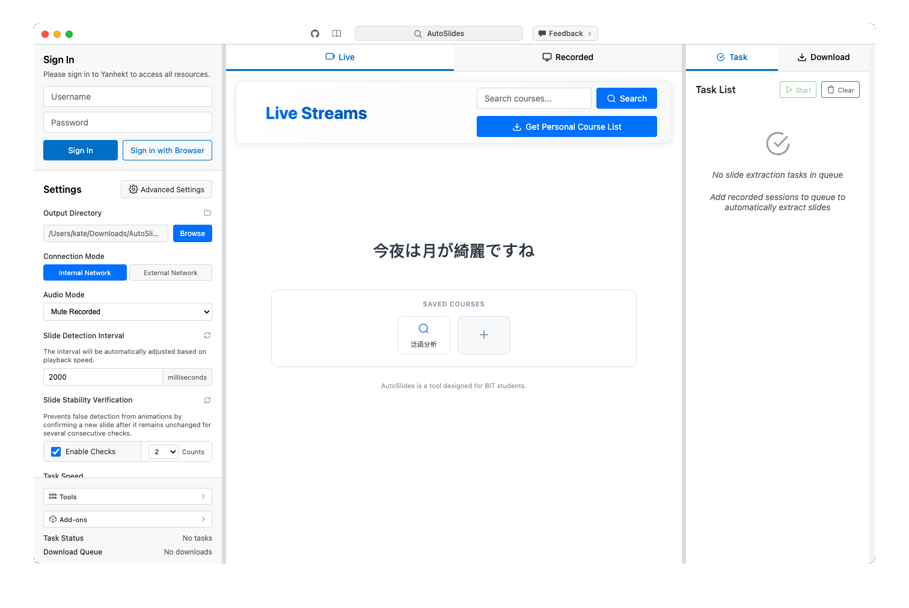
</p>


> [!CAUTION]
> Disclaimer: This tool is intended strictly for personal study; users assume full legal responsibility for ensuring their usage complies with all applicable copyright laws and platform regulations. Terms and Conditions available here: [TERMS AND CONDITIONS](docs/terms.md)
> 
> This tool is NOT an official application of, and is NOT affiliated with, associated with, endorsed by, or in any way connected to Beijing Institute of Technology (BIT), or any of their subsidiaries or affiliates. All product and company names are trademarks™ or registered® trademarks of their respective holders.


### 相关项目

|  | GitHub 仓库 | 描述 |
| --- | --- | --- |
| [网页版](https://learn.ruc.edu.kg) 👈   | [bit&#8209;admin/Yanhe-Web](https://github.com/bit-admin/Yanhe-Web)   |   观看全校直播课程，在移动设备上运行幻灯片提取<sup>2</sup>；记录笔记并导出为文档<sup>3</sup>。  |
| 提取器工具   | [bit&#8209;admin/AutoSlides-Extractor](https://github.com/bit-admin/AutoSlides-Extractor)   |  从下载的屏幕录制中提取幻灯片；处理一节课的视频用时快至10秒<sup>4</sup>；支持 GPU 加速；使用 C++ 构建；使用与 `AutoSlides` 相同的图像处理算法及基于 `MobileNetV4` 的机器学习模型。   |
| 延河课堂下载器   | [bit&#8209;admin/Yanhekt-downloader-electron](https://github.com/bit-admin/Yanhekt-downloader-electron)   |  视频下载功能基于该项目重写；特别感谢 [AuYang261/BIT_yanhe_download](https://github.com/AuYang261/BIT_yanhe_download) 项目提供的思路和参考 。  |
| BIT SSO 登录模块   | [bit&#8209;admin/bit-sso](https://github.com/bit-admin/bit-sso)   |  延河课堂登录功能基于该项目；基于逆向工程的登录模块<sup>5</sup>；基于边缘函数的延河课堂登录实现。   |

---

<sup>1</sup> 以有线方式连接到校园网时，下载峰值速率可达120MB/s；在 Wi-Fi 下速率较慢。

<sup>2</sup> 网页版使用简化的图像处理算法，同时适用于桌面及移动设备。

<sup>3</sup> 网页版提供笔记记录及导出 Word 及 Markdown 文档功能。

<sup>4</sup> **两个工具组合使用速度更快**：使用 `AutoSlides` 下载一节95分钟课程的屏幕录制视频在校园网内用时约10秒；使用 `AutoSlides Extractor` 处理该视频（I-frame 间隔2秒）在 M4 Mac mini 上用时约10秒。

<sup>5</sup> 仅能处理使用账户密码登录北京理工大学统一身份认证；在“非常规时段”登录可能需要二次验证；预先在 [sso.bit.edu.cn](https://sso.bit.edu.cn) 进行验证。

## 🚀 快速开始

### 1. 下载

- 前往 [release 页面](https://github.com/bit-admin/Yanhekt-AutoSlides/releases) 👈 下载适用于您的平台的安装程序（macOS 用户请下载 `DMG` 文件；Windows 用户请下载 `EXE` 文件）。

### 2. 安装
   - **macOS**：打开 `.dmg` 安装包，将应用图标拖动到 `Applications` 文件夹后，双击安装包内的 `install.command` 文件，运行安装脚本，然后输入你的 Mac 密码（注意密码输入时不会显示）。

<p align="center">
  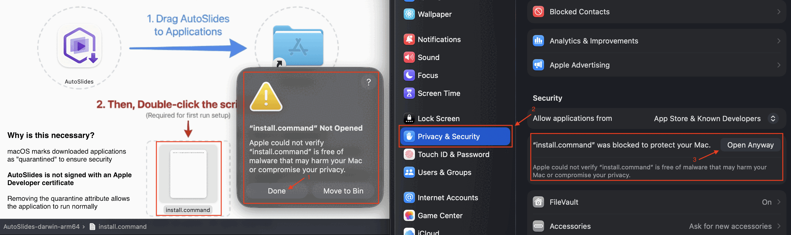
</p>   

> [!IMPORTANT]
> - macOS 将下载的应用程序标记为“隔离”以确保安全。
> - AutoSlides 未使用 Apple 开发者证书签名。
> - 双击 `install.command` 将运行 `sudo xattr -d com.apple.quarantine /Applications/AutoSlides.app` 删除隔离属性允许应用程序正常运行。

   - **Windows**：运行 `.exe` 安装程序并按照安装向导操作。

### 3. 检查更新

- 点击 `菜单栏 > AutoSlides > 检查更新...` （Windows上为 `菜单栏 > 帮助 > 检查更新...`）以查看是否发布了新版本。
- 手动在 [release 页面](https://github.com/bit-admin/Yanhekt-AutoSlides/releases) 下载和安装最新版本。

> [!NOTE]
> - 由于缺乏向后兼容，建议始终在安装新版本的 `AutoSlides` 时彻底删除旧版本重新安装。
> - 如果在安装新版本后遇到问题，可以尝试使用 `高级设置 > 一般 > 重置所有数据` 功能；或者，你也可以移除旧版本的支持文件：
>   - **macOS**：在终端运行以下命令或手动查找并移除 `~/Library/Application\ Support/AutoSlides`：
>     ```bash
>     rm -rf ~/Library/Application\ Support/AutoSlides
>     ```
>   - **Windows**：查找并移除 `C:\Users\<你的用户名>\AppData\Roaming\AutoSlides` 或 `C:\ProgramData\AutoSlides`

### 4. 使用与设置

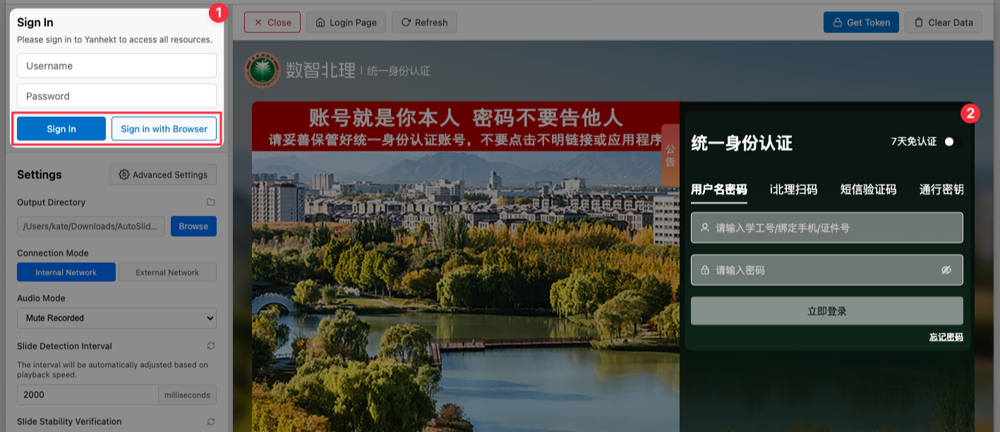

#### A. 基础设置

1. 启动应用程序，使用北京理工大学统一身份认证账户密码进行登录。
2. 根据需要调整 `输出目录`，默认为 `~/Downloads/AutoSlides`（建议设置为独立的文件夹）。
3. 在校园网内时，切换 `连接模式` 到 `内网模式` 以获得更好的连接体验和更快的课程资源访问速度。
4. 根据需要调整 `音频模式`，可以将应用静音运行。

<br clear="both">

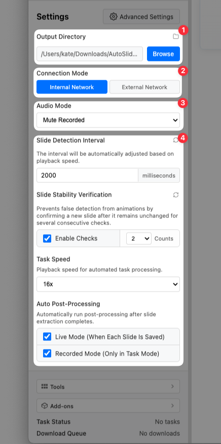

#### B. 基础界面介绍

5. 幻灯片提取功能的基础设置包括 `幻灯片检测间隔`、`幻灯片稳定性复核` 及 `任务速度`。建议保持默认即可。
6. `自动后处理` 设置项默认在直播模式和录播模式均启用。
  - 直播模式下将会在每保存一张幻灯片时进行后处理。
  - 录播模式下将在当前任务完成时进行后处理（需要将课程添加到任务列表）。
7. 点击状态栏中的按钮可以 `查看应用回收站` 及 `打开输出目录`。
8. `直播` 及 `录播` 两种模式可以同时运行，在切换模式时可以继续视频播放。

<br clear="both">

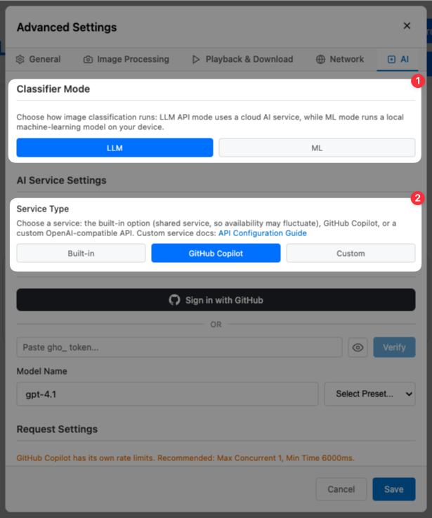

#### C. 高级设置介绍

`高级设置` 界面详细配置请参见下方的 [配置表](#5-配置表)。

9. 建议仅在必要时调整 `图像处理` 标签页中的默认值；部分参数敏感度较高，即便微小变化也可能显著影响性能。
10. `后处理` 包含 `重复去除`、`排除列表` 及 `AI 过滤` 三个阶段，默认全部启用，可根据具体需要调整。

<br clear="both">


<br>

11. `AI` 标签页中包含 AI 过滤功能的各项配置。AI 服务可在 `内置` 和 `自定义` 服务中进行切换。
  - 内置服务为免费提供的共享服务，在登录后可使用 `gpt-4.1` 模型；**共享服务的可用性视情况而定**。
  - 自定义服务可配置 `API Base URL`、`API Key` 及 `模型名称`；了解更多：[AI 配置文档](https://it.ruc.edu.kg/zh/docs)。

> [!IMPORTANT]
> The Built-in service is provided by the developer free of charge and on an "as is" basis. We make no warranties, express or implied, regarding the continuity or stability of the service, and we may modify or interrupt the service at any time without prior notice. The user agrees to use the service in a reasonable, fair, and non-commercial manner.

<br clear="both">

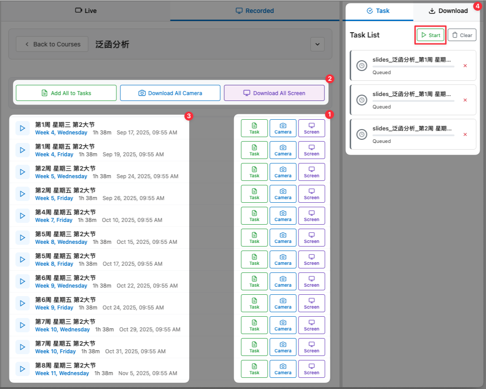

<br>

#### D. 应用使用方法

12. 在课程节次界面，点击控制栏按钮 `添加课程到幻灯片提取任务`、`下载课堂摄像头录像` 及 `下载课程屏幕录像`。
13. 添加项目到 `幻灯片提取任务` 后，点击 `开始` 按钮启动任务队列。

<br clear="both">

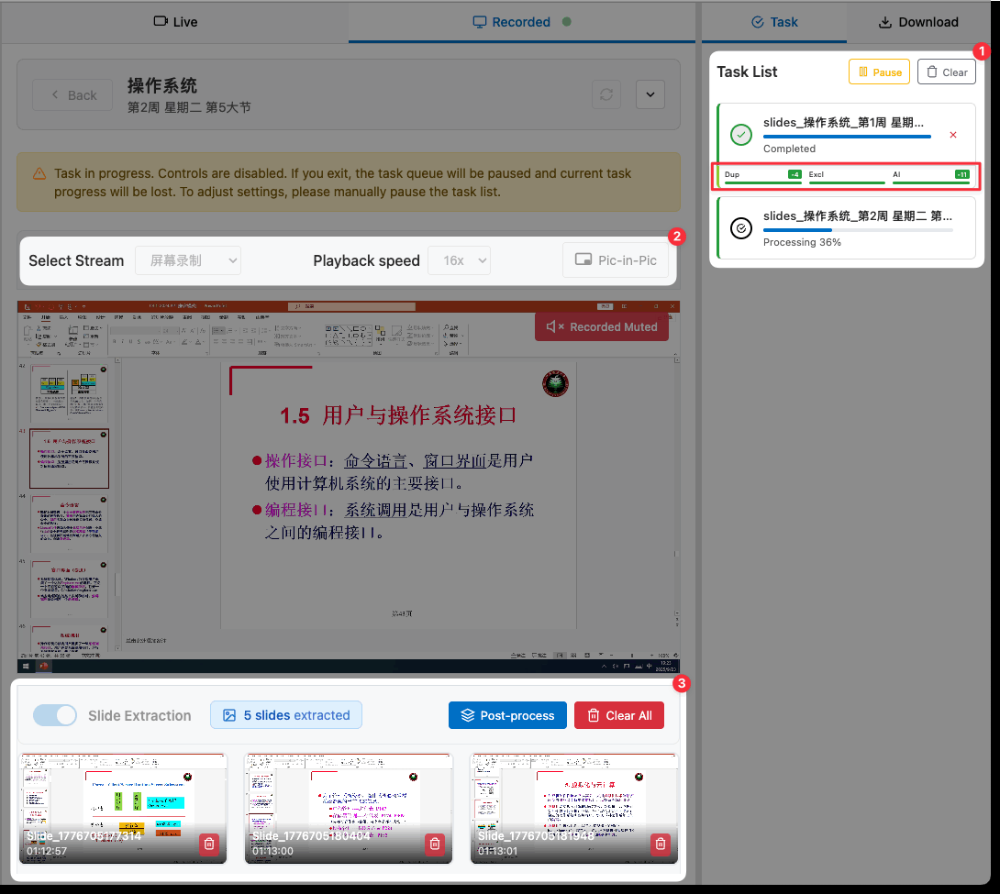

<br>

14. 开始任务后，将会依次以 `任务速度` 播放课程屏幕录制并启动幻灯片提取功能。
15. 保存至输出目录中的幻灯片图像也将显示在下方的幻灯片列表中。

<br clear="both">

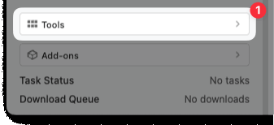

<br>

16. 每一任务运行完成后，将会自动执行 `后处理阶段`。AI 过滤可能需要一段时间以避免 API 速率限制。
17. 建议在后处理完成后，点击 `查看应用回收站`，检查 AI 过滤是否存在错误。

> [!TIP]
> `应用回收站` 在硬盘中位于 `输出目录` 下的 `.autoslidesTrash` 文件夹。

<br clear="both">

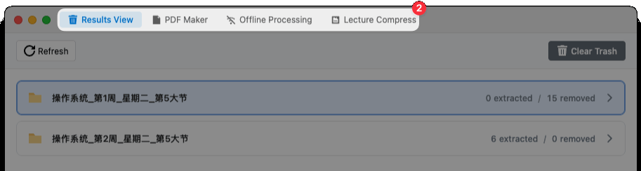

<br>

18. `应用回收站` 界面内，可根据 `文件夹` 及 `排除方法` 筛选图像。
  - `排除方法` 包括 `重复`、`已排除`、`AI 过滤` 及 `手动`。
  - `重复` 指类似 `A -> B -> A`，演讲者在演讲过程中重复播放某一幻灯片页面时，只保留第一次出现的页面，删除之后出现的页面。
  - `已排除` 指预先设置的排除项目。`排除列表` 预置有 `No Signal`、`No Input`、`Black Screen`及`Desktop`；可根据需要在 `高级设置 > 图像处理 > pHash 排除列表` 中进行配置。
  - `AI 过滤` 是 AI 判断不属于全屏播放的幻灯片图像。要修改 AI 的判断标准，可在 `高级设置 > AI > AI 提示词` 中修改。

<br clear="both">

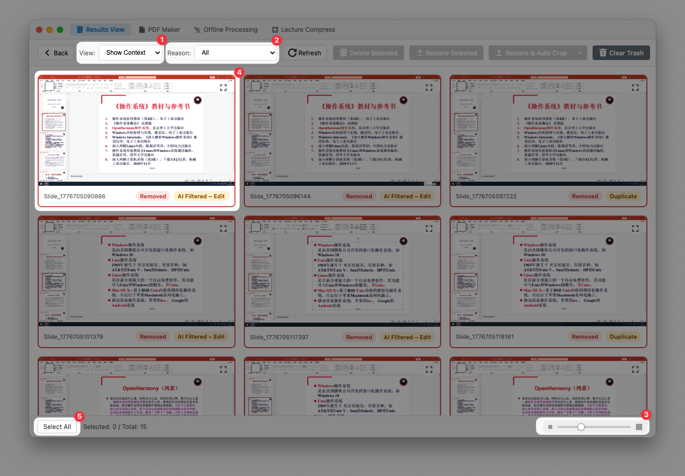

<br>

19. **AI 可能出错**。建议筛选并检查 AI 过滤的结果。
20. 选择你希望恢复的图像，点击 `恢复所选` 按钮将其放回原处。

<br clear="both">

### 5. 配置表

#### A. 基础设置

| 设置 | 默认值 | 范围/选项 | 描述 |
| --- | --- | --- | --- |
| 输出目录 | ~/Downloads/AutoSlides | 文件夹路径 | 幻灯片和下载文件的保存位置 |
| 连接模式 | 外网 | 内网 / 外网 | 选择视频流的网络连接模式 |
| 音频模式 | 正常 | 正常 / 全部静音 / 直播静音 / 录播静音 | 控制视频播放时的音频 |
| 幻灯片检测间隔 | 2000 | 1000-10000 毫秒（步进500） | 检测新幻灯片的时间间隔 |
| 幻灯片稳定性复核 | 启用，2次 | 启用/禁用，1-5 次 | 启用后需多次检测确认幻灯片稳定后才保存 |
| 任务速度 | 10x | 1x - 10x | 任务队列中录播视频的播放速度 |
| 自动后处理（直播） | 启用 | 启用/禁用 | 直播播放时每保存一张幻灯片自动执行后处理 |
| 自动后处理（录播） | 启用 | 启用/禁用 | 录播提取任务结束后自动执行后处理 |

#### B. 高级设置

| 设置 | 默认值 | 范围/选项 | 描述 |
| --- | --- | --- | --- |
| **1. 通用** |  |  |  |
| 令牌 | - | 文本输入 | 可手动手动输入认证令牌登录 |
| 主题 | 浅色 | 跟随系统 / 浅色 / 深色 | 应用程序外观主题 |
| 语言 | 跟随系统 | 跟随系统 / English / 中文 / 日本語 / 한국어 | 界面语言设置 |
| 缓存管理 | - | 刷新 / 清除缓存 / 重置所有数据 | 管理应用程序缓存 |
| **2. 图像处理** |  |  |  |
| SSIM阈值 | 0.9987（自适应模式） | 0.9-1.0（步进0.0001），预设：自适应/严格/标准/宽松/自定义 | 图像相似度阈值，用于判断是否为新幻灯片 |
| 启用降采样 | 启用（480×270） | 启用/禁用，分辨率选择：320×180 / 480×270 / 640×360 / 800×450 | 图像抗锯齿 |
| 后处理阶段 - 重复去除 | 启用 | 启用/禁用 | 基于 pHash 去除重复幻灯片 |
| 后处理阶段 - 排除列表 | 启用 | 启用/禁用 | 根据 pHash 排除列表过滤图像 |
| 后处理阶段 - AI 过滤 | 启用 | 启用/禁用 | 使用 AI 过滤非幻灯片图像 |
| pHash阈值 | 10 | 0-256（汉明距离） | 用于后处理重复检测的感知哈希阈值 |
| pHash排除列表 | 4个预设项 | 添加/删除图像 | 设置要排除的图像pHash列表 |
| **3. 播放及下载** |  |  |  |
| 视频错误重试次数 | 5 | 5-10 次 | 视频加载失败时的重试次数 |
| 阻止系统休眠 | 启用 | 启用/禁用 | 任务运行时阻止系统进入休眠 |
| 并发下载限制 | 5 | 1-10 | 同时下载的最大数量 |
| **4. 网络** |  |  |  |
| 内网映射 | - | 只读显示 | 显示域名到IP的映射配置（单 IP/负载均衡） |
| **5. AI** |  |  |  |
| 服务类型 | 内置 | 内置 / 自定义 | AI 服务提供方式 |
| API 基础 URL | - | 文本输入，含预设选项 | 自定义 API 的基础 URL |
| API 密钥 | - | 文本输入 | 自定义 API 的密钥 |
| 模型名称 | - | 文本输入，含预设选项 | 使用的 AI 模型名称 |
| 请求频率限制 | 10 | 1-10（内置）/ 1-60（自定义）次/分钟 | 每分钟最大请求次数 |
| 最大并发请求数 | 1 | 1-10 个 | 同时进行的最大请求数 |
| 请求最小间隔 | 6000 | 0-60000 毫秒（步进100） | 两次请求之间的最小间隔 |
| 批量大小 | 5 | 1-10 张 | 每次批处理请求的图片数量 |
| AI 图像缩放 | 768×432 | 512×288 / 768×432 / 1024×576 / 1920×1080 | AI 处理前的图像缩放设置 |
| 直播模式提示词 | - | 文本输入 | 直播模式下 AI 过滤的系统提示词 |
| 录播模式提示词 | - | 文本输入 | 录播模式下 AI 过滤的系统提示词 |

#### C. 核心参数介绍

> [!NOTE]
> - SSIM 阈值：更高的全局结构相似性阈值表示更严格的匹配。
>   - 建议仅在必要时调整。即便 0.001 的微小变化也可能显著影响性能。
>   - 使用 [在线测试](https://learn.ruc.edu.kg/test) 👈 或在浏览器中打开 `test-image-comparison.html` 测试和校准 SSIM 算法。

1. `SSIM 阈值` 包含五个预设模式：`自适应/严格(0.999)/标准(0.9987)/宽松(0.998)/自定义(0.990-0.9999)`。
  - `自适应` 模式针对不同教学楼进行特殊优化，部分教学楼由于设备老旧，视频质量不佳，适用更宽松的阈值。
  - `教室位置规则`："综教/理教/研楼" → 宽松；其他位置 → 正常。
  - `严格` 模式下，检测的敏感度极高。
  - `标准` 模式下，该值相对平衡，能有效检出少量文字增减的情境。

<table align="center" width="100%">
  <tr>
    <td align="center" width="33%">
      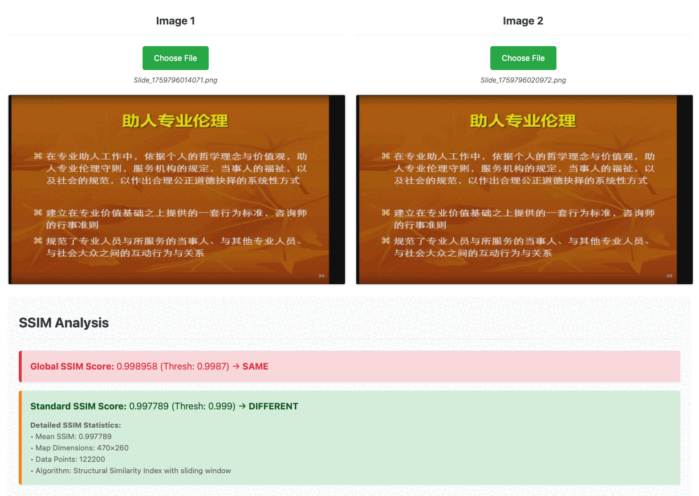
      <br>
      <strong>宽松模式</strong>
    </td>
    <td align="center" width="33%">
      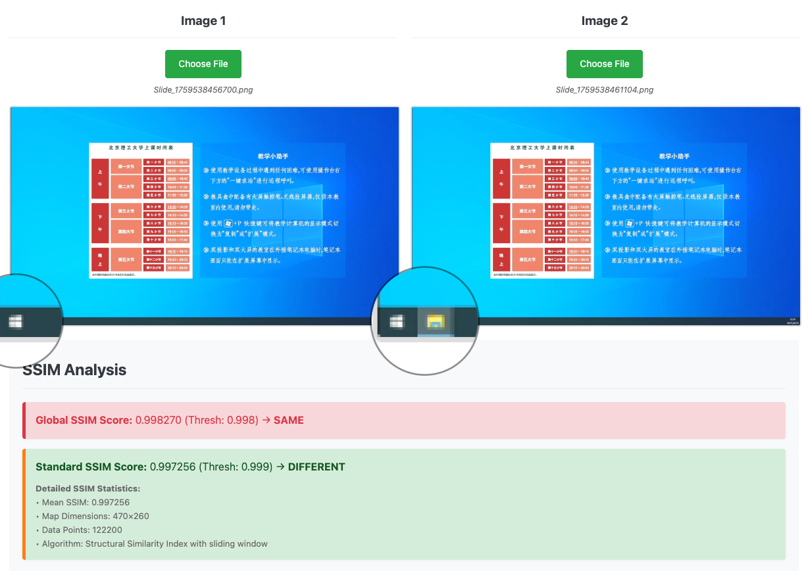
      <br>
      <strong>严格模式</strong>
    </td>
    <td align="center" width="33%">
      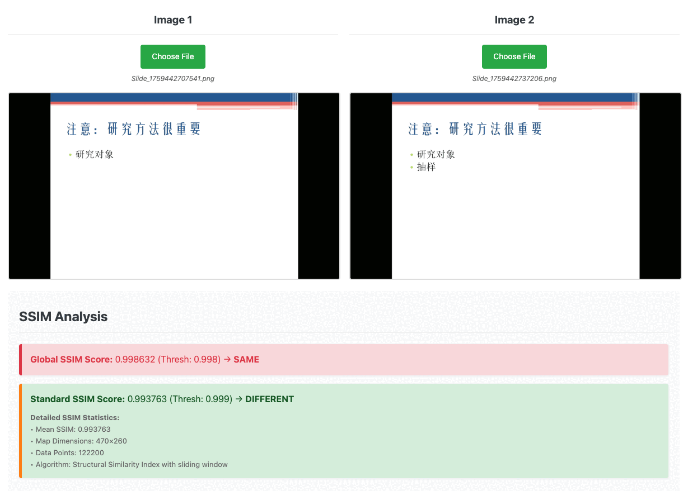
      <br>
      <strong>标准模式</strong>
    </td>
  </tr>
</table>

2. `幻灯片稳定性复核` 基于假设：演讲者通常将停留在同一幻灯片一段时间进行讲解，通过确认新幻灯片是否在连续若干次的检查中保持不变，可排除动画、视频、轻微移动等内容。
  - 在 `幻灯片稳定性复核` 启用，`检查次数` 为 `2` 且 `幻灯片检测间隔` 为 `2000` 毫秒的情况下，一张幻灯片只有“稳定”显示至少 `6` 秒才会被保存。
  - `幻灯片检测间隔` 是视频以 1 倍速播放时的检测间隔。实际检测间隔会根据播放速度自动调整；在以高倍速速播放时将会放慢 `JavaScript` 运行速度，实际检测间隔的最小值为 `200` 毫秒。

> [!TIP]
> 如果演讲者快速翻动幻灯片，部分显示时长过短的幻灯片在 `幻灯片稳定性复核` 启用时将不会被保存。
>
> 这非常合理，因为翻动过快的幻灯片即使你上课认真听讲你也来不及记录下来。如果你认为被跳过的幻灯片很重要，你可以在观看课程视频时手动暂停。

## 🛠 架构设计

### 基于 SSIM 的幻灯片检测

AutoSlides 使用经过修改的全局结构相似性指数 (G-SSIM) 进行图像比较以检测幻灯片变化，并通过双重验证机制进行确认。完整技术细节可在 [`report.pdf`](report.pdf) 中找到。

```typescript
// 核心 SSIM 计算（简化）
function calculateSSIM(img1: ImageData, img2: ImageData): number {
  const gray1 = convertToGrayscale(img1);
  const gray2 = convertToGrayscale(img2);

  // 计算均值、方差和协方差
  const [mean1, mean2] = calculateMeans(gray1, gray2);
  const [var1, var2, covar] = calculateVariances(gray1, gray2, mean1, mean2);

  // SSIM 公式与稳定性常数
  const C1 = 0.01 * 255 * 0.01 * 255;
  const C2 = 0.03 * 255 * 0.03 * 255;

  const numerator = (2 * mean1 * mean2 + C1) * (2 * covar + C2);
  const denominator = (mean1 * mean1 + mean2 * mean2 + C1) * (var1 + var2 + C2);

  return numerator / denominator;
}
```

### 项目主要结构

<div align="left">

<table>
<tr>
<td valign="top" width="50%">

#### Main Process & Root

```text
autoslides/src/
├── main/
│   ├── aiFilteringService.ts
│   ├── aiPromptsService.ts
│   ├── apiClient.ts
│   ├── authService.ts
│   ├── cacheManagementService.ts
│   ├── configService.ts
│   ├── ffmpegService.ts
│   ├── intranetMappingService.ts
│   ├── m3u8DownloadService.ts
│   ├── powerManagementService.ts
│   ├── slideExtractionService.ts
│   ├── themeService.ts
│   └── videoProxyService.ts
├── App.vue
├── index.css
├── main.ts
├── preload.ts
├── renderer.ts
├── trash.ts
└── vite-env.d.ts

```

</td>
<td valign="top" width="50%">

#### Renderer Process

```text
renderer/
├── components/
│   ├── CoursePage.vue
│   ├── LeftPanel.vue
│   ├── MainContent.vue
│   ├── PlaybackPage.vue
│   ├── RightPanel.vue
│   ├── SessionPage.vue
│   ├── TitleBar.vue
│   └── TrashWindow.vue
├── composables/
│   ├── index.ts
│   ├── useAdvancedSettings.ts
│   ├── useAISettings.ts
│   ├── useAuth.ts
│   ├── useCacheManagement.ts
│   ├── useCourseList.ts
│   ├── usePerformanceOptimization.ts
│   ├── usePHashExclusion.ts
│   ├── usePostProcessing.ts
│   ├── useSessionPage.ts
│   ├── useSettings.ts
│   ├── useSlideExtraction.ts
│   ├── useSlideGallery.ts
│   ├── useTaskQueue.ts
│   ├── useTour.ts
│   └── useVideoPlayer.ts
├── services/
│   ├── apiClient.ts
│   ├── authService.ts
│   ├── dataStore.ts
│   ├── downloadService.ts
│   ├── languageService.ts
│   ├── postProcessingService.ts
│   ├── slideExtractor.ts
│   ├── slideProcessorService.ts
│   ├── ssimThresholdService.ts
│   └── taskQueueService.ts
├── workers/
│   ├── postProcessor.worker.ts
│   └── slideProcessor.worker.ts
└── TrashApp.vue

```

</td>
</tr>
</table>

</div>

---

<div align="center">
<p>Made with ❤️ by bit-admin</p>
<p>
<a href="https://learn.ruc.edu.kg">Website</a> •
<a href="mailto:info@ruc.edu.kg">Email</a> •
<a href="https://it.ruc.edu.kg/docs">Docs</a>
</p>
</div>