<div align="center">

  

  # AutoSlides
  
  **北京理工大学延河课堂第三方客户端｜自动提取幻灯片｜下载课程录像｜AI 过滤与审查**

  <p>
    
    
    
    
  </p>

  <p>
    
    
    
  </p>

  <p>
    <a href="#-快速开始">🚀 快速开始</a> • 
    <a href="#-功能特性">✨ 功能特性</a> •
    <a href="#-架构设计">🏗️ 架构设计</a>
  </p>

</div>

---

## ✨ 功能特性

- 通过本地代理和防盗链适配支持延河课堂直播、录播播放与课程录像下载。
- 针对校园网访问链路优化，录播支持 0.5-16 倍速流畅播放；有线校园网下载峰值快至 110MB/s<sup>1</sup>。
- 播放视频的同时自动提取幻灯片，无需预先下载视频；145 分钟课程可在 16 倍速下约 10 分钟处理完成。
- 任务队列运行期间可阻止系统休眠，适合批量、长时间处理课程录像。
- 结合 SSIM、pHash、LLM 或本地 ML 分类器过滤重复页面、非幻灯片画面和编辑模式截图。
- 在 `幻灯片审查页面` 中按文件夹审查提取结果，支持恢复、删除、自动裁剪、基准裁剪和裁剪状态回滚。
- 将提取后的幻灯片合并导出为 PDF，并可通过 PNG 色彩压缩减小文件体积。

<p align="center">
  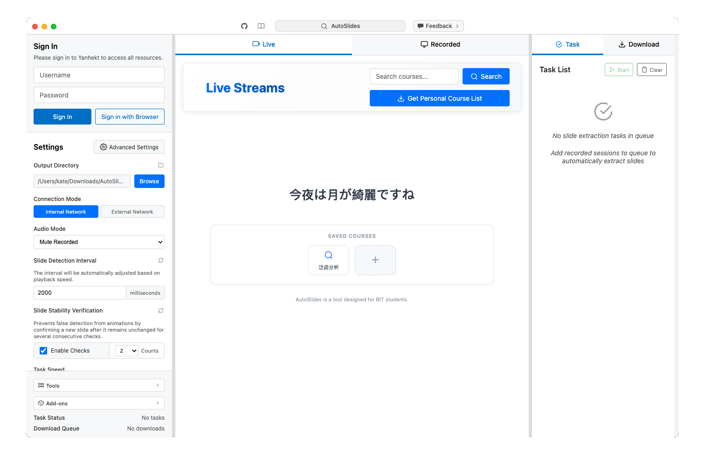
</p>


> [!CAUTION]
> **Disclaimer**: This tool is intended strictly for personal study; users assume full legal responsibility for ensuring their usage complies with all applicable copyright laws and platform regulations. Terms and Conditions apply.
> <br> **免责声明**：本工具严格仅供个人学习之用；用户须自行承担全部法律责任，确保其使用符合所有适用的版权法及平台规例。受条款及细则约束。
>
> <p align="center"><a href="docs/terms.md">Read full Terms and Conditions / 按此查阅完整条款及细则</a></p>
> 
> This tool is NOT an official application of, and is NOT affiliated with, associated with, endorsed by, or in any way connected to Beijing Institute of Technology (BIT), or any of their subsidiaries or affiliates. All product and company names are trademarks™ or registered® trademarks of their respective holders.
> <br> 本工具**并非**北京理工大学（BIT）的官方应用程式，亦与其或其任何附属机构或关联方无任何关联、联系、获其认可或以任何方式相关。所有产品及公司名称均为其各自持有人的商标™或注册®商标。


### 相关项目

<table>
  <thead>
    <tr>
      <th width="155">项目 / 类别</th>
      <th width="190">GitHub 仓库</th>
      <th>描述</th>
    </tr>
  </thead>
  <tbody>
    <tr>
      <td>
        <a href="https://learn.ruc.edu.kg">网页版</a> 👈
      </td>
      <td>
        <a href="https://github.com/bit-admin/Yanhe-Web">bit&#8209;admin/Yanhe-Web</a>
      </td>
      <td>
        观看全校直播课程，在移动设备上运行幻灯片提取<sup>2</sup>；记录笔记并导出为文档<sup>3</sup>。
      </td>
    </tr>
    <tr>
      <td>提取器工具</td>
      <td>
        <a href="https://github.com/bit-admin/AutoSlides-Extractor">bit&#8209;admin/AutoSlides-Extractor</a>
      </td>
      <td>
        从下载的屏幕录制中提取幻灯片；处理一节课的视频用时快至 10 秒；支持 GPU 加速；使用 C++ 构建；使用与 <code>AutoSlides</code> 相同的图像处理算法及基于 <code>MobileNetV4</code> 的机器学习模型。
      </td>
    </tr>
    <tr>
      <td>延河课堂下载器</td>
      <td>
        <a href="https://github.com/bit-admin/Yanhekt-downloader-electron">bit&#8209;admin/Yanhekt-downloader-electron</a>
      </td>
      <td>
        视频下载功能基于该项目重写；特别感谢 <a href="https://github.com/AuYang261/BIT_yanhe_download">AuYang261/BIT_yanhe_download</a> 项目提供的思路和参考。
      </td>
    </tr>
  </tbody>
</table>

---

<sup>1</sup> 以有线方式连接到校园网时，下载峰值速率可达120MB/s；在 Wi-Fi 下速率较慢。

<sup>2</sup> 网页版使用简化的图像处理算法，同时适用于桌面及移动设备。

<sup>3</sup> 网页版提供笔记记录及导出 Word 及 Markdown 文档功能。

## 🚀 快速开始

### 1. 下载

- 前往 [release 页面](https://github.com/bit-admin/Yanhekt-AutoSlides/releases) 👈 下载适用于你平台的安装程序（macOS 用户下载 `DMG` 文件；Windows 用户下载 `EXE` 文件；Linux 用户下载 `AppImage` 或 `deb` 文件）。

### 2. 安装 AutoSlides
   - **macOS**：打开 `.dmg` 安装包，将应用图标拖动到 `Applications` 文件夹。
      - 双击安装包内的 `install.command` 文件运行安装脚本。若看到“Apple 无法验证安全性”的提示，先关闭该提示。
      - 打开 `系统设置 > 隐私与安全性`，如图所示，点击 `仍要打开`。
      - 在终端中输入你的 Mac 密码（注意密码输入时不会显示）。

<p align="center">
  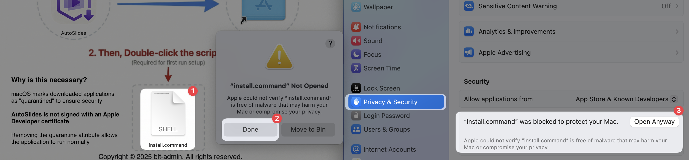
</p>

> [!IMPORTANT]
> - macOS 将下载的应用程序标记为"隔离"以确保安全。
> - AutoSlides 未使用 Apple 开发者证书签名。
> - 除了双击 `install.command` ，你也可以手动在终端运行以下命令删除隔离属性允许应用程序正常运行：
>   ```shell
>   sudo xattr -d com.apple.quarantine /Applications/AutoSlides.app
>   ```

   - **Windows**：运行 `.exe` 安装程序，并按照安装向导操作。

   - **Linux**：
     - **AppImage**：下载 `.AppImage` 文件，添加执行权限后直接运行：
       ```bash
       chmod +x AutoSlides-*.AppImage
       ./AutoSlides-*.AppImage
       ```
     - **Deb 包**（Debian/Ubuntu）：
       ```bash
       sudo apt install ./autoslides-*.deb
       ```

### 3. （可选）安装 [AutoSlides Extractor](https://github.com/bit-admin/AutoSlides-Extractor) 👈

`AutoSlides Extractor` 是一个独立的 C++ 应用程序，它在本地视频文件上提取幻灯片，并支持硬件加速，比在播放过程中实时捕获更快，适合需要快速、批量获取课程幻灯片的情况。`AutoSlides` 主应用可通过对每个下载完成的屏幕录制自动调用外部的 `AutoSlides Extractor CLI` 加速幻灯片提取。

1. 当检测到已安装 `AutoSlides Extractor` 后，可启用 `下载完成后自动使用 C++ 提取器提取幻灯片` 功能；你也可以手动指定 `AutoSlides Extractor` 可执行文件的安装位置。
2. 你也可以在 `高级设置 > 下载与播放 > 下载完成后自动提取` 界面点击 `安装提取器` 下载 `AutoSlides Extractor`。

<p align="center">
  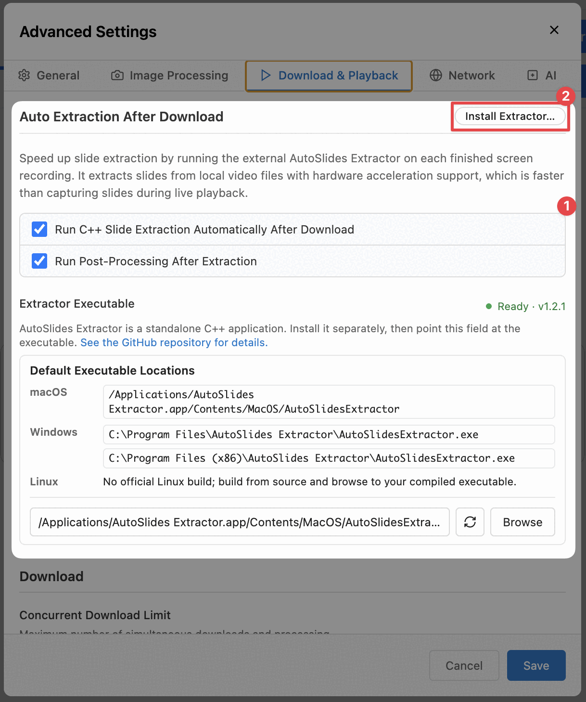
</p>

> [!TIP]
> 这一步是可选的，`AutoSlides` 主应用并不依赖 `AutoSlides Extractor`。你可以正常使用所有基于在线视频播放的幻灯片提取功能。惟 `下载完成后自动使用 C++ 提取器提取幻灯片` 功能需要额外下载 `AutoSlides Extractor`。
>
> **两个工具组合使用速度更快**：使用 `AutoSlides` 下载一节 95 分钟课程的屏幕录制视频在校园网内用时约 10 秒；使用 `AutoSlides Extractor` 处理该视频（I-frame 间隔 2 秒）在 M4 Mac mini 上用时约 10 秒。

### 3. 使用与设置

#### A. 登录

1. 启动应用程序，使用北京理工大学统一身份认证账户密码登录。账户密码登录有时会触发短信验证码二次验证，遇到这种情况请改用 `浏览器登录`。 [#1](https://github.com/bit-admin/Yanhekt-AutoSlides/issues/1)
2. 点击 `浏览器登录` 后，应用会在内置浏览器中打开官方登录界面。登录并跳转到延河课堂页面后，应用会自动获取延河课堂令牌。

<p align="center">
  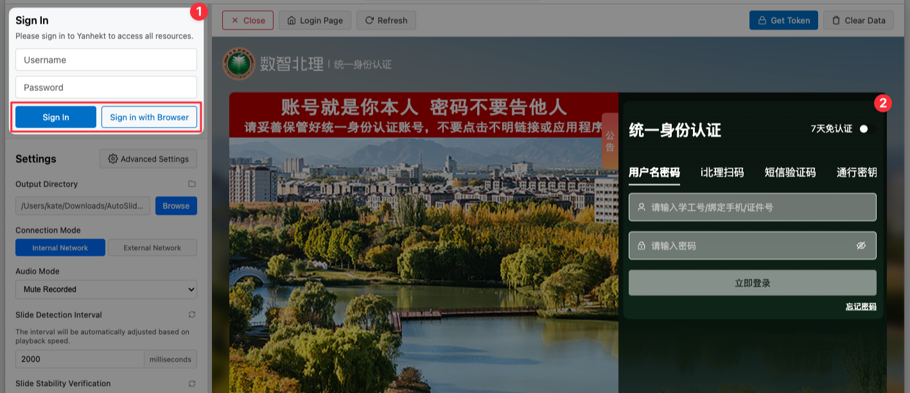
</p>

<br>

#### B. 基础设置

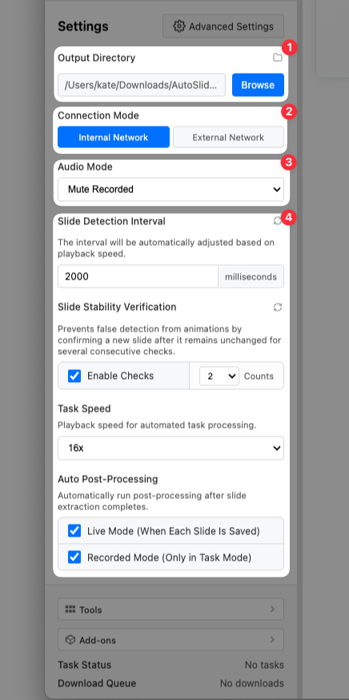

1. 根据需要调整 `输出目录`，默认路径为 `~/Downloads/AutoSlides`（建议设置为独立文件夹）。
2. 在校园网内使用时，将 `连接模式` 切换为 `内网模式`，通常可获得更稳定的连接体验和更快的课程资源访问速度。
3. 根据需要调整 `音频模式`，也可以让应用全程静音运行。
4. 幻灯片提取功能的基础设置包括 `幻灯片检测间隔`、`幻灯片稳定性复核`、`任务速度` 及 `自动后处理`。
- `幻灯片检测间隔` 为视频以 1 倍速播放时检测新幻灯片的时间间隔。实际检测间隔会随播放速度自动调整。
- `幻灯片稳定性复核` 启用后需多次检测确认幻灯片稳定，排除动画、视频、轻微移动等内容。此设计基于“演讲者通常将停留在同一幻灯片一段时间进行讲解”的假设。
- `任务速度` 为任务队列中录播视频的播放速度。
- `自动后处理` 控制是否在幻灯片提取后自动执行排除、过滤等后处理步骤：
  - 直播模式下将会在每保存一张幻灯片时进行后处理。
  - 录播模式下将在当前任务完成时进行后处理（需要将课程添加到任务列表）。

> [!TIP]
> 在 `幻灯片稳定性复核` 启用，`检查次数` 为 `2` 且 `幻灯片检测间隔` 为 `2000` 毫秒的情况下，一张幻灯片只有“稳定”显示至少 `6` 秒才会被保存。如果演讲者快速翻动幻灯片，部分显示时长过短的幻灯片在 `幻灯片稳定性复核` 启用时将不会被保存。
>
> 这样设计是因为翻动过快的幻灯片即使在课堂上认真听讲也很难及时记录。如果你认为被跳过的幻灯片非常重要，可以在观看课程视频时手动暂停。

<br clear="both">

<br>

#### C. AI 设置

1. 在 `高级设置 > AI` 中配置 AI 服务。图像分类可选择两种运行方式：`LLM` 模式调用云端多模态大语言模型 API，`ML` 模式在本机运行机器学习模型。`LLM` 模式通常更准确，`ML` 模式则更快，并且不依赖外部服务。
2. `LLM` 模式 `内置服务` 在一定期限内提供 `免费模型`。`免费模型` 列表可能会不时进行调整，且**共享服务的可用性视实际负载而定**。你也可以使用 GitHub 登录，或填写自定义服务的 `API Base URL`、`API Key` 和 `模型名称`。了解更多：[AI 配置及 GitHub 教育优惠文档](https://it.ruc.edu.kg/zh/docs)。

<p align="center">
  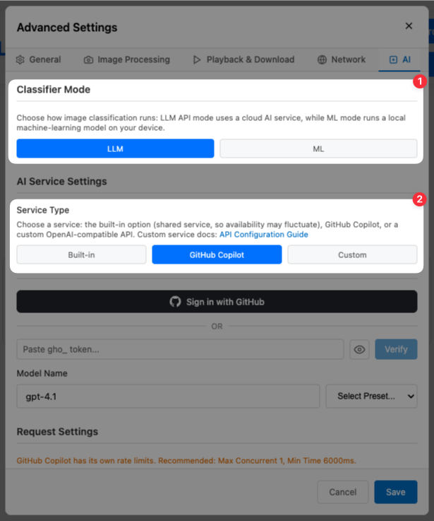
</p>

> [!TIP]
> AI 可能出错。核查 AI 的分类结果。

> [!IMPORTANT]
> The Built-in service is provided by the developer free of charge and on an "as is" basis. We make no warranties, express or implied, regarding the continuity or stability of the service, and we may modify or interrupt the service at any time without prior notice.
> <br> 开发者免费并按“原样”基础提供内置服务。我们不对服务的连续性或稳定性作出任何明示或隐含的保证，并可能随时修改或中断服务，恕不另行通知。

<br>

#### D. 基础页面使用

1. `直播` 和 `录播` 两种模式可以同时运行；切换页面时，正在播放的视频不会被中断。
2. `获取个人课程列表`，找到你想要观看的课程；或者使用 `搜索` 功能在全校课程中进行搜索；你还可以观看任意正在直播的课程，即便你并未注册该课程。
3. 你还可以在 `课程收藏夹` 中保存你常观看的课程的关键词，快速进行搜索。

<p align="center">
  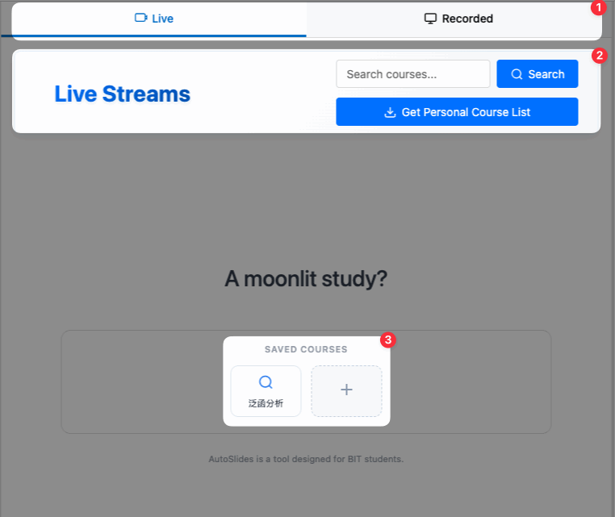
</p>

<br>

#### E. 录播课程播放与下载

1. 进入录播课程页面后，可将具体节次添加到 `幻灯片提取任务列表`，也可下载 `课堂摄像头录像` 和 `屏幕录制` 视频。
2. 你也可以一次性将课程的所有节次添加到 `任务列表` 或 `下载队列`。
3. 如果只是想认真观看课程录像，可以直接点击某一节次的 `播放`，无需加入幻灯片提取任务列表。
4. 在右侧栏中可管理 `任务列表` 及 `下载队列`；在 `任务列表` 中点击 `开始` 启动任务队列。

<p align="center">
  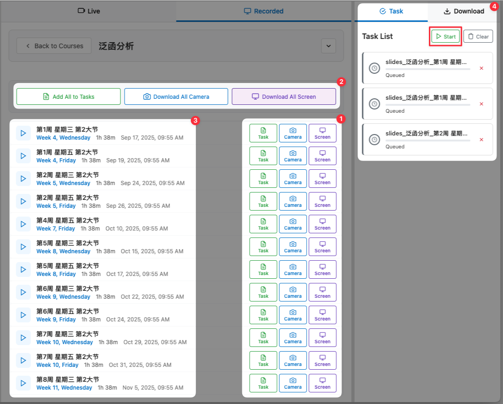
</p>

<br>

---

处于播放模式时，可以同时观看 `屏幕录制` 和 `课堂摄像头` 视频。

<p align="center">
  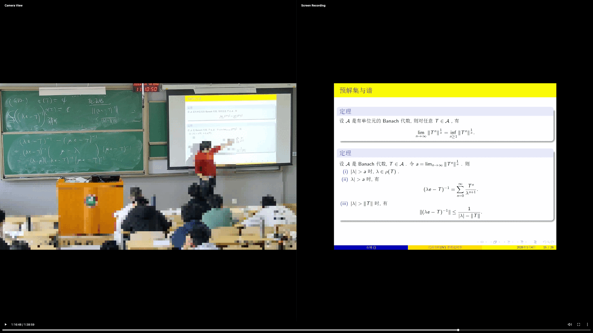
</p>

<br>

#### F. 幻灯片提取

1. 启动录播课程的 `幻灯片提取任务` 后，应用会依次按 `任务速度` 播放课程屏幕录制，并自动启动幻灯片提取。列表中会显示任务进度，以及已完成项目的 `后处理` 状态。
2. 在播放页面，可以通过控制栏选择 `视频源`、调整 `播放速度`，或进入 `画中画` 模式（控制栏仅在 `播放模式` 下可操作；录播课程处于 `任务模式` 时会被禁用，直播课程始终处于 `播放模式`）。
3. 播放页面下方是 `幻灯片提取预览窗口`；在 `播放模式` 下可以手动开启或停止 `幻灯片提取`。你也可以随时手动触发 `后处理`，或 `删除` 已提取的幻灯片。

<p align="center">
  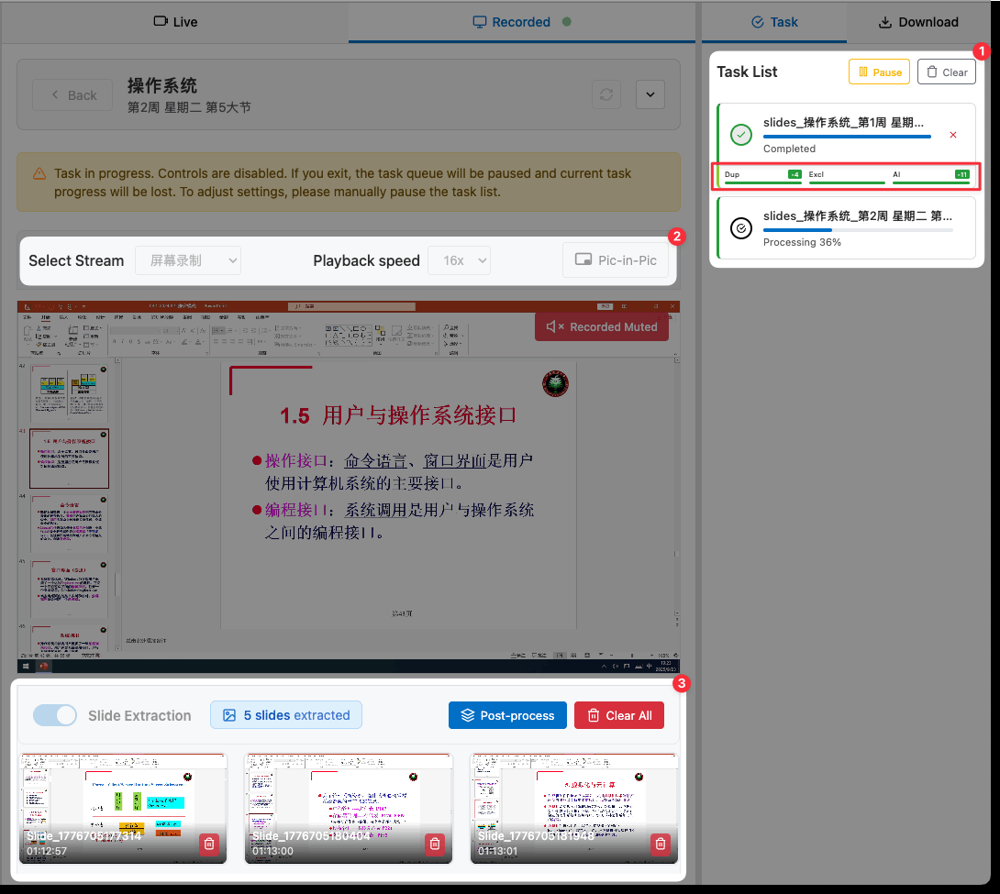
</p>

<br>

---

当 `下载完成后自动使用 C++ 提取器提取幻灯片` 功能启用时，下载屏幕录制视频会自动运行 `幻灯片提取` 和 `后处理`。

<p align="center">
  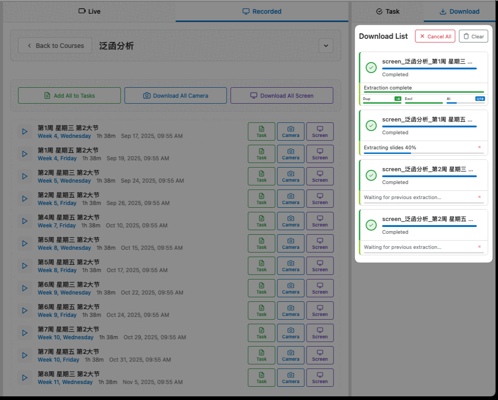
</p>


#### G. 审查幻灯片

1. 点击左下角的 `工具` 按钮。
2. 进入 `幻灯片审查` 页面。
3. 如需删除文件夹，点击 `编辑` 按钮并选择目标文件夹。删除文件夹时，与该文件夹关联的回收站项目和裁剪前原始图像备份也会一并删除。

<p align="center">
  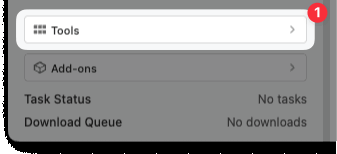
  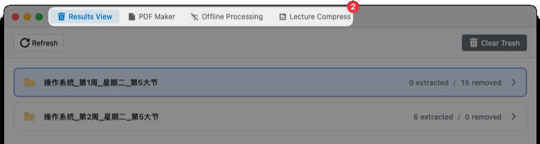
</p>

<p align="center">
  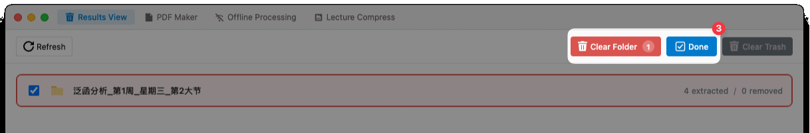
</p>

<br>

---

1. 查看已保存的幻灯片图像时，可在 `保留上下文`、`仅看已提取` 和 `仅看已移除` 视图之间切换。
2. 对于被移除的幻灯片，使用移除原因进行筛选，包括 `重复`、`已排除`、`AI 过滤 - 非幻灯片`、`AI 过滤 - 编辑模式` 及 `手动`。
3. 滑动右下角的滑块可调整 `缩略图` 的大小。
4. 点击缩略图右上角的按钮可 `放大` 查看图片。
5. 点击左下角的 `全选` 按钮可全选当前筛选下的全部图像。

<p align="center">
  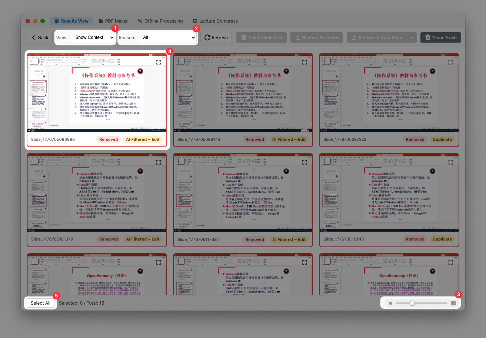
</p>

<br>

---

图像可能会因为被判定为非 `全屏播放的幻灯片` 或其他原因而被移除：
- `重复` 指类似 `A -> B -> A`，演讲者在演讲过程中重复播放某一幻灯片页面时，只保留第一次出现的页面，删除之后出现的页面图像。
- `已排除` 指与预先设置的排除项目一致的图像。
- `AI 过滤` 指 AI 判断应被移除的图像。
- `AI 过滤 - 编辑模式` 指 AI 判断为演示软件编辑模式的幻灯片图像。由于部分教师会在这一模式下放映幻灯片，此类图像会被单独标记，并可在 `自动裁剪` 后恢复。


> [!TIP]
> `被移除的图像` 不会出现在常规输出文件夹中；`被移除的图像` 会被移动至 `输出目录` 下的 `.autoslidesTrash` 文件夹；`被裁剪的图像` 的原始图像会被备份至 `输出目录` 下的 `.autoslidesCrop` 文件夹。

<p align="center">
  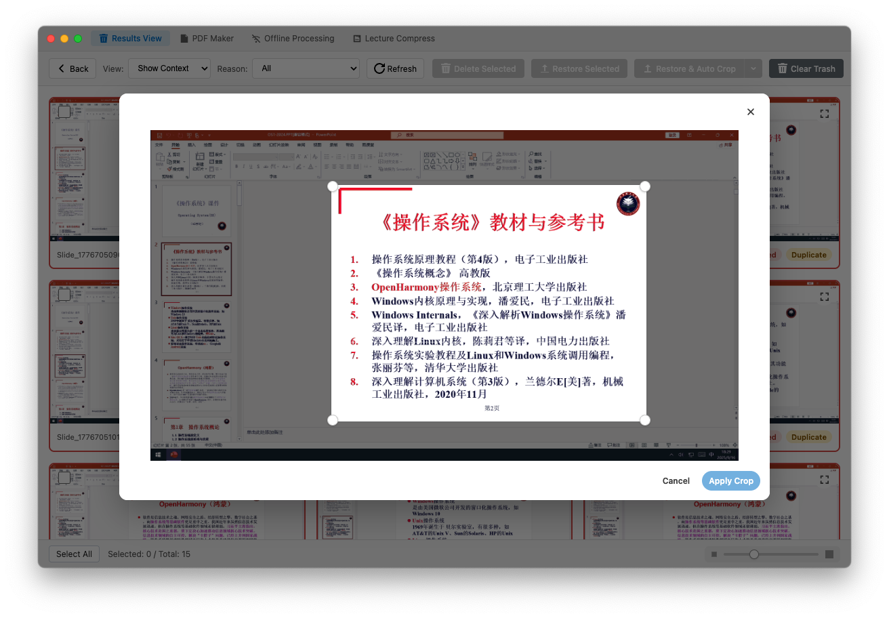
</p>

<br>

---

选择需要操作的图像后，可执行 `删除`、`恢复`、`自动裁剪`、`去除重复` 和 `清空回收站`：
- `删除` 可将 `已提取` 的图像以 `手动` 删除的原因移入回收站；
- `恢复` 可将 `已移除` 的图像恢复为 `已提取` 状态；`恢复` 下的额外选项 `还原已裁剪` 可将当前文件夹中所有被 `手动裁剪` 或 `自动裁剪` 的图像恢复为原始状态；
- `自动裁剪` 可对标记为 `已提取` 或 `AI 过滤 - 编辑模式` 的图像进行裁剪；额外选项 `设置裁剪基准` 和 `应用裁剪基准` 可将一张 `已裁剪` 或 `已自动裁剪` 的图像设为基准，并把同一裁剪区域应用到其他图像；
- `去除重复` 可对当前文件夹运行 `pHash 重复去除后处理`；其额外选项可选择是否在裁剪后自动运行 `去重`，移除裁剪后新出现的 `重复项`。


<p align="center">
  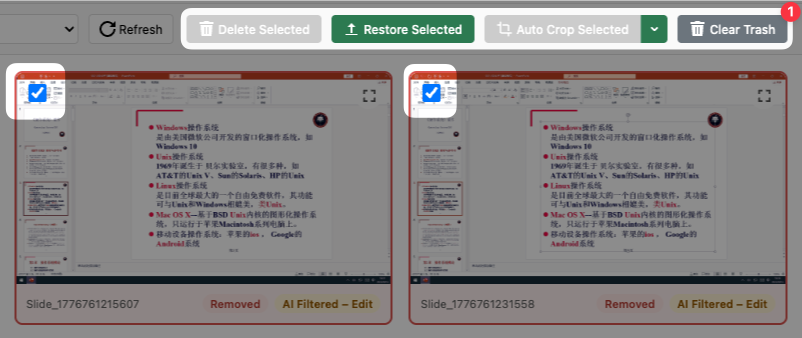
</p>

<br>

#### H. 将幻灯片导出为 PDF

1. 转到 `幻灯片导出` 页面，选择需要导出的文件夹（例如一学期的课程）。文件夹默认按自然顺序排列，也可以拖动调整；文件夹名称和顺序将决定 PDF 大纲标题与章节顺序。
2. 根据需要调整 `压缩选项` 和 `宽高比`，在 `PDF` 和 `PPTX` 中选择导出格式，以及选择 `合并所有文件夹为一个文件` 或 `批量导出多个文件夹为多个文件`，然后点击生成。

<p align="center">
  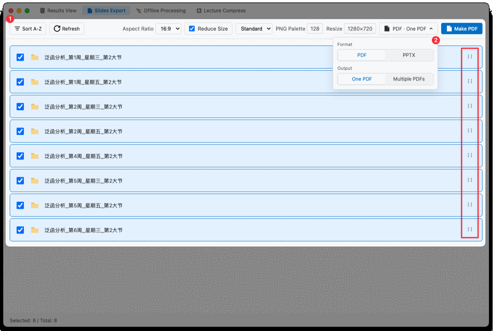
</p>

<br>

#### I. 高级设置

##### 高级设置 > 一般

1. 进入高级设置界面后，可在 `高级设置 > 一般` 中调整主题、语言，或直接使用 `令牌` 登录。
2. 应用运行过程中可能积累较多 `缓存`，建议不定期清理；如果运行异常，可以尝试 `重置所有数据`。`重置所有数据` 不会删除 `输出目录` 下的任何文件。

<p align="center">
  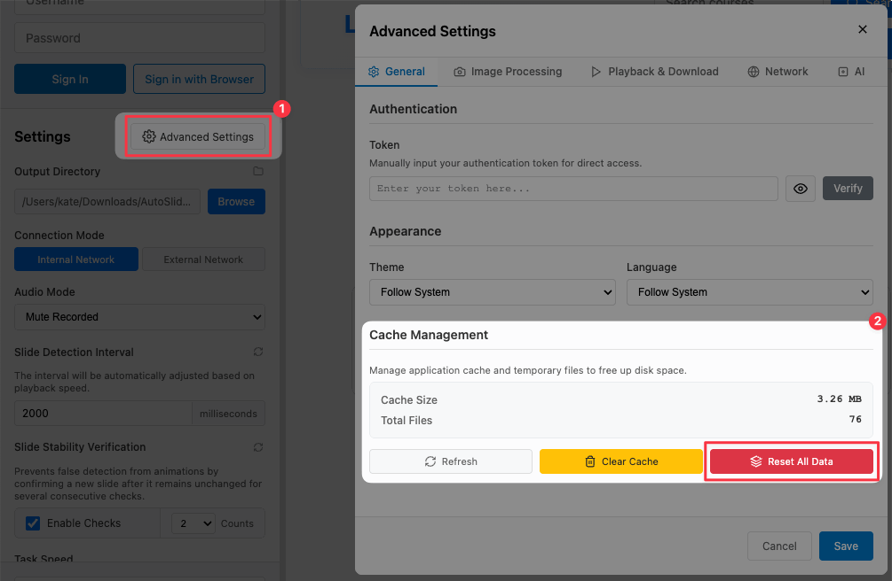
</p>

<br>

##### 高级设置 > 图像处理

1. 应用输出图像使用 PNG 格式，默认 `启用 PNG 色彩压缩`。
- 普通 PNG 图像通常使用“真彩色”模式存储，即每个像素的颜色由红、绿、蓝和透明度四个通道直接定义。这种模式能呈现数百万种颜色，但文件体积较大。
- `压缩 PNG 图像调色盘大小` 通过将普通 PNG 文件颜色量化为 128 种或更少的颜色以显著减小文件体积。
- 对于幻灯片图像，由于幻灯片通常只有有限数量的颜色，压缩的效果较好，视觉损失相对较小，同时文字仍保持清晰锐利。
2. 不建议随意调整图像处理的核心参数 `SSIM 阈值`。更高的 `全局结构相似性阈值` 表示更严格的匹配。可选预设包括：`自适应/严格(0.999)/标准(0.9987)/宽松(0.998)/自定义(0.990-0.9999)`。
- `自适应` 模式针对不同教学楼进行特殊优化，部分教学楼由于设备老旧，视频质量不佳，适用更宽松的阈值。
- `教室位置规则`："综教/理教/研楼" → 宽松；其他位置 → 正常。
- `严格` 模式下，检测的敏感度极高。
- `标准` 模式下，该值相对平衡，能有效检出少量文字增减的情境。

> [!NOTE]
> 建议仅在必要时调整 SSIM 阈值。即便 0.001 的微小变化也可能显著影响性能。使用 [在线测试](https://learn.ruc.edu.kg/test) 👈 或在浏览器中打开 `test-image-comparison.html` 测试和校准 SSIM 算法。

<p align="center">
  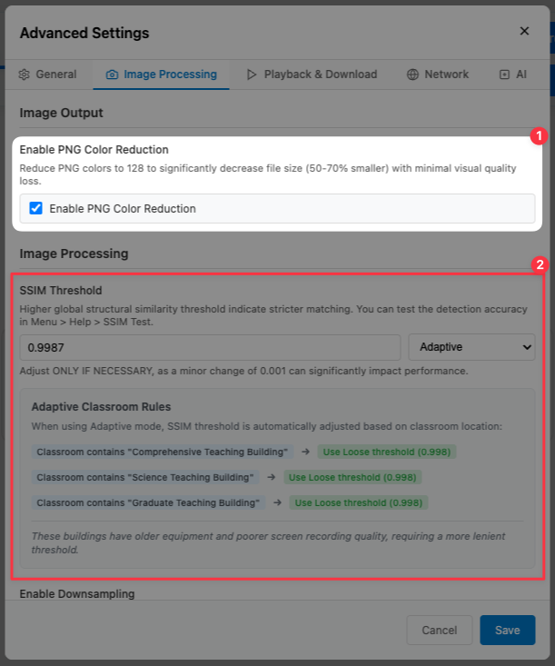
</p>

<br>

---

1. `后处理` 是在获取幻灯片后执行的过滤和排除流程，包含三个阶段：`重复去除`、`比对排除列表` 和 `AI 过滤`。这些阶段默认全部启用，你也可以单独关闭 `AI 过滤`。
2. 如果想统一排除某类图像，例如特殊错误页面，可以将其添加到 `pHash 排除列表`，应用会记录其哈希值用于后续比对。`排除列表` 预置了 `No Signal`、`No Input`、`Black Screen` 和 `Desktop` 等常见排除项的哈希值。

> [!TIP]
> 基于 pHash 的排除仅能有效排除几乎完全一致的图像。建议启用 AI 过滤功能进行智能过滤。
>
> 应用使用 256 位 pHash。不建议调整 256 位 pHash 的汉明距离阈值以更好地与应用整体协同工作。
 
<p align="center">
  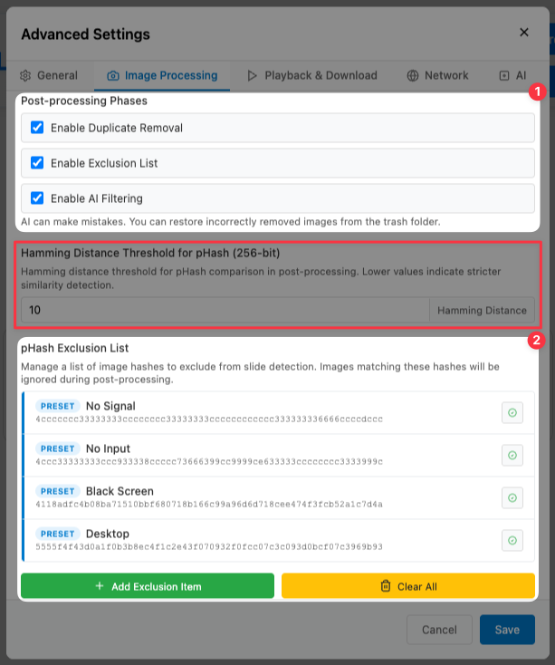
</p>

<br>

---

1. 自动裁剪功能同时使用 `Canny 边缘检测` 算法和 `YOLO` 机器学习模型。默认优先使用 `Canny 边缘检测`；它能精准识别幻灯片边框，但容易受遮挡影响。`YOLO` 模型可靠性更好，能覆盖多数裁剪场景，但裁剪范围可能与幻灯片边缘有轻微偏移。
2. 对于 `Canny 边缘检测` 算法，可调整 `宽高比容差`，即匹配检测到的幻灯片宽高比时，相对常见幻灯片比例 16:9 或 4:3 允许的最大偏差；其他自动裁剪参数不建议进行调整。
 
<p align="center">
  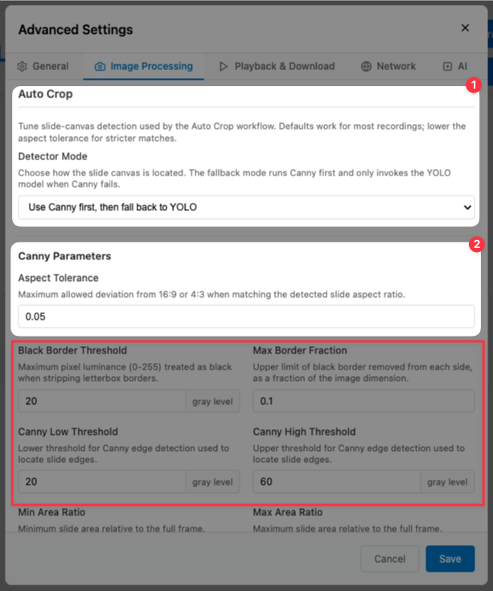
</p>

<br>

##### 高级设置 > 播放和下载

1. `显示更多播放速度` 控制播放模式下是否显示 0.5-16 倍速选项。
2. `阻止系统休眠` 可在视频播放期间阻止系统进入休眠状态，避免播放中断。
 
<p align="center">
  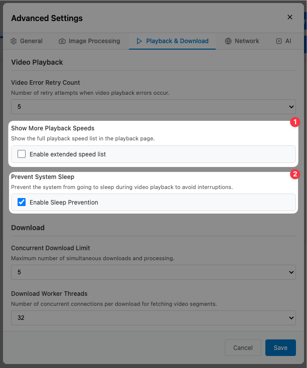
</p>

<br>

##### 高级设置 > 网络

`内网网络接口` 可设置将内网模式流量绑定到指定的本地网络接口。此设置仅作用于经由内网模式的请求，其他流量仍然使用系统默认路由。
 
<p align="center">
  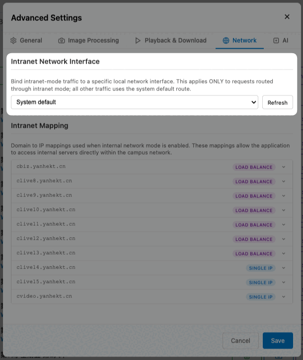
</p>

<br>

##### 高级设置 > AI

1. `ML` 模式基于本地机器学习模型。面对训练数据覆盖不足的场景时，它的准确率可能下降，因此适合使用更保守的置信度阈值。
2. `ML` 和 `LLM` 模式都可以在 `AI 行为` 中选择是否区分 `may_be_slide` 分类，即让模型单独判断图像是否处于幻灯片编辑模式。
 
<p align="center">
  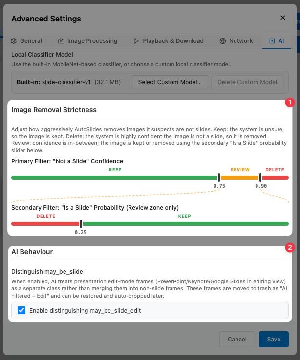
</p>

<br>

#### J. 其他工具

1. `离线处理` 是实验性工具。`离线后处理` 可输入图像文件夹，将其复制到 `输出目录` 并运行后处理；`自动裁剪` 可输入图像文件，运行自动裁剪并查看结果。

<p align="center">
  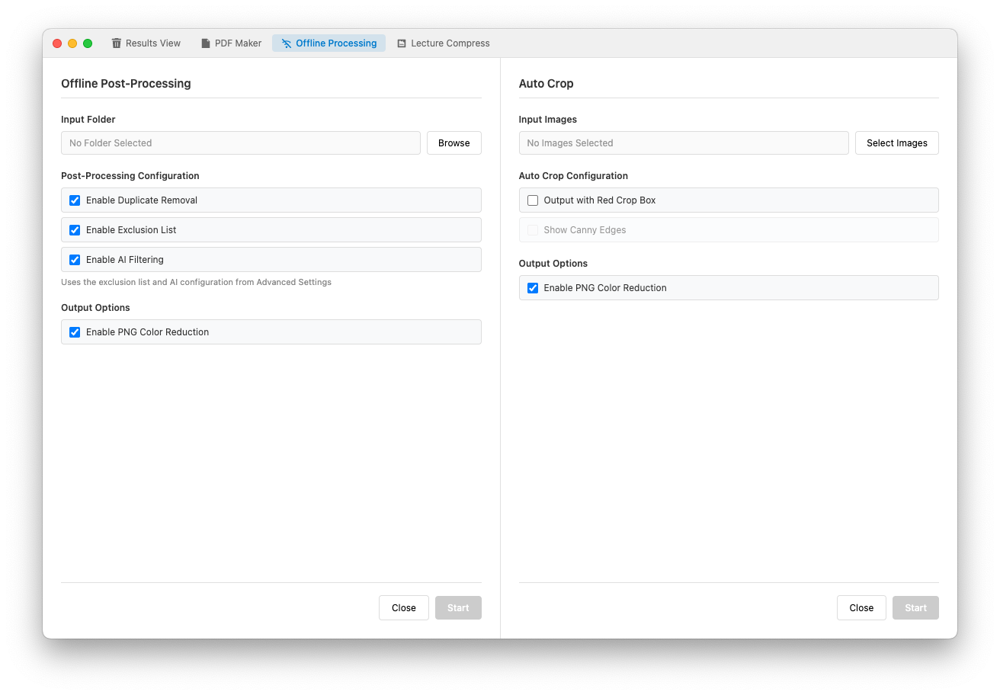
</p>

<br>

---

2. `讲座压缩` 可对下载的屏幕录制视频进行激进压缩，便于长期存档。它会降低帧率和分辨率，并可降低音频噪声，以较小文件体积保留基本可读性和相对清晰的音频。

<p align="center">
  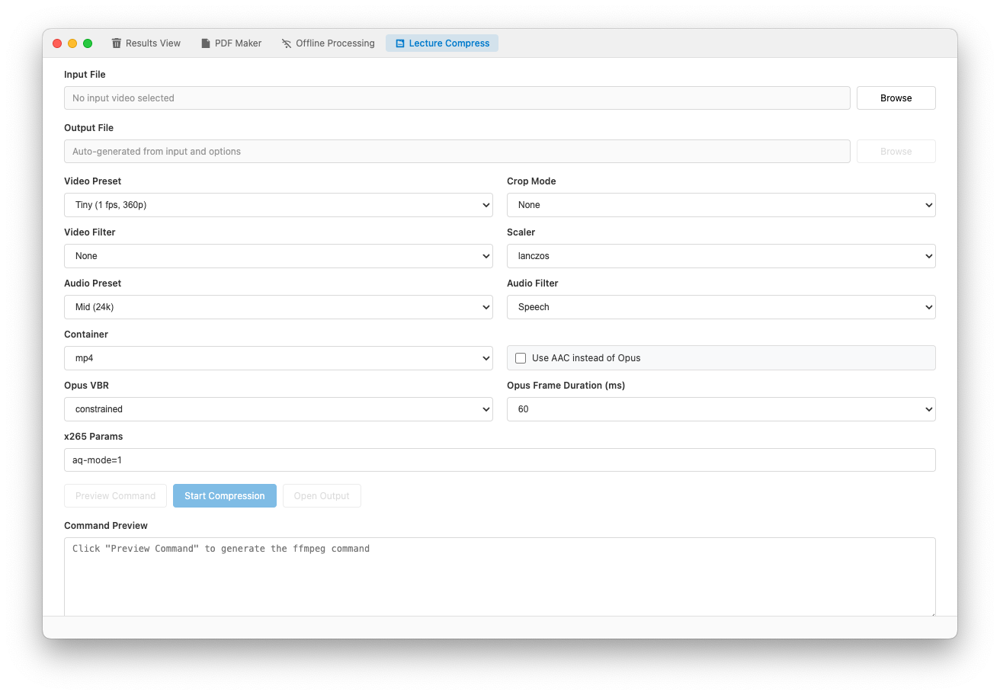
</p>

<br>

#### K. 扩展

1. `雨课堂` 扩展可解决该平台原生课件导出带边框和水印的问题；如果教师使用雨课堂播放幻灯片，通常可在课程开始时一次性获取当前课件的所有页面。

<p align="center">
  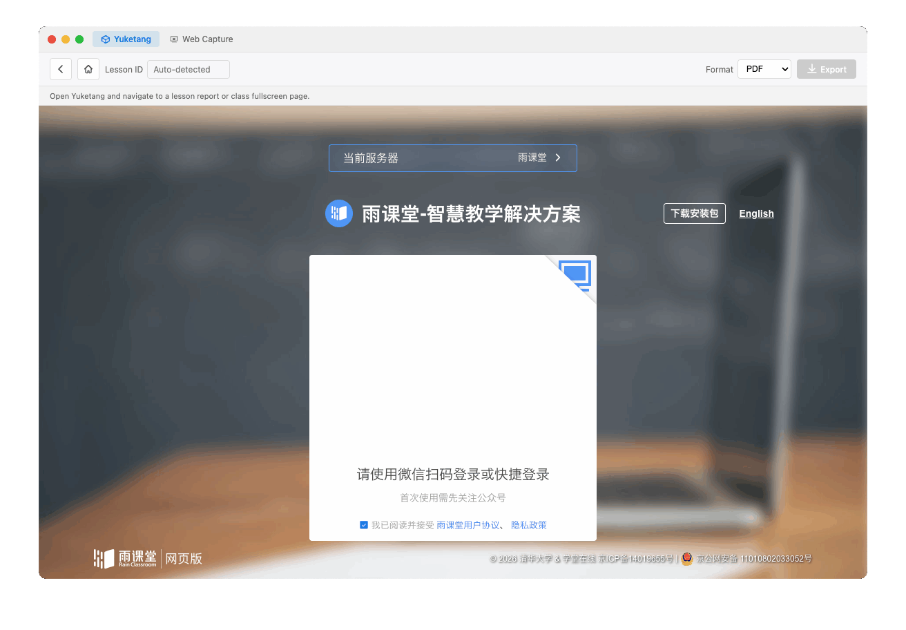
</p>

<br>

---

2. 如果希望对任意网页视频运行幻灯片提取，可以使用 `网页捕获` 扩展。它支持手动输入网址、自动检测或手动选择页面视频元素，也支持绘制页面区域并持续监控画面变化。点击右上角的 `预设` 按钮可进入并自动登录延河官方网页。

<p align="center">
  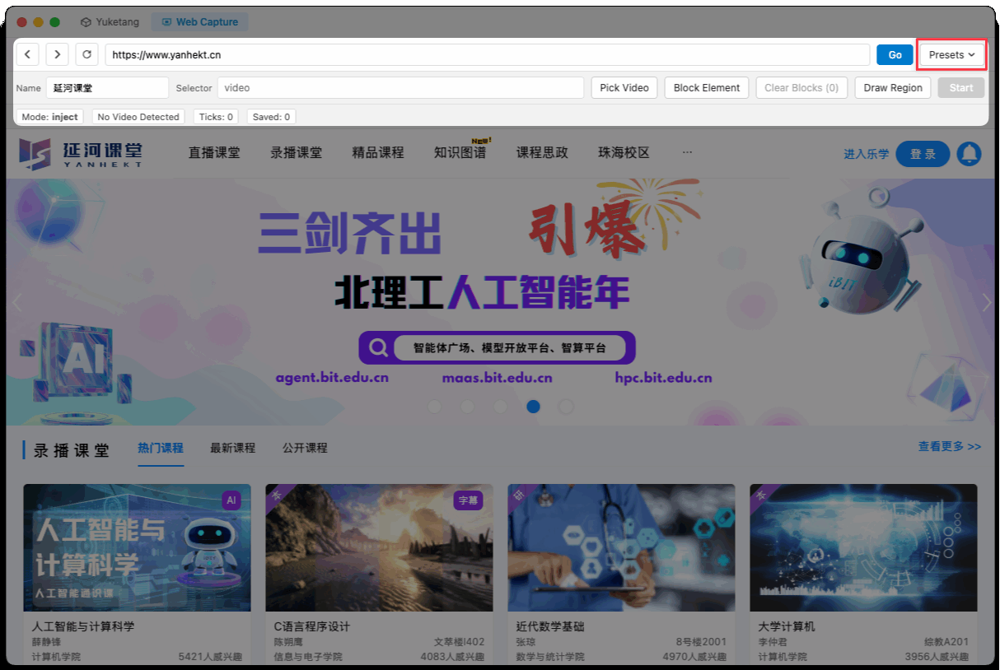
</p>

## 🏗️ 架构设计

AutoSlides 使用 Electron + Vue 3 + TypeScript 构建，采用多进程架构：主进程负责系统服务、网络代理和文件操作；渲染器负责 UI 和轻量计算；Web Worker 承载图像处理等 CPU 密集任务。详细的进程模型、模块依赖、IPC 通信、状态机、流水线设计、构建系统等完整架构说明请参阅 [ARCHITECTURE.md](ARCHITECTURE.md)。

图像分析算法（SSIM、pHash、ML 分类、自动裁剪）的技术细节和数学推导请参阅 [AutoSlides Image Analysis Technical Report](docs/image-analysis-technical-report.pdf)。

### 为什么推荐组合使用 `AutoSlides` 和 `AutoSlides Extractor`？

因为 `AutoSlides Extractor` 基于 C++ 构建，对于视频解码、逐帧分析、SSIM 计算等性能任务，C++ 实现直接调用 FFmpeg、OpenCV 和平台原生硬件能力，减少跨运行时开销；同时更精确地管理内存，使用分块处理、内存池、零拷贝缓冲区和 RAII 自动释放。C++ 版本还可以充分利用 CPU 指令集和硬件加速，包括 Apple Silicon 的 NEON、Intel/AMD 的 SSE/AVX/AVX2/AVX512，以及 VideoToolbox、CUDA、DirectML、OpenCL、Metal 等平台能力，把高强度的帧提取和相似度计算交给更适合这类任务的原生引擎。

### 开发者指南

所有开发命令都在 `autoslides/` 子目录中运行：

```bash
cd autoslides
npm start              # 启动开发服务器（热重载）
npm run lint           # 运行 ESLint（含领域边界规则）
npm test               # 运行单元测试 (Vitest)
npm run package        # 打包应用
npm run make:mac       # 生成 macOS DMG
npm run make:win       # 生成 Windows 安装包
npm run make:linux     # 生成 Linux AppImage/deb
```

代码变更后建议运行验证：

```bash
npx tsc --noEmit       # 类型检查
npm run lint           # Lint 检查
npm start              # 启动应用，确认 3 个窗口无控制台错误
```

开发约定：

- 主进程服务按领域组织（`platform`、`infra`、`video`、`extraction`、`ai`、`export`、`download`），IPC 处理器通过 `IpcServices` 依赖注入接收服务实例，禁止直接导入单例。
- 渲染器 Feature 领域之间禁止互相导入（ESLint `no-restricted-imports` 强制）；共享逻辑放入 `@shared/*`。
- 新增持久化设置时，先扩展 `src/shared/types.ts` 中的 `AppConfig` 类型和 `src/main/platform/config/defaults.ts` 中的默认值。
- 耗时图像处理应放入 Web Worker；需要文件系统、Sharp、FFmpeg 或模型文件时，通过主进程 IPC 处理。
- 新增界面文案时同步更新 `src/renderer/shared/i18n/locales/` 下的多语言文件。
- CSS 颜色必须引用 `src/renderer/shared/styles/theme.css` 中的变量，不使用硬编码色值。
- 更多架构细节请参阅 [ARCHITECTURE.md](ARCHITECTURE.md)。

## Star History

<div align="center">
  <a href="https://www.star-history.com/?repos=bit-admin%2FYanhekt-AutoSlides&type=date&legend=top-left">
   <picture>
     <source media="(prefers-color-scheme: dark)" srcset="https://api.star-history.com/image?repos=bit-admin/Yanhekt-AutoSlides&type=date&theme=dark&legend=top-left" />
     <source media="(prefers-color-scheme: light)" srcset="https://api.star-history.com/image?repos=bit-admin/Yanhekt-AutoSlides&type=date&legend=top-left" />
     
   </picture>
  </a>
</div>

---

<div align="center">
<p>Copyright © 2025 bit-admin.</p>
<p>
<a href="https://learn.ruc.edu.kg">Website</a> •
<a href="mailto:info@ruc.edu.kg">Email</a> •
<a href="https://it.ruc.edu.kg/docs">Docs</a>
</p>
</div>
