<div align="center">

  

  # AutoSlides
  
  **北京理工大学延河课堂第三方客户端｜自动提取幻灯片｜下载课程录像｜AI 过滤与审查**

  <p>
    
    
    
    
  </p>

  <p>
    
    
    
  </p>

  <p>
    <a href="#-快速开始">🚀 快速开始</a> • 
    <a href="#-功能特性">✨ 功能特性</a> •
    <a href="#-架构设计">🏗️ 架构设计</a>
  </p>

</div>

---

> [!CAUTION]
> **Disclaimer**: This tool is intended strictly for personal study; users assume full legal responsibility for ensuring their usage complies with all applicable copyright laws and platform regulations. Terms and Conditions apply.
> <br> **免责声明**：本工具严格仅供个人学习之用；用户须自行承担全部法律责任，确保其使用符合所有适用的版权法及平台规例。受条款及细则约束。
>
> <p align="center"><a href="https://learn.ruc.edu.kg/terms">Read full Terms and Conditions / 按此查阅完整条款及细则</a></p>
> 
> This tool is NOT an official application of, and is NOT affiliated with, associated with, endorsed by, or in any way connected to Beijing Institute of Technology (BIT), or any of their subsidiaries or affiliates. All product and company names are trademarks™ or registered® trademarks of their respective holders.
> <br> 本工具**并非**北京理工大学（BIT）的官方应用程式，亦与其或其任何附属机构或关联方无任何关联、联系、获其认可或以任何方式相关。所有产品及公司名称均为其各自持有人的商标™或注册®商标。

## ✨ 功能特性

- 通过本地代理和防盗链适配支持延河课堂直播、录播播放与课程录像下载。
- 针对校园网访问链路优化，录播支持 0.5-16 倍速流畅播放；有线校园网下载峰值快至 110MB/s<sup>1</sup>。
- 播放视频的同时自动提取幻灯片，无需预先下载视频；145 分钟课程可在 16 倍速下约 10 分钟处理完成。
- 多标签页并行：可同时打开多个播放标签页，任务队列亦可并行处理多门录播；切换页面时后台播放与提取不中断。
- 任务队列运行期间可阻止系统休眠，适合批量、长时间处理课程录像。
- 结合 SSIM、pHash、LLM 或本地 ML 分类器过滤重复页面、非幻灯片画面和编辑模式截图。
- 工作区 `课程幻灯片` 按课程文件夹审查提取结果，支持恢复、删除、自动裁剪、基准裁剪，导出 PDF / PPTX。
- 工作区 `课程视频` 管理本地录像，双流同步播放，可按幻灯片时间轴跳转，并压缩、重命名屏幕录像。
- 工作区 `云存储` 同步延河课堂笔记、导入导出幻灯片、浏览 `公共索引`；观看时可记 `随堂笔记`。
- 校园网登录支持短信验证码；可保存并切换多个学工号。
- 另有 `网页版` 支持移动设备使用<sup>2</sup>。

<table>
  <tr>
    <td width="50%" align="center">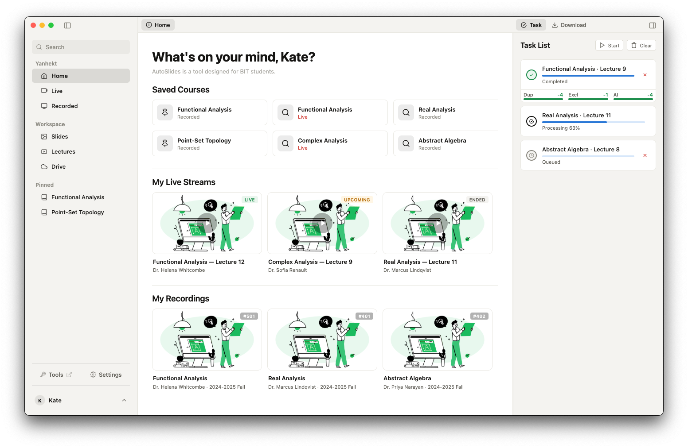</td>
    <td width="48%" align="center">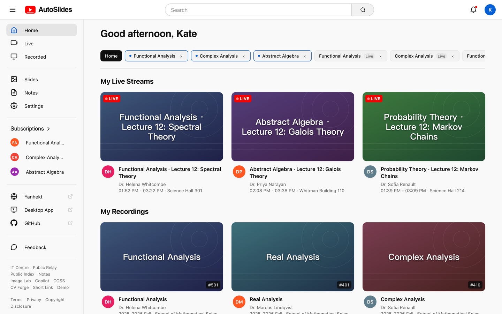</td>
  </tr>
  <tr>
    <td align="center"><b>桌面版</b></td>
    <td align="center"><b>网页版</b></td>
  </tr>
</table>

<sup>1</sup> 以有线方式连接到校园网时，下载峰值速率可达120MB/s；在 Wi-Fi 下速率较慢。

<sup>2</sup> 网页版直连延河课堂直播服务器，并通过中继服务器提供录播视频播放支持；录播播放速率可能受限。

### 相关项目

<table>
  <thead>
    <tr>
      <th width="120">项目 / 类别</th>
      <th width="190">仓库 / 文档</th>
      <th>描述</th>
    </tr>
  </thead>
  <tbody>
    <tr>
      <td>
        <a href="https://learn.ruc.edu.kg">网页版</a> 👈
      </td>
      <td>
        <a href="web/README.md">web/README.md</a>
      </td>
      <td>
        浏览器里的 AutoSlides：免安装，边看边提取幻灯片，导出 PDF / ZIP，同步延河课堂云端笔记；手机与平板同样可用。查看<a href="https://learn.ruc.edu.kg/demo/">在线演示</a> 👈。
      </td>
    </tr>
    <tr>
      <td>
        <a href="https://share.ruc.edu.kg">公共索引</a> 👈
      </td>
      <td>
        <a href="share/README.md">share/README.md</a>
      </td>
      <td>
        AutoSlides 的分享端：把整套课件做成一条链接分享出去，或公开到公共索引，让别人按课程、老师、学院搜到——提取一门课之前，也可以先来看看有没有人上传过。查看<a href="https://share.ruc.edu.kg/demo/">在线演示</a> 👈。
      </td>
    </tr>
    <tr>
      <td>
        <a href="https://relay.ruc.edu.kg">公共中继</a> 👈
      </td>
      <td>
        <a href="relay/README.md">relay/README.md</a>
      </td>
      <td>
        录播视频中继：把延河课堂的签名防盗链处理为任何 HLS 播放器都能播的地址，网页版的录播播放经由它完成。只对校园网开放，在此<a href="https://relay.ruc.edu.kg">检查网络连接</a> 👈。
      </td>
    </tr>
    <tr>
      <td>提取器工具</td>
      <td>
        <a href="https://github.com/bit-admin/AutoSlides-Extractor">bit&#8209;admin/AutoSlides-Extractor</a>
      </td>
      <td>
        从下载的屏幕录制中提取幻灯片；处理一节课的视频用时快至 10 秒；支持 GPU 加速；使用 C++ 构建；使用与 <code>AutoSlides</code> 相同的图像处理算法及基于 <code>MobileNetV4</code> 的机器学习模型。
      </td>
    </tr>
  </tbody>
</table>

---

## 🚀 快速开始

### 1. 下载

- 前往 [release 页面](https://github.com/bit-admin/Yanhekt-AutoSlides/releases) 👈 下载适用于你平台的安装程序（macOS 用户下载 `DMG` 文件；Windows 用户下载 `EXE` 文件；Linux 用户下载 `AppImage` 或 `deb` 文件）。

### 2. 安装 AutoSlides
   - **macOS**：打开 `.dmg` 安装包，将应用图标拖动到 `Applications` 文件夹。
      - 双击安装包内的 `install.command` 文件运行安装脚本。若看到“Apple 无法验证安全性”的提示，先关闭该提示。
      - 打开 `系统设置 > 隐私与安全性`，如图所示，点击 `仍要打开`。
      - 在终端中输入你的 Mac 密码（注意密码输入时不会显示）。

<p align="center">
  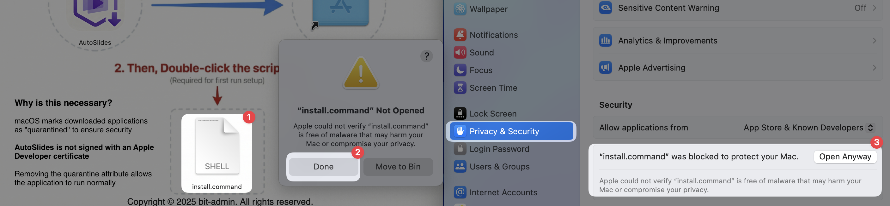
</p>

> [!IMPORTANT]
> - macOS 将下载的应用程序标记为"隔离"以确保安全。
> - AutoSlides 未使用 Apple 开发者证书签名。
> - 除了双击 `install.command` ，你也可以手动在终端运行以下命令删除隔离属性允许应用程序正常运行：
>   ```shell
>   sudo xattr -d com.apple.quarantine /Applications/AutoSlides.app
>   ```

   - **Windows**：运行 `.exe` 安装程序，并按照安装向导操作。

   - **Linux**：
     - **AppImage**：下载 `.AppImage` 文件，添加执行权限后直接运行：
       ```bash
       chmod +x AutoSlides-*.AppImage
       ./AutoSlides-*.AppImage
       ```
     - **Deb 包**（Debian/Ubuntu）：
       ```bash
       sudo apt install ./autoslides-*.deb
       ```

### 3. （可选）安装 [AutoSlides Extractor](https://github.com/bit-admin/AutoSlides-Extractor) 👈

`AutoSlides Extractor` 是一个独立的 C++ 应用程序，它在本地视频文件上提取幻灯片，并支持硬件加速，比在播放过程中实时捕获更快，适合需要快速、批量获取课程幻灯片的情况。`AutoSlides` 主应用可通过对每个下载完成的屏幕录制自动调用外部的 `AutoSlides Extractor CLI` 加速幻灯片提取。

1. 在 `设置 > 下载与播放 > 下载完成后自动提取` 界面点击 `安装提取器`，应用会从 GitHub 拉取最新版本并引导你完成下载安装。
2. 当检测到已安装 `AutoSlides Extractor` 后（界面右上角显示 `Ready` 及版本号），可勾选 `下载完成后自动使用 C++ 提取器提取幻灯片`；你也可以手动 `浏览` 指定 `AutoSlides Extractor` 可执行文件的安装位置。

<p align="center">
  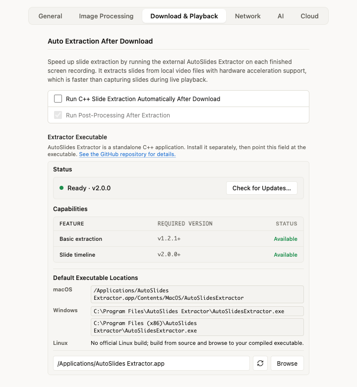
</p>

> [!TIP]
> 这一步是可选的，`AutoSlides` 主应用并不依赖 `AutoSlides Extractor`。你可以正常使用所有基于在线视频播放的幻灯片提取功能。惟 `下载完成后自动使用 C++ 提取器提取幻灯片` 功能需要额外下载 `AutoSlides Extractor`。
>
> **两个工具组合使用速度更快**：使用 `AutoSlides` 下载一节 95 分钟课程的屏幕录制视频在校园网内用时约 10 秒；使用 `AutoSlides Extractor` 处理该视频（I-frame 间隔 2 秒）在 M4 Mac mini 上用时约 10 秒。

### 4. 首次启动向导

首次启动时，应用会弹出一个简短的引导向导，带你快速完成几项基础配置。这些选项之后都可以在 `设置` 中随时修改。

<p align="center">
  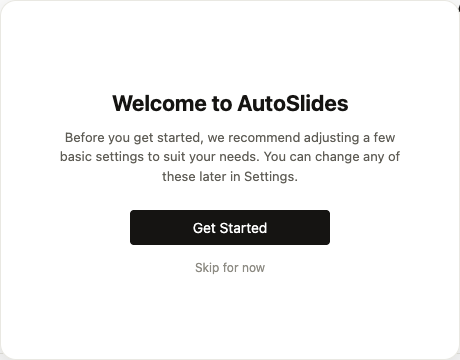
</p>

向导依次引导你设置：**输出目录**（幻灯片、下载与导出文件的保存位置）、**连接模式**（校园内网 / 外网）、**音频模式**（直播 / 录播是否静音），以及可选的 **GitHub Copilot AI 过滤**（使用 GitHub 登录以启用免费的 gpt-4.1 模型来过滤非幻灯片画面）。随后是 **登录延河课堂**（支持短信验证码）和可选的 **云存储** 初始化。任务速度与并行任务数改在 `设置 > 一般` 中调整（默认任务速度为 16 倍）。

<p align="center">
  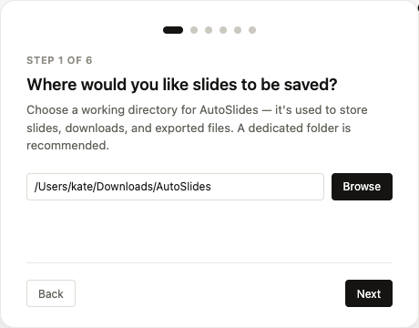
  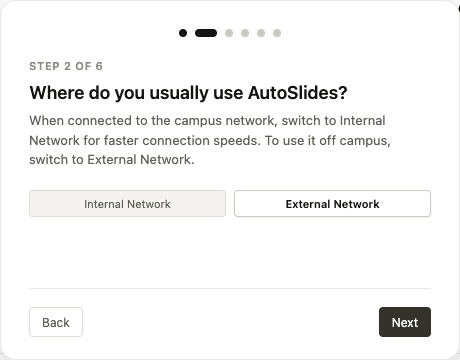
  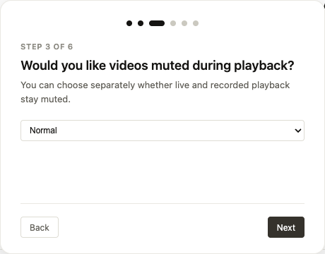
</p>
<p align="center">
  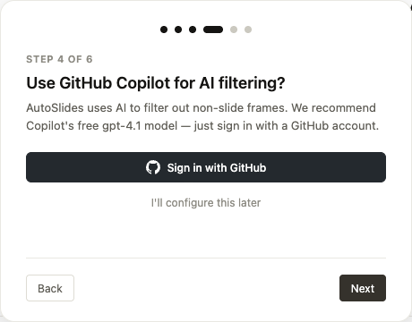
  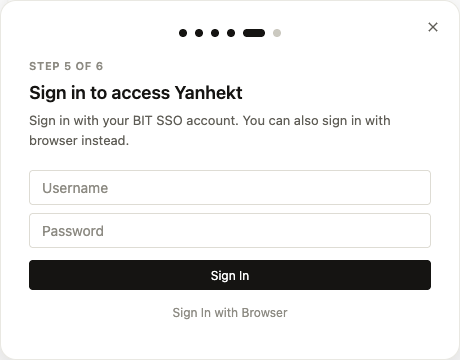
  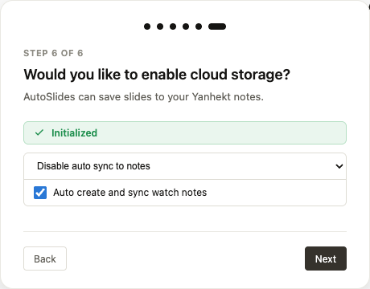
</p>

### 5. 使用与设置

#### A. 登录

1. 你可以直接使用北京理工大学统一身份认证账户密码登录。若校园网要求短信二次验证，应用会在登录框内提示输入 6 位验证码。
2. 点击 `浏览器登录` 后，应用会在内置浏览器中打开官方登录界面。登录并跳转到延河课堂页面后，应用会自动获取延河课堂令牌。浏览器登录仍可作为验证码失败或需要图形验证码时的备选。

<p align="center">
  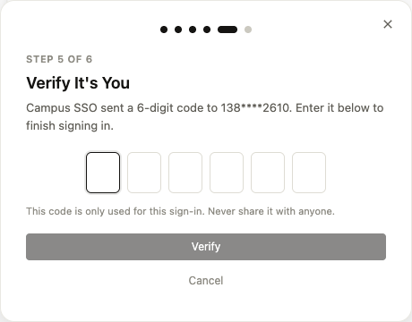
  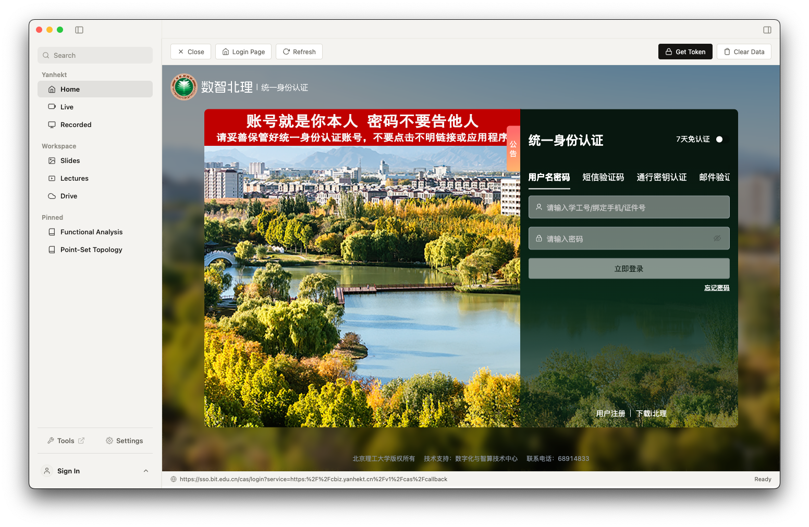
</p>

3. 侧栏底部的用户菜单支持 `切换账号` / `添加账号`，可保存多个学工号并一键切换。

<p align="center">
  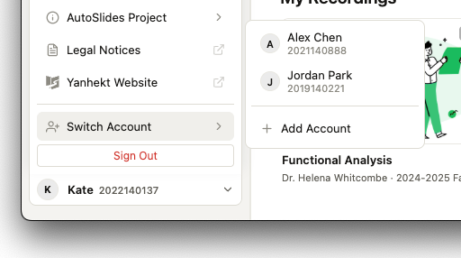
</p>

<br>

#### B. 界面概览

应用采用三栏布局：左侧为导航边栏，中间为内容区（持久的浏览标签页 + 多个播放标签页），右侧为 `任务` / `下载` / `笔记` 切换面板。工作区页面会自动收起右侧栏。

左侧从上到下是：

- `主页`、`直播课程`、`录播课程`，以及顶部的 `搜索` 框
- `工作区`：`课程幻灯片`、`课程视频`、`云存储`
- `置顶` 的录播课程
- 底部的 `工具`、`设置`，以及用户菜单

`直播课程` 和 `录播课程` 可以同时运行；切换页面时，正在播放的视频不会被中断。点击侧栏导航会回到浏览标签页，已打开的播放标签页继续在后台提取。

<p align="center">
  
</p>

<br>

#### C. 基础设置

所有设置集中在主窗口的 `设置` 页面中。顶部是分段标签：`一般`、`图像处理`、`下载与播放`、`网络`、`AI`、`云端`。改动不会立刻生效，需点击右下角 `保存`；`取消` 或切走页面会丢弃未保存的更改。

在 `设置 > 一般` 中：

1. 根据需要调整 `输出目录`，默认路径为 `~/Downloads/AutoSlides`（建议设置为独立文件夹）。
2. 在校园网内使用时，将 `连接模式` 切换为 `内网模式`，通常可获得更稳定的连接体验和更快的课程资源访问速度。若已开内网模式但探测不到校园网，主页会提示你切换到外网或检查网卡。
3. 根据需要调整 `音频模式`，也可以让应用全程静音运行。
4. `任务速度` 为任务队列中录播视频的播放速度。
5. `并行任务数` 控制任务队列同时处理的录播数量；`最大播放标签数` 控制可手动打开的播放标签页上限。

<p align="center">
  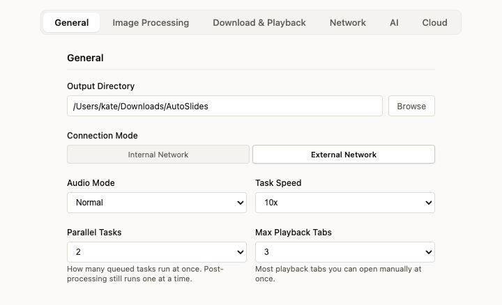
</p>

在 `设置 > 图像处理` 中可配置幻灯片提取的核心参数：

- `幻灯片检测间隔` 为视频以 1 倍速播放时检测新幻灯片的时间间隔。实际检测间隔会随播放速度自动调整。
- `幻灯片稳定性复核` 启用后需多次检测确认幻灯片稳定，排除动画、视频、轻微移动等内容。此设计基于“演讲者通常将停留在同一幻灯片一段时间进行讲解”的假设。

<p align="center">
  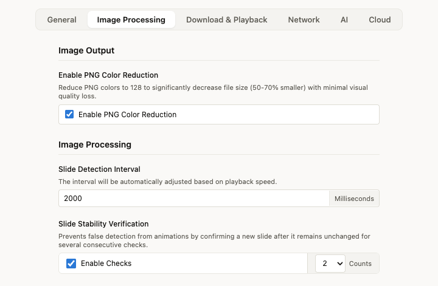
</p>

- `自动后处理` 控制是否在幻灯片提取后自动执行排除、过滤等后处理步骤：
  - `观看模式`：每保存一张幻灯片时处理（直播和手动观看录播）。
  - `任务模式`：队列中每个任务完成后再处理。
- `后处理阶段` 默认开启去重、排除列表和 AI 过滤。当 AI 认定画面为处于幻灯片编辑界面时，可：
  - `自动裁剪 AI 过滤 – 编辑`：尝试自动裁剪掉周围的软件界面；若成功则保留为幻灯片；
  - `自动裁剪后重新检查重复`：裁剪完成后再次进行去重处理。

<p align="center">
  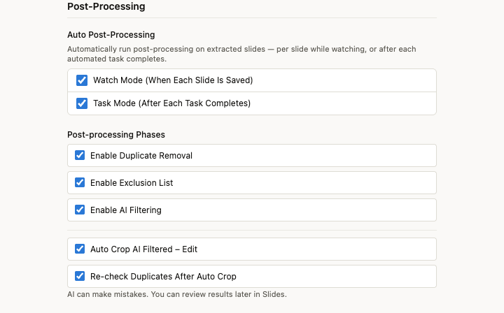
</p>

> [!TIP]
> 在 `幻灯片稳定性复核` 启用，`检查次数` 为 `2` 且 `幻灯片检测间隔` 为 `2000` 毫秒的情况下，一张幻灯片只有“稳定”显示至少 `6` 秒才会被保存。如果演讲者快速翻动幻灯片，部分显示时长过短的幻灯片在 `幻灯片稳定性复核` 启用时将不会被保存。
>
> 这样设计是因为翻动过快的幻灯片即使在课堂上认真听讲也很难及时记录。如果你认为被跳过的幻灯片非常重要，可以在观看课程视频时手动暂停。

<br>

#### D. AI 设置

1. 在 `设置 > AI` 中配置 AI 服务。图像分类可选择两种运行方式：`LLM` 模式调用云端多模态大语言模型 API，`ML` 模式在本机运行机器学习模型。`LLM` 模式通常更准确，`ML` 模式则更快，并且不依赖外部服务。
2. `LLM` 模式 `内置服务` 在一定期限内提供 `免费模型`。`免费模型` 列表可能会不时进行调整，且**共享服务的可用性视实际负载而定**。你也可以使用 GitHub Copilot 登录，或填写自定义服务的 `API Base URL`、`API Key` 和 `模型名称`。了解更多：[AI 配置及 GitHub 教育优惠文档](https://it.ruc.edu.kg/zh/docs)。

<p align="center">
  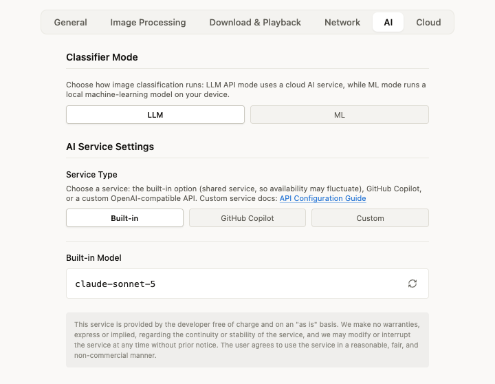
</p>

> [!TIP]
> AI 可能出错。核查 AI 的分类结果。

> [!IMPORTANT]
> The Built-in service is provided by the developer free of charge and on an "as is" basis. We make no warranties, express or implied, regarding the continuity or stability of the service, and we may modify or interrupt the service at any time without prior notice.
> <br> 开发者免费并按“原样”基础提供内置服务。我们不对服务的连续性或稳定性作出任何明示或隐含的保证，并可能随时修改或中断服务，恕不另行通知。

<br>

#### E. 浏览课程

1. 点击 `录播课程` 或 `直播课程` 可进入对应的课程列表；或者使用顶部的 `搜索` 在全校课程中检索。你还可以观看任意正在直播的课程，即便你并未注册该课程。
2. 在 `主页` 的收藏夹中保存你常看课程的关键词，即可一键快速搜索。
3. 在录播节次页可以把课程 `置顶` 到侧栏和主页，并与延河课堂的订阅同步。

<p align="center">
  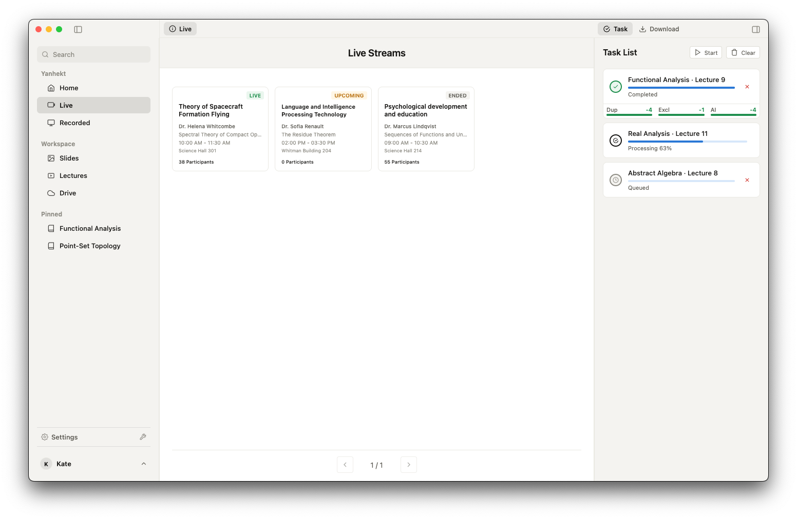
  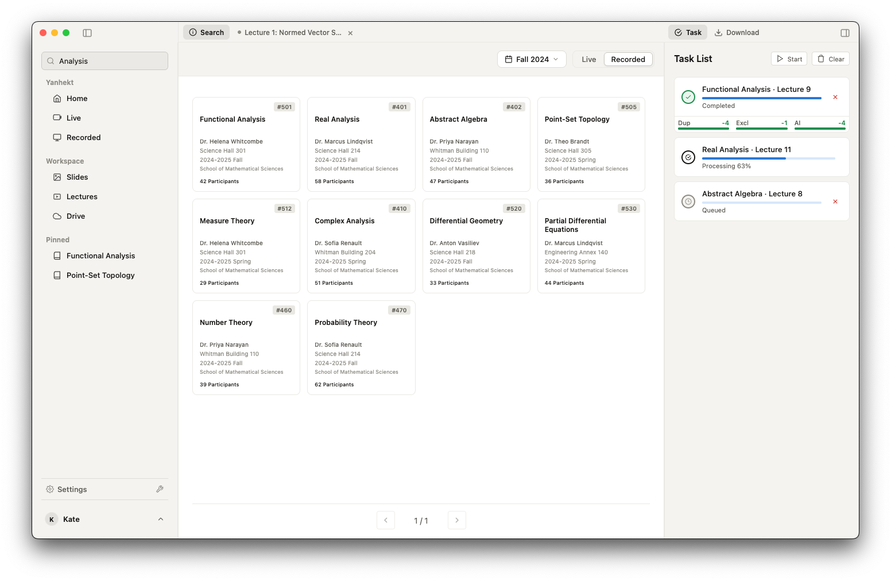
</p>

<br>

#### F. 录播课程播放与下载

1. 在 `录播课程` 网格中选择课程后，进入节次列表。可将具体节次添加到 `幻灯片提取任务列表`，也可下载 `课堂摄像头录像` 和 `屏幕录制` 视频。
2. 你也可以一次性将课程的所有节次添加到 `任务列表` 或 `下载队列`。
3. 如果只是想认真观看课程录像，可以直接点击某一节次的 `播放`，无需加入幻灯片提取任务列表。
4. 在右侧栏中可管理 `任务列表` 及 `下载队列`；在 `任务列表` 中点击 `开始` 启动任务队列。提取或下载仍在进行时关闭窗口，应用会先确认，以免任务做到一半被掐掉。

<p align="center">
  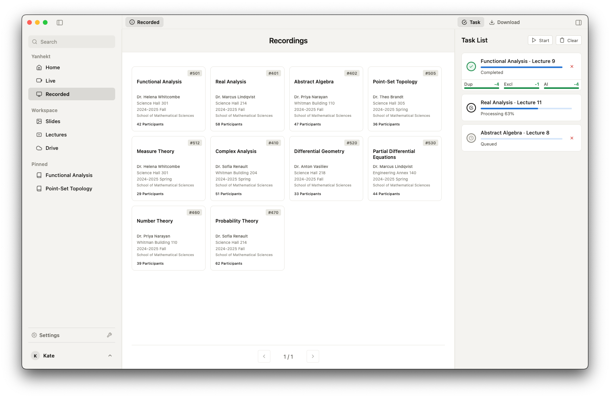
  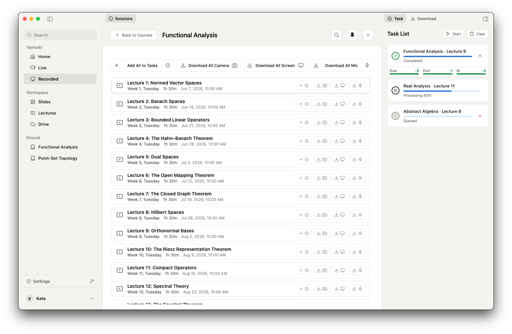
</p>

<br>

---

处于观看模式时，可以同时观看 `屏幕录制` 和 `课堂摄像头` 视频；每个播放标签页相互独立，可在后台继续播放与提取。播放器支持键盘快捷键：空格 / `K` 播放暂停，方向键 ±5 秒，`M` 静音，`F` 全屏。

<p align="center">
  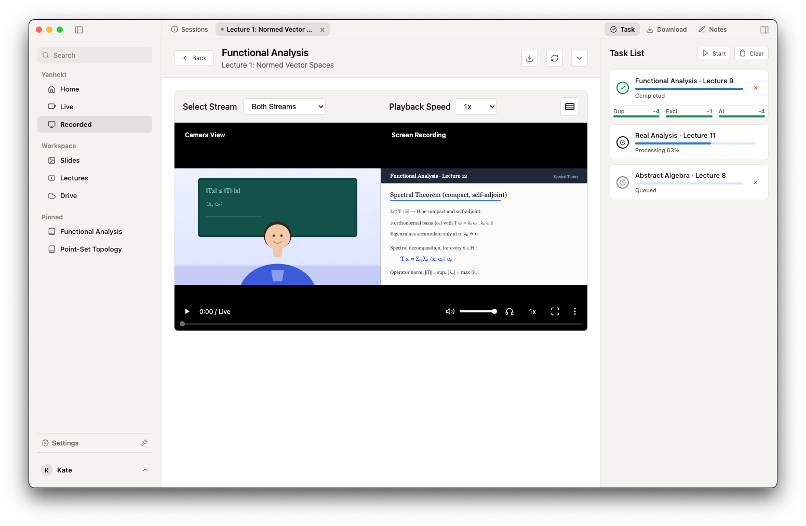
</p>

<br>

#### G. 幻灯片提取

1. 启动录播课程的 `幻灯片提取任务` 后，应用会依次按 `任务速度` 播放课程屏幕录制，并自动启动幻灯片提取。`任务列表` 中会显示任务进度，以及已完成项目的 `后处理` 状态（去重 / 排除 / AI 三个阶段的进度条）。
2. 在播放页面，可以通过控制栏选择 `视频源`、调整 `播放速度`，或进入 `画中画` 模式（控制栏仅在 `观看模式` 下可操作；录播课程处于 `任务模式` 时会被禁用，直播课程始终处于 `观看模式`）。
3. 切换到 `屏幕录制` 单流视图后，播放页面下方会显示 `幻灯片提取预览画廊`；在 `观看模式` 下可以手动开启或停止 `幻灯片提取`，也可随时手动触发 `后处理` 或 `删除` 已提取的幻灯片。
4. 录播提取会在幻灯片文件夹中输出时间轴（`timeline.json`），记录每一页出现的时间，供 `课程视频` 播放器跳转，以及分享链接使用。直播不会生成时间轴。

<p align="center">
  
</p>

<p align="center">
  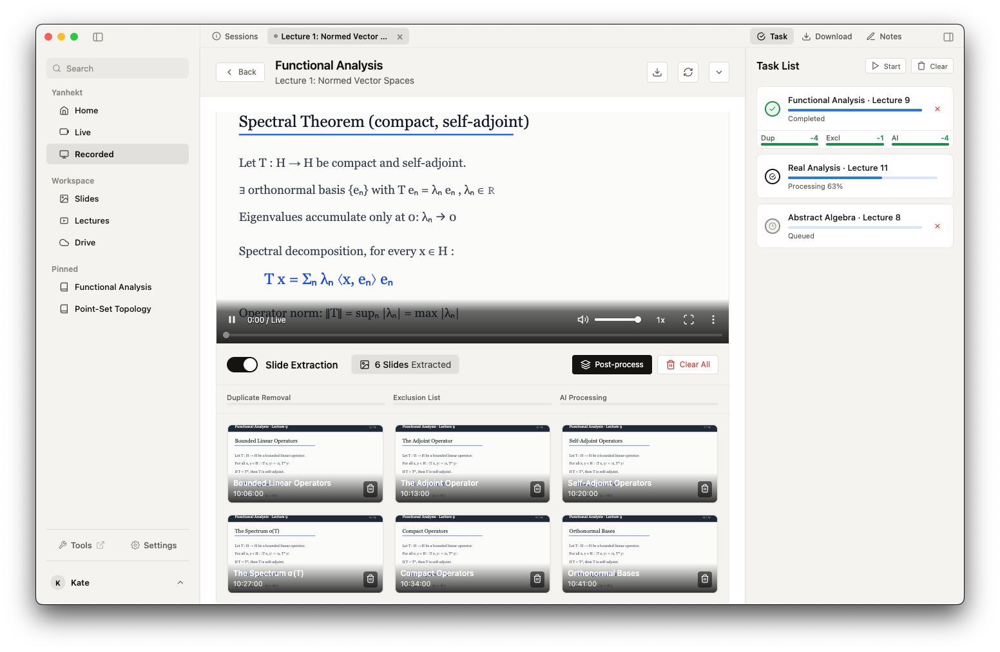
</p>

<br>

---

当 `下载完成后自动使用 C++ 提取器提取幻灯片` 功能启用时，下载屏幕录制视频会在下载完成后自动运行 `幻灯片提取` 和 `后处理`；`下载队列` 中每个项目下方会显示提取与三阶段后处理的进度。Extractor 2.0.0 及以上在兼容模式下也可以输出时间轴。

<p align="center">
  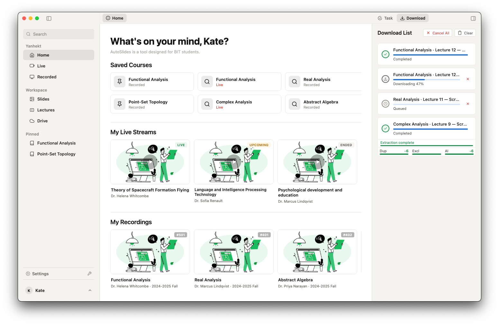
</p>

若在 `设置 > 云端` 中开启 `自动创建并同步随堂笔记`，处于观看模式并开始提取时，右侧栏会多一个 `笔记` 页：后处理确认保留的幻灯片会自动追加到延河课堂的随堂笔记中，你可以在观看过程中自由编辑随堂笔记。

<p align="center">
  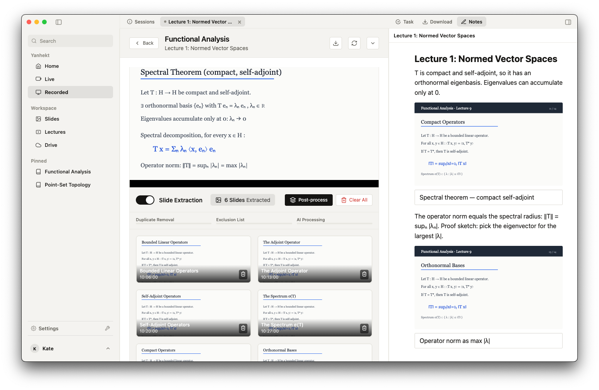
</p>

#### H. 工作区：课程幻灯片

审查与导出都在左侧 `工作区 > 课程幻灯片`。

1. 点击进入 `课程幻灯片`，查看按 `课程` 分组的文件夹列表，并可进入某个文件夹后查看其图像。
2. 如需删除文件夹，点击 `选择` 并勾选目标文件夹。删除文件夹时，与该文件夹关联的回收站项目和裁剪前原始图像备份也会一并删除。
3. 同一 `选择` 模式也用于导出：勾选文件夹后可设置压缩、宽高比与格式，生成 PDF 或 PPTX（合并为一个文件，或按文件夹批量导出）。文件夹名称和顺序将决定 PDF 大纲标题与章节顺序。还可以 `导入到笔记` 或 `发布到索引`。

<p align="center">
  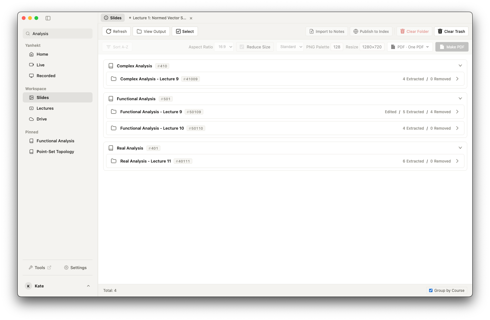
</p>

<p align="center">
  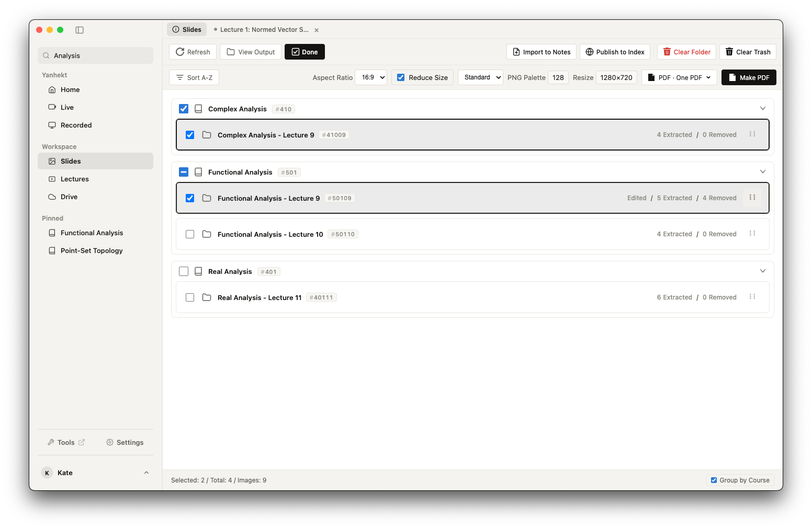
</p>

<br>

---

进入某个文件夹后，可同时查看 `已提取` 与 `已移除` 的图像：

1. 可在 `保留上下文`、`仅看已提取` 和 `仅看已移除` 视图之间切换。
2. 对于被移除的幻灯片，使用移除原因进行筛选，包括 `重复`、`已排除`、`AI 过滤 - 非幻灯片`、`AI 过滤 - 编辑模式` 及 `手动`。
3. 滑动右下角的滑块可调整 `缩略图` 的大小。
4. 点击缩略图右上角的按钮可 `放大` 查看图片。
5. 点击左下角的 `全选` 按钮可全选当前筛选下的全部图像。
6. 若该文件夹有时间轴，预览元数据中会显示该页在录像中的出现时间。

<p align="center">
  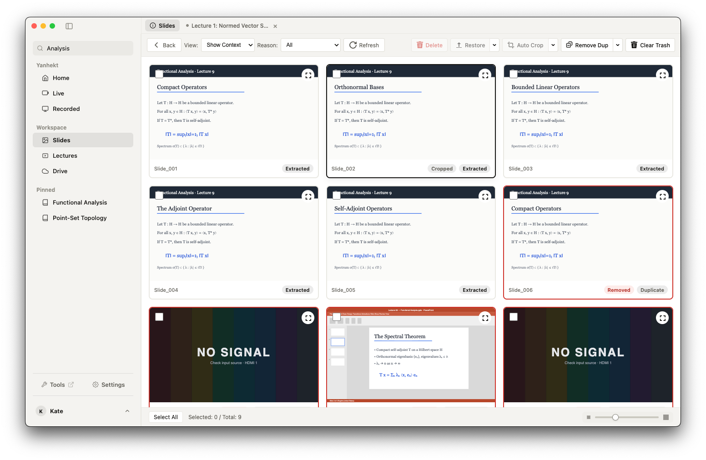
</p>

<br>

---

图像可能会因为被判定为非 `全屏播放的幻灯片` 或其他原因而被移除：
- `重复` 指类似 `A -> B -> A`，演讲者在演讲过程中重复播放某一幻灯片页面时，只保留第一次出现的页面，删除之后出现的页面图像。
- `已排除` 指与预先设置的排除项目一致的图像（如 `No Signal` 等）。
- `AI 过滤` 指 AI 判断应被移除的图像。
- `AI 过滤 - 编辑模式` 指 AI 判断为演示软件编辑模式的幻灯片图像。由于部分教师会在这一模式下放映幻灯片，此类图像会被单独标记；后处理默认会先尝试自动裁掉周围界面，裁成功则保留。

点击缩略图右上角的按钮即可放大查看图片，并在同一弹窗内进行裁剪等操作。

<p align="center">
  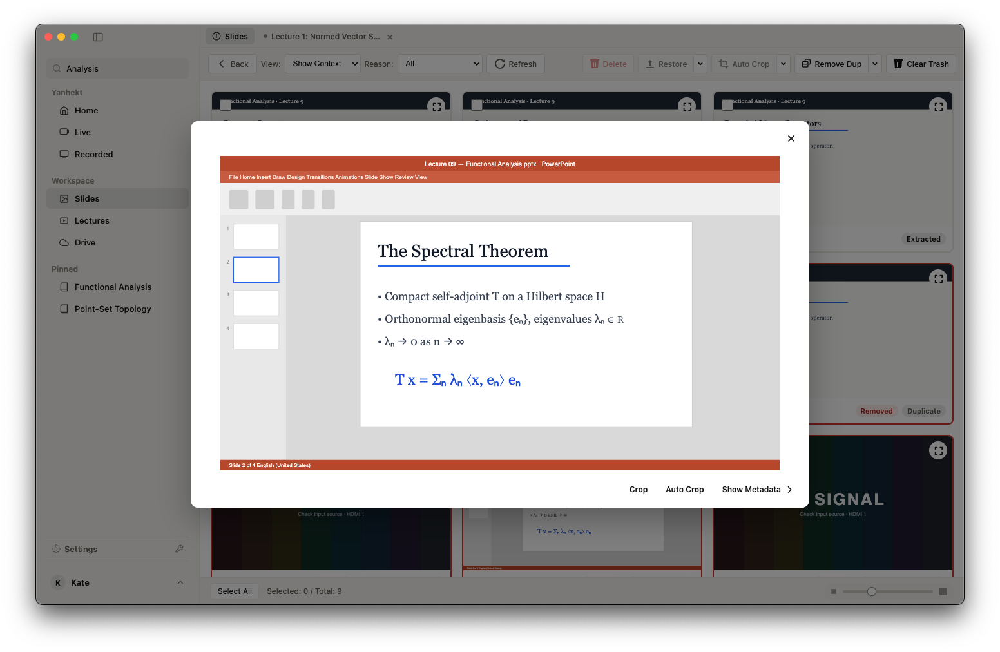
</p>

> [!TIP]
> `被移除的图像` 不会出现在常规输出文件夹中；`被移除的图像` 会被移动至 `输出目录` 下的 `.autoslidesTrash` 文件夹；`被裁剪的图像` 的原始图像会被备份至 `输出目录` 下的 `.autoslidesCrop` 文件夹。

<br>

---

选择需要操作的图像后，可执行 `删除`、`恢复`、`自动裁剪`、`去除重复` 和 `清空回收站`：
- `删除` 可将 `已提取` 的图像以 `手动` 删除的原因移入回收站；
- `恢复` 可将 `已移除` 的图像恢复为 `已提取` 状态；`恢复` 下的额外选项 `还原已裁剪` 可将当前文件夹中所有被 `手动裁剪` 或 `自动裁剪` 的图像恢复为原始状态；
- `自动裁剪` 可对标记为 `已提取` 或 `AI 过滤 - 编辑模式` 的图像进行裁剪；额外选项 `设置裁剪基准` 和 `应用裁剪基准` 可将一张 `已裁剪` 或 `已自动裁剪` 的图像设为基准，并把同一裁剪区域应用到其他图像；
- `去除重复` 可对当前文件夹运行 `pHash 重复去除后处理`；其额外选项可选择是否在裁剪后自动运行 `去重`，移除裁剪后新出现的 `重复项`。

在放大预览中进入 `裁剪` 模式后，拖动裁剪框选定区域，点击 `应用裁剪` 即可（裁剪 `AI 过滤 - 编辑模式` 图像时会自动将其恢复）。

<p align="center">
  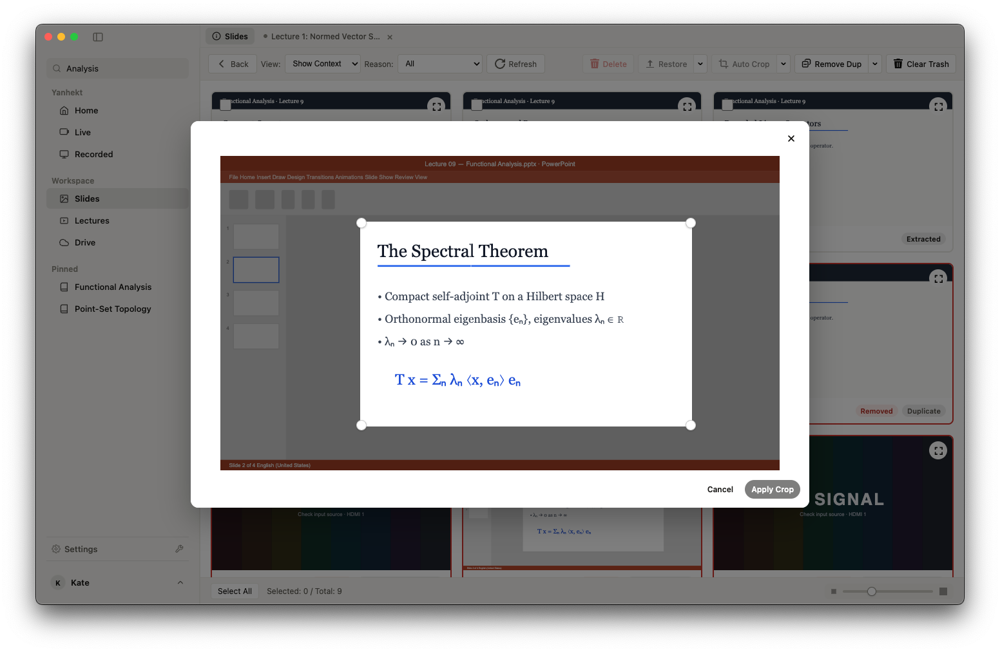
</p>

<br>

#### I. 工作区：课程视频

`工作区 > 课程视频` 管理已下载的课堂录像，也可播放有幻灯片和时间轴、但还没有本地录像的节次。顶部可在 `资料库` 与 `列表` 之间切换；右上角 `从链接克隆幻灯片时间轴` 可粘贴分享链接，把别人的幻灯片和时间轴复制进资料库（链接必须带有嵌入的时间轴）。

`资料库` 按课程做成海报墙，只显示已识别的内容：文件名或文件夹里带有课程/课时编号（`__c…s…` 或 Emby `[yhid=…]`）的录像，以及带同样编号且含 `timeline.json` 的幻灯片文件夹。未识别的视频文件将显示在 `列表`。

<p align="center">
  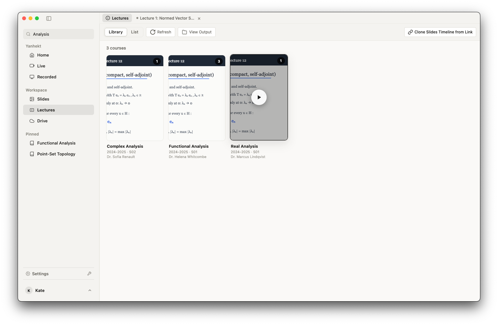
</p>

<br>

---

点进一门课后，上方是课程海报、教师、教室和文件数，下方是 `课时` 卡片。卡片上的 `双路` 表示屏幕和摄像头都在本地；`屏幕` / `课件/摄像头` 表示只下了一路；`在线` 表示这一路会从延河课堂补播；`已压缩` 表示屏幕录像已经用压缩预设处理过。点 `播放` 或某一课时即可打开内置播放器。

<p align="center">
  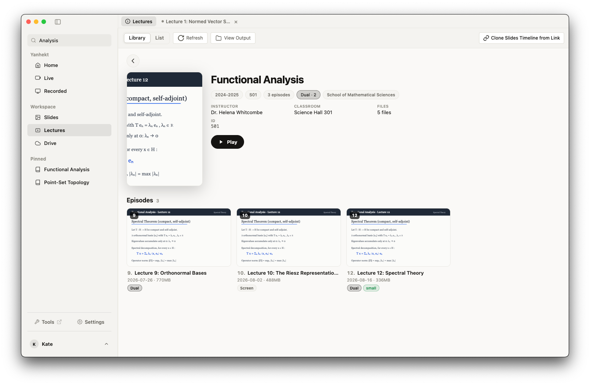
</p>

<br>

---

播放器走本地文件协议，可同时看 `屏幕录制` 和 `课件/摄像头`，两路对齐时间。只下了一路时，另一路会从服务器拉流同步。切到别的工作区时本地播放会暂停。

若该节有时间轴，进度条左侧会出现 `第 N 张` 章节按钮，点开是带缩略图的幻灯片条，当前页标为 `正在观看`；点击某一张即跳到录像里对应的时刻。

<p align="center">
  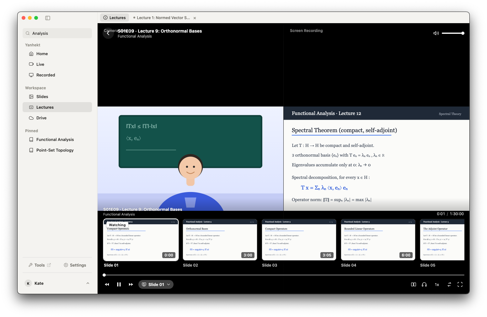
</p>

<br>

---

`列表` 按文件列出输出目录里的 `.mp4` / `.mkv`，可 `按课程分组`。每行标明 `屏幕` 或 `课件/摄像头`、体积，以及是否 `已压缩`。

点击 `选择` 勾选文件后，右上角的 `压缩` 和 `重命名` 可用：

- `压缩` 只作用于已识别的屏幕录像。课堂屏幕几乎是静帧，用极低帧率即可保持字迹并明显缩小体积。每个文件先编码到临时文件，校验大小与时长后再替换原文件；失败则保留原件。
- `重命名` 按 Emby/Jellyfin 习惯写成 `S01E01` 这类名字，可选是否写入教师、学年、学院、教室；文件名里会留下 `[yhid=…]`，AutoSlides 之后仍能对上课程和节次。

<p align="center">
  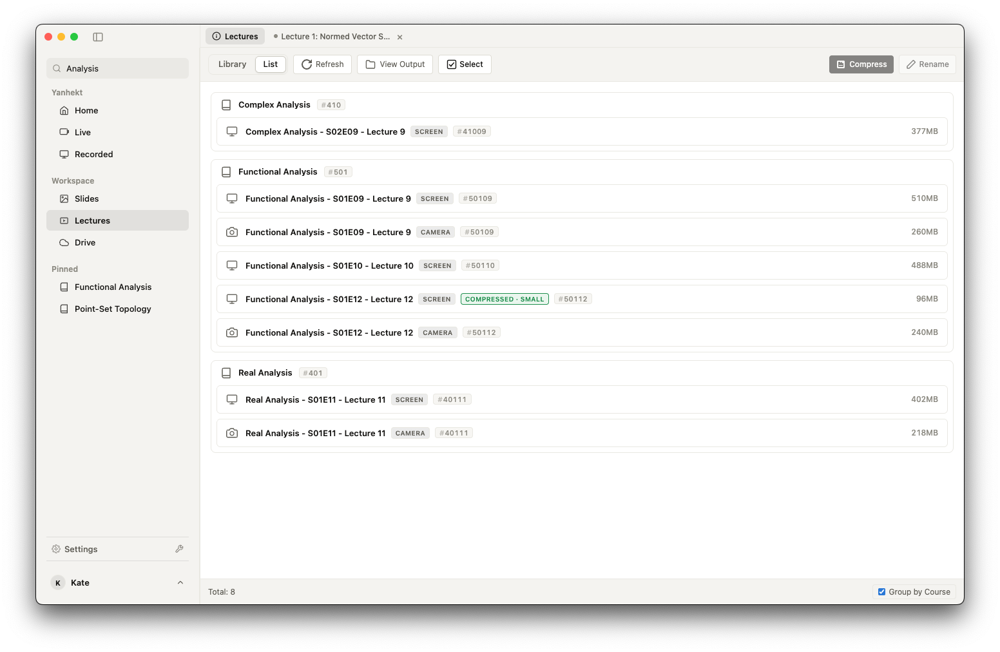
</p>

<br>

#### J. 工作区：云存储

`工作区 > 云存储` 把延河课堂笔记嵌进桌面端。首次使用需在 `设置 > 云端` 里 `初始化云存储`。应用会在你的延河课堂笔记中创建两个自动管理的分组（请不要在延河课堂上手动改名或删除它们；延河课堂上的名称分别是 `ASnote` 和 `ASuser`）：

- `AutoSlides 数据库`：从本地幻灯片文件夹导入的整套课件
- `随堂笔记`：观看直播 / 录播时记下的个人笔记（见上文 G 节）

界面分三栏：左侧 `公共索引` / `全部笔记` 以及分组（`自动管理的分组`、`其他分组`、`未分组`），中间笔记列表，右侧编辑器。顶部可按标题搜索。底部在选中 `AutoSlides 数据库` 时出现 `导入` / `导出`。

<p align="center">
  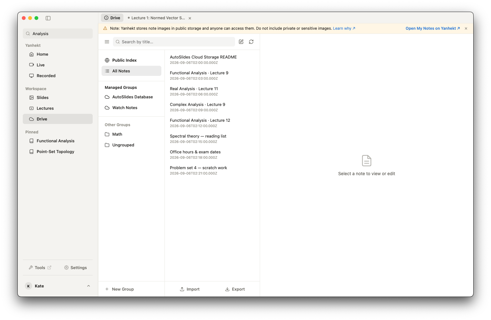
</p>

<br>

---

点开一条笔记即可在右侧编辑：支持标题、列表、图片、引用、代码和表格，笔记会自动保存至延河课堂服务器。右上角可改标题、换分组、`分享`（生成分享链接或短链接，也可 `发布` 到公共索引）。

`导入` 把本地 `slides_*` 文件夹做成数据库里的笔记（观看时随手截的文件夹不会进入导入，以免一套不完整的课件被公开）。`导出` 把数据库笔记还原成本地文件夹，包括时间轴。其它分组的单条笔记可导出为 PDF、Markdown（`note.md` + `images` 的 zip）或 Word（`.docx`）。

<p align="center">
  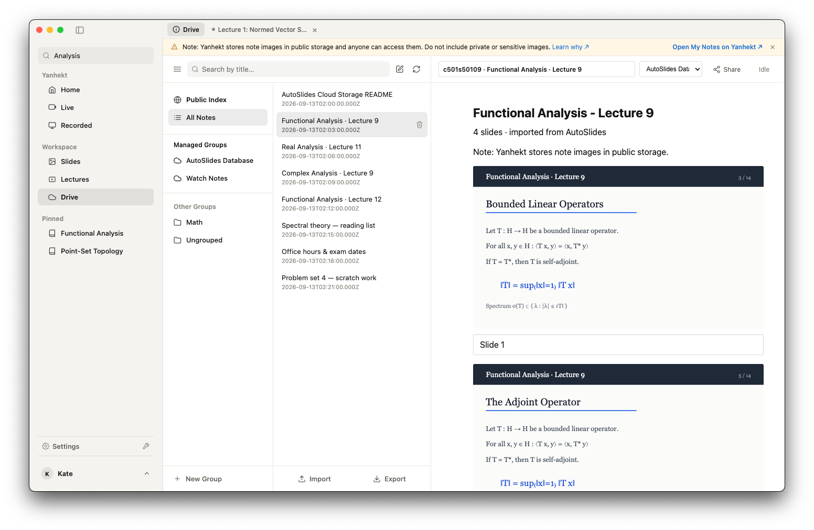
</p>

<br>

---

左侧点 `公共索引`，可切换到浏览别人公开的课件。未搜索时中间是 `最近添加`；可按学期筛选，或点右上角在浏览器打开公共索引站点。

<p align="center">
  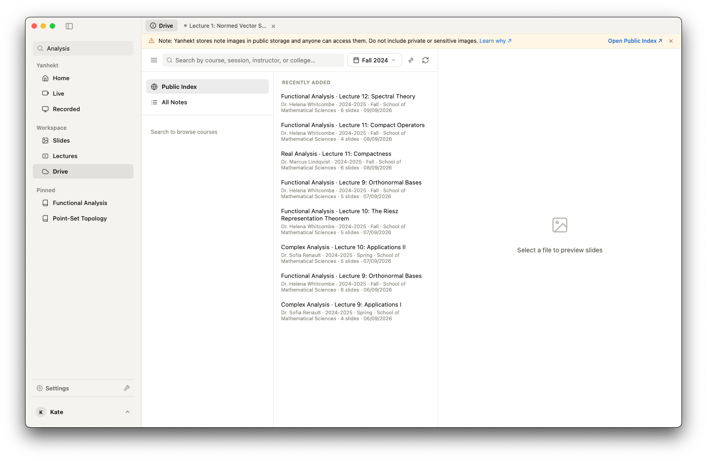
</p>

<br>

---

搜索框按课程、课节、教师或学院查找，也可以点 `有分享链接？` 按钮直接粘贴分享链接。点进一门课会列出各节次的版本；带 `时间轴` 勾的版本可以按页跳转到录像时刻。右侧预览课件，并可：

- `导入到 AutoSlides 数据库`：做成一条云端笔记
- `导出到本地`：还原成幻灯片文件夹（含时间轴）
- `申请移除`：你可以要求服务器移除你上传的课程课件笔记

<p align="center">
  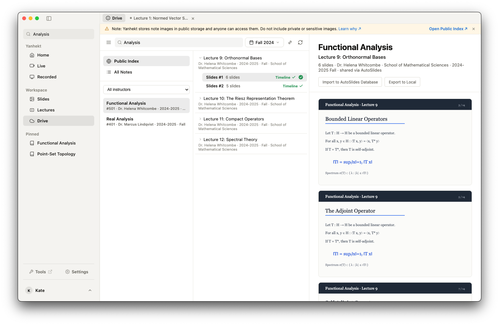
</p>

> [!WARNING]
> 延河课堂将笔记中的图片存放在公开对象存储中，任何人都可能访问。请不要在笔记里放入私人或敏感图片。

自动同步、随堂笔记开关、分享链接是否嵌入时间轴，见下方 `设置 > 云端`。

<br>

#### K. 设置

`设置` 是主窗口中的一页，分为六个标签：`一般`、`图像处理`、`下载与播放`、`网络`、`AI`、`云端`。修改后必须 `保存`。

##### 设置 > 一般

1. 可调整主题、语言，或直接使用 `令牌` 登录。界面语言支持简体中文、英语、日语和韩语。
2. 应用运行过程中可能积累较多 `缓存`，建议不定期清理；如果运行异常，可以尝试 `重置所有数据`。`重置所有数据` 不会删除 `输出目录` 下的任何文件。
3. `启用开发者模式` 会显示开发者功能。一般使用无需打开。

<p align="center">
  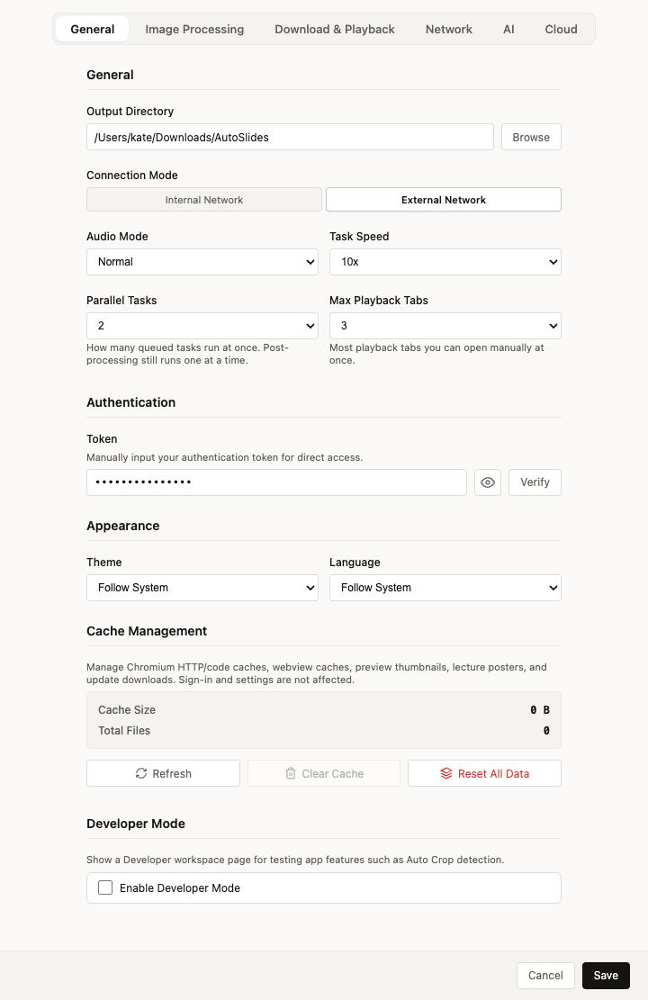
</p>

<br>

##### 设置 > 图像处理

1. 应用输出图像使用 PNG 格式，默认 `启用 PNG 色彩压缩`。
- 普通 PNG 图像通常使用“真彩色”模式存储，即每个像素的颜色由红、绿、蓝和透明度四个通道直接定义。这种模式能呈现数百万种颜色，但文件体积较大。
- `压缩 PNG 图像调色盘大小` 通过将普通 PNG 文件颜色量化为 128 种或更少的颜色以显著减小文件体积。
- 对于幻灯片图像，由于幻灯片通常只有有限数量的颜色，压缩的效果较好，视觉损失相对较小，同时文字仍保持清晰锐利。
2. 不建议随意调整图像处理的核心参数 `SSIM 阈值`。更高的 `全局结构相似性阈值` 表示更严格的匹配。可选预设包括：`自适应/严格(0.999)/标准(0.9987)/宽松(0.998)/自定义(0.990-0.9999)`。
- `自适应` 模式针对不同教学楼进行特殊优化，部分教学楼由于设备老旧，视频质量不佳，适用更宽松的阈值。
- `教室位置规则`："综教/理教/研楼" → 宽松；其他位置 → 正常。
- `严格` 模式下，检测的敏感度极高。
- `标准` 模式下，该值相对平衡，能有效检出少量文字增减的情境。

> [!NOTE]
> 建议仅在必要时调整 SSIM 阈值。即便 0.001 的微小变化也可能显著影响性能。

<p align="center">
  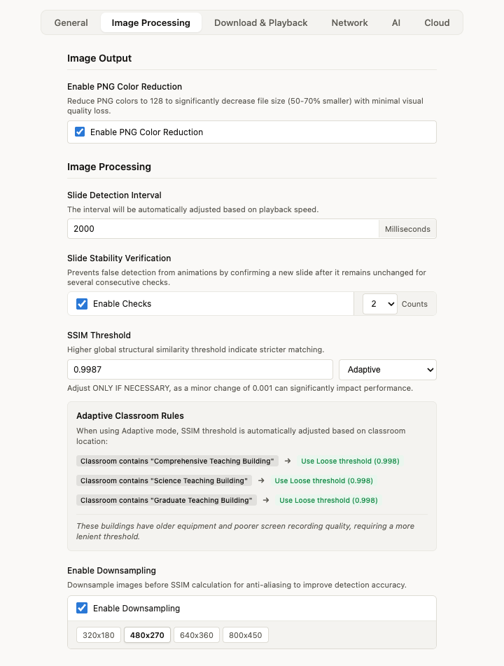
</p>

<br>

---

1. `后处理` 是在获取幻灯片后执行的过滤和排除流程，包含三个阶段：`重复去除`、`比对排除列表` 和 `AI 过滤`。这些阶段默认全部启用，你也可以单独关闭 `AI 过滤`。开启 `区分编辑模式` 时，还可选择对 `AI 过滤 - 编辑模式` 的帧先自动裁剪再决定是否丢弃，以及裁剪后再做一次去重。
2. 如果想统一排除某类图像，例如特殊错误页面，可以将其添加到 `pHash 排除列表`，应用会记录其哈希值用于后续比对。`排除列表` 预置了 `No Signal`、`No Input`、`Black Screen` 和 `Desktop` 等常见排除项的哈希值。

> [!TIP]
> 基于 pHash 的排除仅能有效排除几乎完全一致的图像。建议启用 AI 过滤功能进行智能过滤。
>
> 应用使用 256 位 pHash。不建议调整 256 位 pHash 的汉明距离阈值以更好地与应用整体协同工作。

<p align="center">
  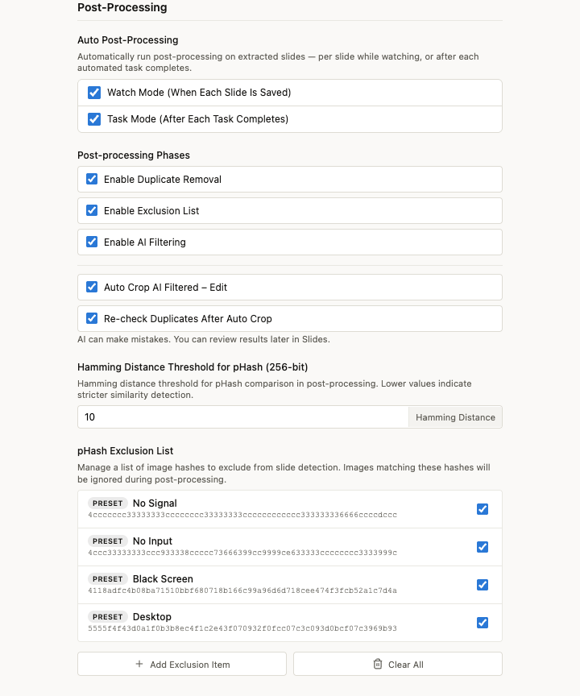
</p>

<br>

---

1. 自动裁剪功能同时使用 `Canny 边缘检测` 算法和 `YOLO` 机器学习模型。默认优先使用 `Canny 边缘检测`；它能精准识别幻灯片边框，但容易受遮挡影响。`YOLO` 模型可靠性更好，能覆盖多数裁剪场景，但裁剪范围可能与幻灯片边缘有轻微偏移。
2. 对于 `Canny 边缘检测` 算法，可调整 `宽高比容差`，即匹配检测到的幻灯片宽高比时，相对常见幻灯片比例 16:9 或 4:3 允许的最大偏差；其他自动裁剪参数不建议进行调整。
3. 如有自训练的检测模型，可在 `模型` 中选择自定义模型替代内置模型。

<p align="center">
  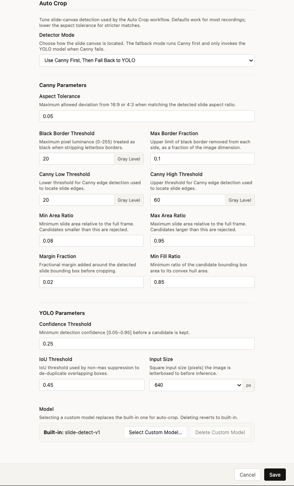
</p>

<br>

##### 设置 > 下载与播放

1. 顶部 `下载完成后自动提取` 区域用于配置外部 `AutoSlides Extractor`。状态面板会列出当前二进制支持的功能（例如输出时间轴需要 2.0.0 及以上）；你可在此安装与检查更新。
2. `下载并发数`、`下载工作线程数` 和 `下载重试次数` 控制下载行为。
3. `显示更多播放速度` 控制观看模式下是否显示 0.5-16 倍速选项。
4. `阻止系统休眠` 可在视频播放和提取期间阻止系统进入休眠状态，避免任务中断。
5. `从视频生成预览` 控制主页课程卡片的预览图：启用后从屏幕录制截取一帧作为预览，否则使用封面图。

<p align="center">
  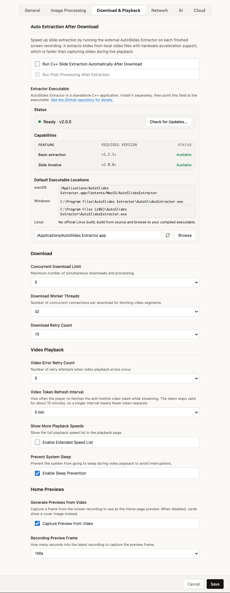
</p>

<br>

##### 设置 > 网络

`内网网络接口` 可设置将内网模式流量绑定到指定的本地网络接口。此设置仅作用于经由内网模式的请求，其他流量仍然使用系统默认路由。`内网映射` 列出内网模式下使用的域名到 IP 的映射。`尽可能发送匿名请求` 会在公开的课程目录、课程详情和视频令牌请求上省略登录令牌；节次列表、个人数据和笔记仍会带上身份。

<p align="center">
  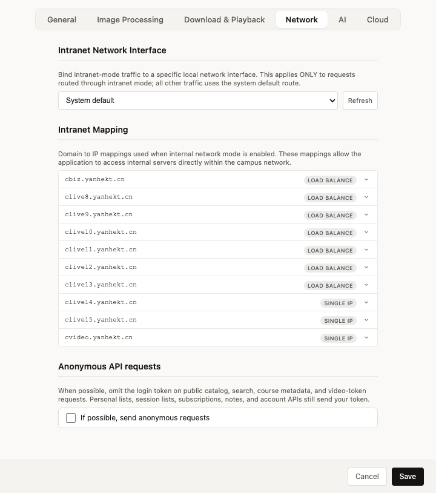
</p>

<br>

##### 设置 > AI

1. `ML` 和 `LLM` 模式都可以在 `AI 行为` 中选择是否区分 `may_be_slide` 分类，即让模型单独判断图像是否处于幻灯片编辑模式。开启后，编辑模式帧会被单独标记为 `AI 过滤 - 编辑模式`，并可在自动裁剪后恢复。开启时还可分别编辑直播与录播模式下使用的三分类提示词。
2. `ML` 模式基于本地机器学习模型。面对训练数据覆盖不足的场景时，它的准确率可能下降，因此可使用更保守的置信度阈值：`主过滤器` 滑块设置“非幻灯片”的置信度区间（保留 / 复核 / 删除），处于“复核”区间的图像再由 `次过滤器` 的“是幻灯片”概率决定保留或删除。

<p align="center">
  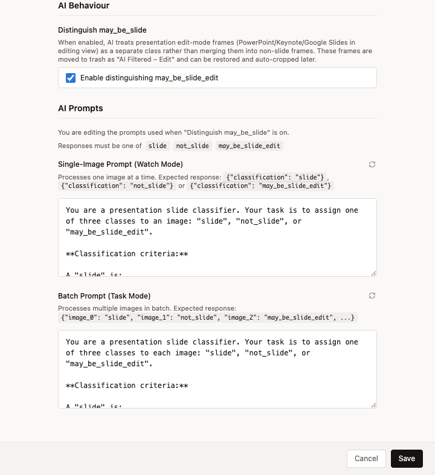
  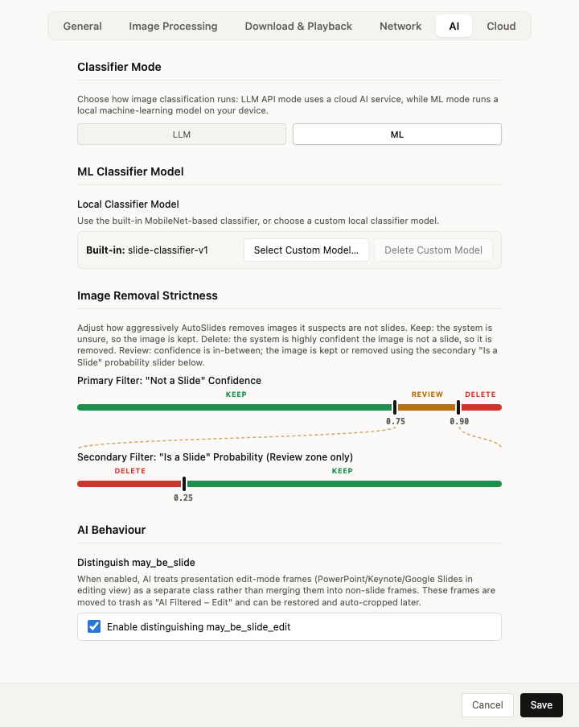
</p>

3. 使用自定义 OpenAI 兼容接口时，可在补全参数表中选择是否发送 `max_tokens`、`temperature`、`top_p` 和思考相关字段。内置服务的这些参数由服务器管理。

<p align="center">
  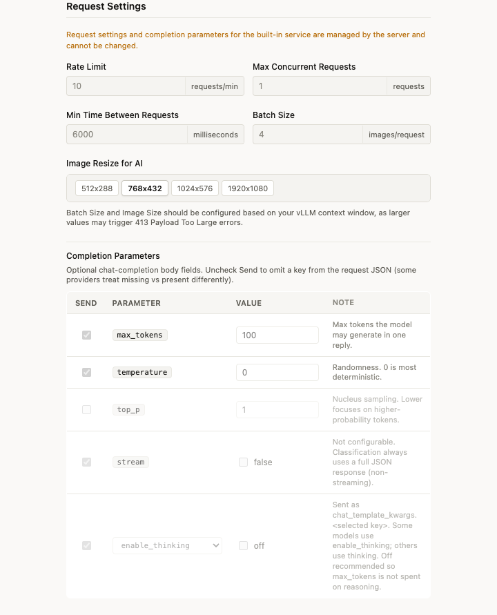
</p>

<br>

##### 设置 > 云端

1. 可初始化或修复 `AutoSlides 数据库` 与 `随堂笔记` 两个分组。
2. `自动同步到笔记` 可在文件夹被审阅或编辑后导入到笔记；可选同步后再发布到公共索引。
3. `自动创建并同步随堂笔记` 控制播放时右侧 `笔记` 页。
4. `分享时嵌入幻灯片时间轴` 默认开启，让分享链接带上每一页出现的时间。

<p align="center">
  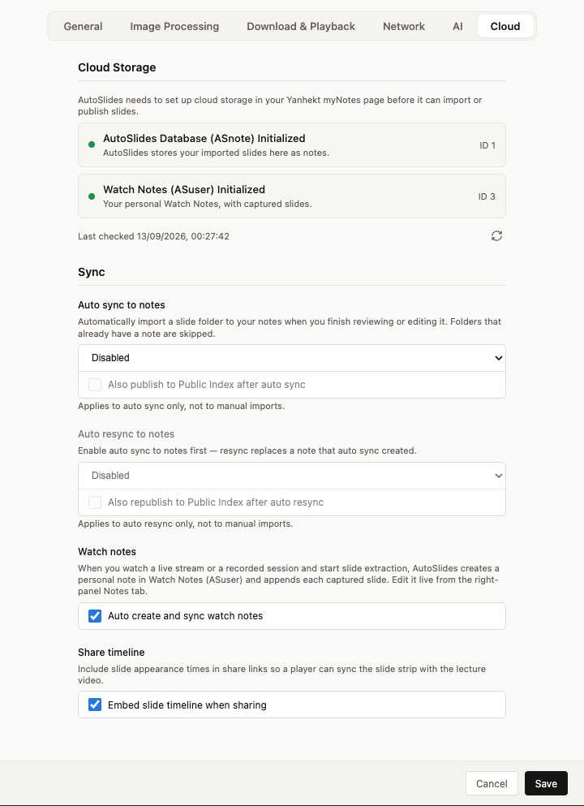
</p>

<br>

#### L. 工具

点击侧栏底部 `工具` 会打开独立的工具窗口，目前有两个标签：

1. `雨课堂` 可解决该平台原生课件导出带边框和水印的问题；如果教师使用雨课堂播放幻灯片，通常可在课程开始时一次性获取当前课件的所有页面。
2. 如果希望对任意网页视频运行幻灯片提取，可以使用 `网页捕获`。它支持手动输入网址、自动检测或手动选择页面视频元素，也支持绘制页面区域并持续监控画面变化。点击右上角的 `预设` 按钮可进入并自动登录延河官方网页。

<p align="center">
  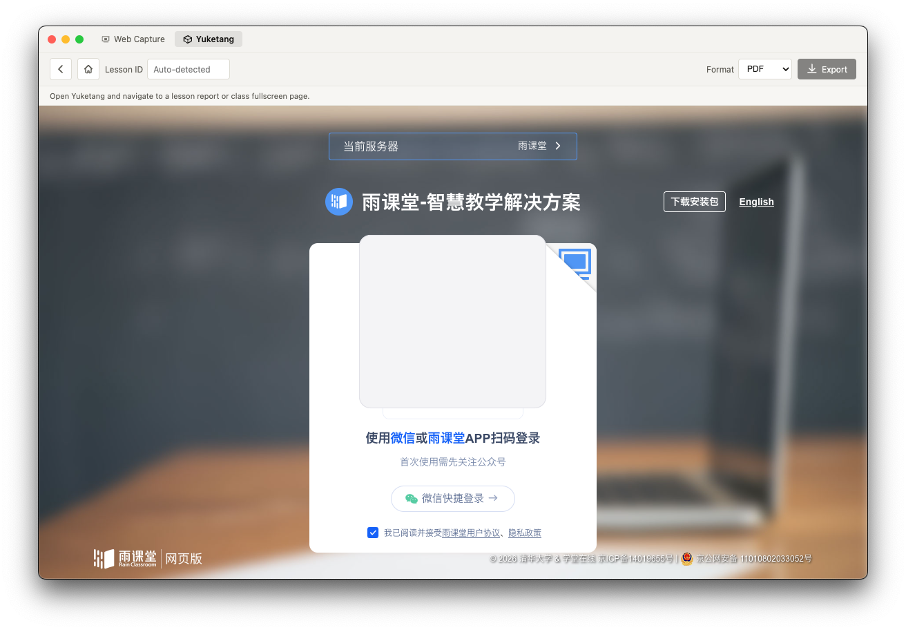
  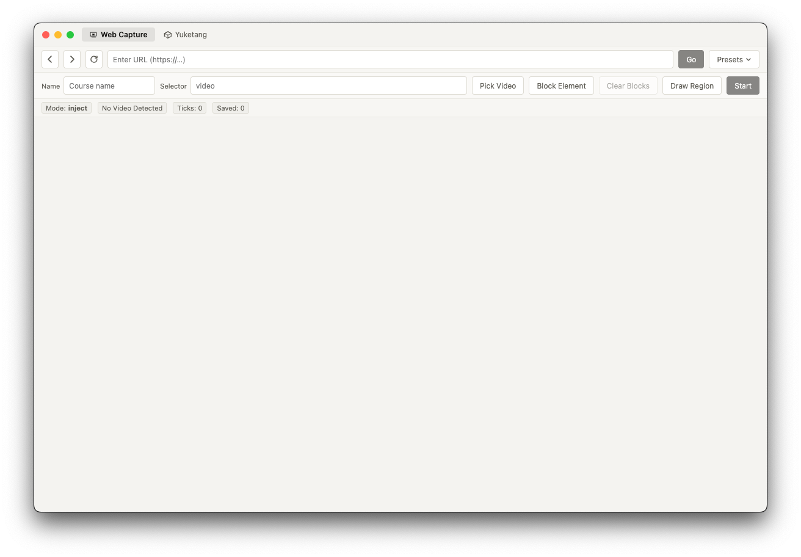
</p>

## 🏗️ 架构设计

本仓库包含四个被 git 跟踪的项目。根 README 同时是桌面应用的用户手册；开发者完整说明请参阅 **[docs/architecture.md](docs/architecture.md)**.

| 目录 | 角色 | 线上地址 / 产物 |
|------|------|-----------------|
| [`autoslides/`](autoslides/) | Electron 桌面客户端（Vue 3 + Vite + Forge） | GitHub Releases |
| [`web/`](web/) | 浏览器客户端：Hono Worker + Vue 3 SPA | [learn.ruc.edu.kg](https://learn.ruc.edu.kg) · [`web/README.md`](web/README.md) |
| [`share/`](share/) | 分享查看器 + 公共索引（Worker + 两套 React SPA） | [share.ruc.edu.kg](https://share.ruc.edu.kg) · [`share/README.md`](share/README.md) |
| [`relay/`](relay/) | 录播 HLS 防盗链中继（Worker，无 D1/KV） | [relay.ruc.edu.kg](https://relay.ruc.edu.kg) · [`relay/README.md`](relay/README.md) |

图像分析算法（SSIM、pHash、ML 分类、自动裁剪）的数学推导请参阅 [AutoSlides Image Analysis Technical Report](docs/image-analysis-technical-report.pdf).

### 四个项目如何协作

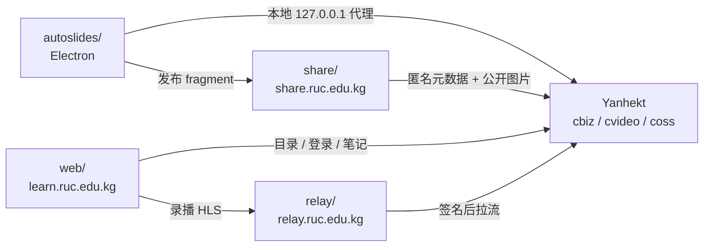
```mermaid
flowchart LR
  Desktop["autoslides/<br/>Electron"]
  Web["web/<br/>learn.ruc.edu.kg"]
  Share["share/<br/>share.ruc.edu.kg"]
  Relay["relay/<br/>relay.ruc.edu.kg"]
  Yanhekt["Yanhekt<br/>cbiz / cvideo / coss"]

  Desktop -->|本地 127.0.0.1 代理| Yanhekt
  Desktop -->|发布 fragment| Share
  Web -->|目录 / 登录 / 笔记| Yanhekt
  Web -->|录播 HLS| Relay
  Relay -->|签名后拉流| Yanhekt
  Share -->|匿名元数据 + 公开图片| Yanhekt
```

- **直播**：桌面和网页都直连延河课堂 CDN（桌面可选校园网 IP 映射）。
- **录播**：桌面走主进程本地 HTTP 代理（`videoProxyService`）；网页走 `relay/`。生产默认是 `direct` 模式——浏览器直连 `relay.ruc.edu.kg`，应用中继服务的校园网边缘策略；此时网页 Worker 同源的 `/playlist`、`/segment` 会 403。
- **幻灯片**：桌面写本地 `slides_*` 文件夹（附带 `metadata.json` / `timeline.json`）；网页写 IndexedDB。
- **分享**：两端把 v2/v3 fragment 发到 `share/`。索引只存课程 / 场次 ID 和图片指纹，标题在读取时从延河课堂拉取；图片从公开 COSS 列举解析。

### 为什么推荐组合使用 `AutoSlides` 和 `AutoSlides Extractor`？

因为 `AutoSlides Extractor` 基于 C++ 构建，对于视频解码、逐帧分析、SSIM 计算等性能任务，C++ 实现直接调用 FFmpeg、OpenCV 和平台原生硬件能力，减少跨运行时开销；同时更精确地管理内存，使用分块处理、内存池、零拷贝缓冲区和 RAII 自动释放。C++ 版本还可以充分利用 CPU 指令集和硬件加速，包括 Apple Silicon 的 NEON、Intel/AMD 的 SSE/AVX/AVX2/AVX512，以及 VideoToolbox、CUDA、DirectML、OpenCL、Metal 等平台能力，把高强度的帧提取和相似度计算交给更适合这类任务的原生引擎。

### 开发者指南

**桌面**（`autoslides/`）：

```bash
cd autoslides
npm start              # 启动开发服务器（热重载）
npm run demo           # 以演示模式启动（虚构账户/课程，用于干净的截图）
npm run lint           # 运行 ESLint（含领域边界规则）
npm test               # 运行单元测试 (Vitest)
npx tsc --noEmit && npx vue-tsc --noEmit
npm run package        # 打包应用
npm run make:mac       # 生成 macOS DMG
npm run make:win       # 生成 Windows 安装包
npm run make:linux     # 生成 Linux AppImage/deb
```

文档截图通过演示模式 + Playwright 自动生成，再处理为 `docs/` 图像：

```bash
npm run screenshots:build   # 演示模式下重新截图（重新打包 + 截图）
npm run docs:images         # 重命名/拆分/复制到 ../docs（处理记录见 out/screenshots/NOTES.md）
```

**网页 / 索引 / 中继**（各自目录；先 `cp wrangler.example.jsonc wrangler.jsonc`）：

```bash
cd web
npm run build && npm run dev    # wrangler :8787，需先 build 出 dist/
# 另开终端：
npm run dev:web                 # Vite :5173，把 /api 代理到 :8787

cd share && npm run db:migrate && npm run deploy
cd relay && npm run dev         # 无前端构建
```

部分必须保持行为一致的算法文件是有意复制的，由根目录 [`scripts/check-drift.mjs`](scripts/check-drift.mjs) 进行检查。改了 Electron ↔ 网页的复制文件之后：

```bash
node scripts/check-drift.mjs            # 与 CI 同一条
node scripts/check-drift.mjs --update   # 移植完成（或有意保持分叉）后再盖章
```

---

<div align="center">
<p>Copyright © 2026 bit-admin.</p>
<p>
<a href="https://github.com/bit-admin/Yanhekt-AutoSlides">GitHub</a> •
<a href="mailto:info@ruc.edu.kg">Email</a> •
<a href="https://it.ruc.edu.kg/docs">Docs</a>
</p>
</div>
