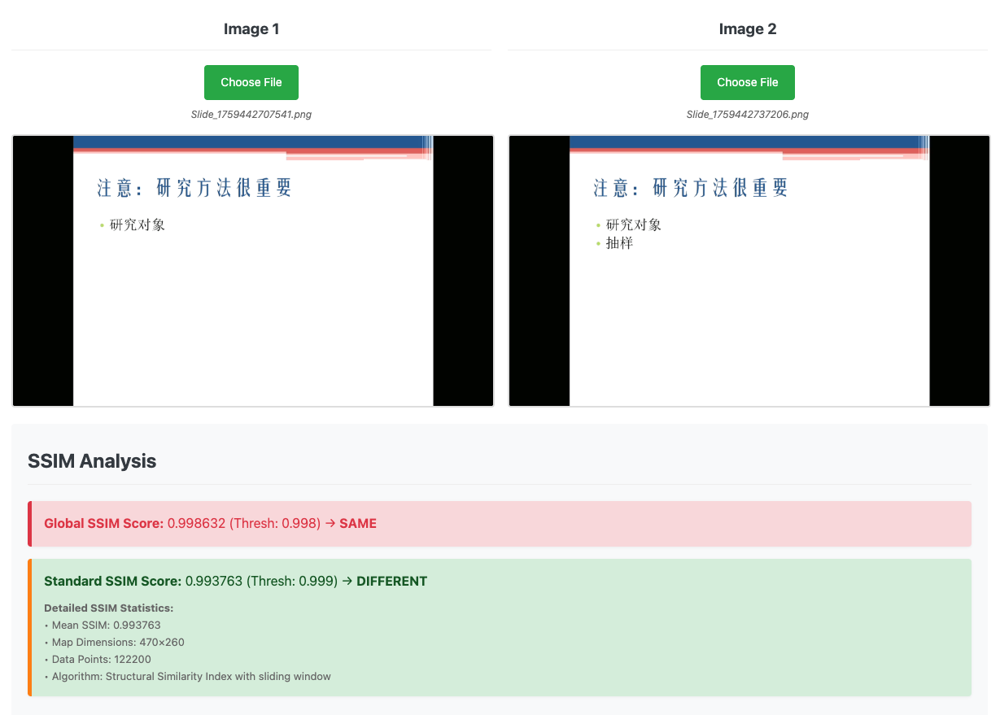

# AutoSlides 

**AutoSlides** 是为北京理工大学延河课堂设计的第三方客户端。基于 Electron 构建，提供了一个全面的解决方案，从屏幕录制中自动提取幻灯片，下载录播课程。
- **Web 版本**：https://learn.ruc.edu.kg - 您也可使用网页版观看全校直播课程，运行幻灯片提取<sup>1</sup>，记录笔记并导出为文档。

> AutoSlides is a third-party tool developed independently by its contributors. It is NOT an official client of, and is NOT affiliated with, associated with, endorsed by, or in any way connected to Beijing Institute of Technology (BIT), or any of their subsidiaries or affiliates. All product and company names are trademarks™ or registered® trademarks of their respective holders.

---
<sup>1</sup> 网页版使用简化的图像处理算法，准确率可能低于桌面版。

## 🚀 快速开始

1. **下载** - 前往 [release 页面](https://github.com/bit-admin/Yanhekt-AutoSlides/releases)获取适用于您的平台的安装程序（macOS 的 DMG、Windows 的 EXE）

2. **安装**
   - **macOS**：将文件拖到 Applications 文件夹后，在终端运行：
     ```bash
     sudo xattr -d com.apple.quarantine /Applications/AutoSlides.app
     ```
     **为什么这很必要？**
      - macOS 将下载的应用程序标记为“隔离”以确保安全
      - AutoSlides 未使用 Apple 开发者证书签名
      - 删除隔离属性允许应用程序正常运行
   - **Windows**：运行安装程序并按照向导操作

3. **旧版本迁移提示** - AutoSlides 在 v4.0.0 进行了主要重构，如果您曾下载过 v3.3.0 及之前的版本，建议您彻底删除旧版本重新安装；或者，你也可以移除旧版本的支持文件：
   - **macOS**：在终端运行：
      ```bash
      rm -rf ~/Library/Application\ Support/AutoSlides
      ```
   或者查找并移除`~/Library/Application\ Support/AutoSlides`。
   - **Windows**：请查找并移除：` C:\Users<你的用户名>\AppData\Roaming\AutoSlides` 或 `C:\ProgramData\AutoSlides`

4. **开始使用**
   - 在主面板中浏览课程
   - 启用幻灯片提取以自动捕获幻灯片
   - 排队多个会话以进行批量处理
   - 下载视频以供离线查看

## 🎯 核心功能

### 📺 双模式视频流媒体
- **独立操作**：直播及录播两种模式可以同时运行，具有单独的状态管理
- **后台播放**：在切换模式时继续视频播放

### 🖼️ 智能幻灯片提取
- **自动检测**：使用 SSIM（结构相似性指数）进行实时幻灯片变化检测
- **动态阈值系统**：5 个智能预设模式（自适应、严格、正常、宽松、自定义）
  - **自适应模式**：基于教室位置自动调整
  - **课堂感知**：针对不同教学楼的特殊优化
- **双重验证**：可选择的多帧验证以减少误报
- **自适应速度**：基于播放速度（1x-10x）动态调整间隔

### 📥 高级下载系统
- **并发下载**：可配置并行下载限制（1-10 个同时下载）
- **HLS 流处理**：本机 M3U8 播放列表解析和 TS 段下载
- **FFmpeg 集成**：自动视频处理和格式转换

### 🎯 任务队列管理
- **批量处理**：排队多个课程以进行自动幻灯片提取
- **顺序执行**：一次一个处理，具有可配置的播放速度
- **错误恢复**：自动错误处理和任务继续

### 🌐 网络灵活性
- **内网模式**：校园网内访问使用 IP 映射的内部代理优化网络性能
- **处理服务器防盗链防护**：处理服务器针对录制内容的复杂基于令牌的身份验证
- **动态令牌刷新**：自动凭据续订以实现不间断访问

## ⚙️ 配置

### 快速参考

| 设置 | 默认 | 范围/选项 | 描述 |
|---------|---------|---------------|-------------|
| **输出目录** | `~/Downloads/AutoSlides` | 任何有效路径 | 保存幻灯片和视频的位置 |
| **连接模式** | 外部 | 外部/内部 | 网络路由模式 |
| **语言** | 系统 | 系统/英语/中文 | UI 语言 |
| **主题** | 系统 | 系统/浅色/深色 | 应用程序主题 |
| **下载并发数** | 5 | 1-10 | 同时下载 |
| **任务速度** | 10x | 1x-10x | 任务队列的播放速度 |
| **静音模式** | 正常 | 正常/全部/直播/录播 | 音频静音行为 |
| **检查间隔** | 2000ms | 1000-10000ms | 幻灯片检测频率 |
| **SSIM 阈值模式** | 自适应 | 自适应/严格/正常/宽松/自定义 | 阈值预设模式 |
| **SSIM 阈值值** | 0.9987 | 0.990-0.9999 | 自定义相似度阈值 |
| **双重验证** | 启用 | 启用/禁用 | 多帧确认 |
| **验证计数** | 2 | 1-10 | 要验证的帧 |

### 应用程序设置
应用程序提供广泛的配置选项：

#### 基本设置
- **输出目录**：默认 `~/Downloads/AutoSlides`
  - 所有幻灯片和下载视频保存在此处
  - 按课程和会话组织
  - 点击“更改输出目录”进行自定义

- **连接模式**：外部（直接）或内部（代理）
  - **外部**：用于家庭/公共互联网
  - **内部**：用于校园网内访问

#### 高级设置
- **下载并发数**：1-10 个同时下载
- **任务速度**：1x-10x 播放速度用于批量处理
- **静音模式**：音频行为控制
  - **正常**：所有内容播放音频
  - **全部静音**：所有音频静音（系统范围）
  - **直播静音**：仅实时流静音
  - **录播静音**：仅录制内容静音

#### 图像处理参数
- **检查间隔**：检测频率（默认：2000ms）
  - 检查幻灯片变化的频率
  - 基于播放速度自动调整

- **SSIM 阈值模式**：智能阈值选择（默认：自适应），具有五个预设模式：
  1. **自适应模式**（推荐）🌟
     - **教室位置规则**（自动应用）：
       - "综教"→ 宽松 (0.998)
       - "理教"→ 宽松 (0.998)
       - "研楼"→ 宽松 (0.998)
       - 其他位置 → 正常 (0.9987)
      > 部分教学楼由于设备老旧，视频质量不佳，适用更宽松的阈值

      

  2. **严格模式** (0.999) - 严格模式下，检测的敏感度极高
      > TODO: 新增后处理功能使用高位pHash及机器学习模型进行二次处理

      

  3. **标准模式** (0.9987) - 该值相对平衡，能有效检出少量文字增减的情境

      

  4. **宽松模式** (0.998)

  5. **自定义模式**
     - 在 0.990 和 0.9999 之间设置任何值
     - 使用 `test-image-comparison.html` 查找最佳值
     - 需要手动校准

- **双重验证**：启用/禁用多帧确认
  - 默认启用
  - 显著减少误报
  - 高度推荐用于准确性

- **验证计数**：确认帧数（默认：2）
  - 仅在启用双重验证时使用
  - 更高 = 更多确认 = 更少误报
  - 推荐：2-3 帧

## 🔬 图像处理技术

### SSIM 基础的幻灯片检测
应用程序使用基于结构相似性指数 (SSIM) 的复杂图像比较算法来检测幻灯片变化。同时，为了最小化误报，系统实现了双重验证机制。完整技术细节可在 `report.pdf` 中找到。

```typescript
// 核心 SSIM 计算（简化）
function calculateSSIM(img1: ImageData, img2: ImageData): number {
  const gray1 = convertToGrayscale(img1);
  const gray2 = convertToGrayscale(img2);

  // 计算均值、方差和协方差
  const [mean1, mean2] = calculateMeans(gray1, gray2);
  const [var1, var2, covar] = calculateVariances(gray1, gray2, mean1, mean2);

  // SSIM 公式与稳定性常数
  const C1 = 0.01 * 255 * 0.01 * 255;
  const C2 = 0.03 * 255 * 0.03 * 255;

  const numerator = (2 * mean1 * mean2 + C1) * (2 * covar + C2);
  const denominator = (mean1 * mean1 + mean2 * mean2 + C1) * (var1 + var2 + C2);

  return numerator / denominator;
}
```

### 测试算法

您可以自己测试和校准 SSIM 算法：

1. **交互测试**：在浏览器中打开 `test-image-comparison.html`
2. **加载测试图像**：上传两张图像进行比较
3. **查看结果**：查看 SSIM 分数和处理时间
4. **校准设置**：为您的内容找到最佳阈值

## 📁 项目主要结构

```
AutoSlides/
├── autoslides/                # 主应用程序目录
│   ├── src/
│   │   ├── main/                    # 主进程 (Node.js)
│   │   │   ├── authService.ts      # 身份验证管理
│   │   │   ├── apiClient.ts        # 后端 API 通信
│   │   │   ├── videoProxyService.ts # 视频流媒体代理
│   │   │   ├── intranetMappingService.ts # 网络路由
│   │   │   ├── ffmpegService.ts    # 视频处理
│   │   │   └── m3u8DownloadService.ts # HLS 下载
│   │   │
│   │   ├── renderer/               # 渲染器进程 (Vue.js)
│   │   │   │
│   │   │   ├── components/         # Vue 组件
│   │   │   │   ├── TitleBar.vue    # 自定义窗口标题栏
│   │   │   │   ├── LeftPanel.vue   # 设置和身份验证
│   │   │   │   ├── MainContent.vue # 课程浏览器和播放器
│   │   │   │   ├── RightPanel.vue  # 任务和下载
│   │   │   │   ├── CoursePage.vue  # 课程列表
│   │   │   │   ├── PlaybackPage.vue # 视频播放器
│   │   │   │   └── SessionPage.vue # 会话选择
│   │   │   │
│   │   │   ├── services/           # 渲染器服务
│   │   │   │   ├── slideExtractor.ts # 幻灯片检测逻辑
│   │   │   │   ├── slideProcessorService.ts # Web Worker 接口
│   │   │   │   ├── ssimThresholdService.ts # 动态 SSIM 阈值
│   │   │   │   ├── taskQueueService.ts # 任务管理
│   │   │   │   ├── downloadService.ts # 下载协调
│   │   │   │   └── dataStore.ts    # 状态管理
│   │   │   │
│   │   │   ├── workers/            # Web Workers
│   │   │   │   └── slideProcessor.worker.ts # 图像处理
│   │   │
│   │   ├── main.ts                # 应用程序入口点
│   │   └── preload.ts             # 安全 IPC 桥
│   │
│   └── package.json              # 依赖和脚本
│
├── test-image-comparison.html    # 🧪 图像处理测试工具
├── report.pdf                     # 📄 技术性能报告
└── LICENSE                        # ⚖️ Apache 2.0 许可证
```

## 📄 许可证

此项目根据 Apache License 2.0 获得许可。请参见 `LICENSE` 文件以获取详细信息。

## TERMS AND CONDITIONS

By downloading, installing, or using this software ("Software"), you ("User") signify your agreement to be legally bound by these Terms and Conditions ("Terms"). If you do not agree to these Terms, you are not permitted to install or use the Software.

### 1. Definitions

**"Software"** refers to the software application provided by the Developer designed to interact with the Platform.

**"Platform"** refers to the "Yanhe Classroom" platform of the Beijing Institute of Technology ("BIT").

**"Content"** refers to all course resources available on the Platform, including but not limited to videos, documents, images, and audio files.

**"Developer"** refers to the creator and owner of the Software.

### 2. Permitted Use and Scope of Service

The Software is a technical tool designed exclusively to facilitate the download of Content from the Platform. The User's right to use the Software is contingent upon the User having the necessary legal rights and permissions from BIT and/or the relevant rights holders to access and download such Content.

The Software acts solely as a technical intermediary. It does not store, modify, host, or distribute any Content. All downloaded materials originate directly from the Platform's servers at the User's explicit direction.

### 3. Intellectual Property Rights

The User acknowledges and agrees that all right, title, and interest in and to the Content are the intellectual property of their original authors, BIT, or respective rights holders. The Developer claims no ownership or rights to the Content and assumes no liability for the IP status of any material on the Platform. The User is solely responsible for complying with the Platform's terms of service, intellectual property policies, and all applicable international and domestic copyright laws.

### 4. User Obligations and Prohibited Conduct

The User agrees not to use the Software for any purpose that is unlawful or prohibited by these Terms. The User is solely responsible for their conduct and any Content they download. Prohibited activities include, but are not limited to:

a. Reproducing, distributing, publicly performing, modifying, or creating derivative works from any Content without explicit authorization from the rightful owner;

b. Using the Content for any commercial purpose;

c. Reverse-engineering, decompiling, or attempting to discover the source code of the Software or the Platform;

d. Using the Software to infringe upon the intellectual property rights or other legal rights of any third party, including BIT, content creators, or other rights holders.

Any breach of these obligations may result in the termination of the User's right to use the Software and may expose the User to civil and/or criminal liability. The User agrees that they bear sole legal responsibility for any disputes arising from their use of the Software.

### 5. Disclaimer of Warranties

TO THE MAXIMUM EXTENT PERMITTED BY APPLICABLE LAW, THE SOFTWARE IS PROVIDED **"AS IS"** AND **"AS AVAILABLE"**, WITH ALL FAULTS AND WITHOUT WARRANTY OF ANY KIND. THE DEVELOPER EXPRESSLY DISCLAIMS ALL WARRANTIES, WHETHER EXPRESS, IMPLIED, STATUTORY, OR OTHERWISE, INCLUDING, BUT NOT LIMITED TO, THE IMPLIED WARRANTIES OF MERCHANTABILITY, FITNESS FOR A PARTICULAR PURPOSE, TITLE, AND NON-INFRINGEMENT.

THE DEVELOPER DOES NOT WARRANT THAT THE SOFTWARE WILL MEET THE USER'S REQUIREMENTS, BE UNINTERRUPTED, OR BE ERROR-FREE, NOR DOES THE DEVELOPER MAKE ANY WARRANTY AS TO THE LEGALITY, ACCURACY, OR AVAILABILITY OF THE PLATFORM OR ITS CONTENT.

### 6. Limitation of Liability

TO THE MAXIMUM EXTENT PERMITTED BY APPLICABLE LAW, IN NO EVENT SHALL THE DEVELOPER BE LIABLE FOR ANY DIRECT, INDIRECT, PUNITIVE, INCIDENTAL, SPECIAL, OR CONSEQUENTIAL DAMAGES, INCLUDING WITHOUT LIMITATION, DAMAGES FOR LOSS OF DATA, LOSS OF PROFITS, BUSINESS INTERRUPTION, INTELLECTUAL PROPERTY DISPUTES, OR ANY OTHER COMMERCIAL DAMAGES OR LOSSES, ARISING OUT OF OR IN ANY WAY RELATED TO THE USE OR INABILITY TO USE THE SOFTWARE, HOWEVER CAUSED, REGARDLESS OF THE THEORY OF LIABILITY (CONTRACT, TORT, OR OTHERWISE) AND EVEN IF THE DEVELOPER HAS BEEN ADVISED OF THE POSSIBILITY OF SUCH DAMAGES.

### 7. Indemnification

The User agrees to indemnify, defend, and hold harmless the Developer and its affiliates from and against any and all claims, liabilities, damages, losses, costs, and expenses (including reasonable attorneys' fees) arising out of or in any way connected with the User's: (a) access to or use of the Software; (b) violation of these Terms; or (c) violation of any third-party right, including any intellectual property right.

### 8. General Provisions


**Governing Law:** These Terms shall be governed by and construed in accordance with the laws of Hong Kong SAR, without regard to its conflict of law principles.

**Severability:** If any provision of these Terms is held to be unenforceable or invalid, such provision will be changed and interpreted to accomplish the objectives of such provision to the greatest extent possible under applicable law, and the remaining provisions will continue in full force and effect.

**Entire Agreement:** These Terms constitute the entire agreement between the User and the Developer regarding the use of the Software and supersede all prior agreements and understandings.

**Contact Information:** For technical or legal inquiries, please contact info@ruc.edu.kg.