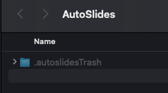

<div align="center">

  

  # AutoSlides
  
  **Third-party client for BIT Yanhekt | Automatic Slide Extraction | Course Video Download | AI Filtering**

  <p>
    
    
    
    
  </p>

  <p>
    
    
    
  </p>

  <p>
    <a href="#-quick-start">🚀 Quick Start</a> • 
    <a href="#-features">✨ Features</a> • 
    <a href="#-architecture-design">🛠 Architecture Design</a>
  </p>

  <p>
    <a href="./README_EN.md">English</a> | <a href="./README.md">简体中文</a>
  </p>

</div>

---

## ✨ Features

- Handles Yanhekt anti-leech protection via reverse engineering, providing video playback and download;
- Optimized for campus network, no more lag when watching Yanhekt videos; smooth playback of recorded videos at 10x speed; download speeds up to 110MB/s<sup>1</sup>.
- Runs slide extraction simultaneously with video playback; no need to download videos; a 145-minute course can be processed in 15 minutes at 10x speed.
- Prevents system sleep during slide extraction tasks, allowing for long-duration overnight runs.

> [!TIP]
> To speed up processing, you can use `AutoSlides` to download course videos and then use `AutoSlides Extractor` for processing.

- AI filtering based on multimodal large language models (vLLM) to remove non-fullscreen slide images and other distractions.

> [!TIP]
> vLLM processing is highly effective, with a tested accuracy of 99.9%, far superior to machine learning model solutions.
>
> Recommended models: `gpt-4.1`, `Qwen/Qwen3-VL-235B-A22B-Instruct`, `Qwen/Qwen3-VL-30B-A3B-Instruct`, and `Qwen/Qwen3-VL-8B-Instruct`. Even lightweight models like `qwen3-vl-2b-instruct` running locally via LM Studio can achieve good recognition results in tests.

<p align="center">
  
</p>


> [!CAUTION]
> Disclaimer: This tool is intended strictly for personal study; users assume full legal responsibility for ensuring their usage complies with all applicable copyright laws and platform regulations. Terms and Conditions available here: [TERMS AND CONDITIONS](docs/terms.md)
> 
> This tool is NOT an official application of, and is NOT affiliated with, associated with, endorsed by, or in any way connected to Beijing Institute of Technology (BIT), or any of their subsidiaries or affiliates. All product and company names are trademarks™ or registered® trademarks of their respective holders.


### Related Projects

|  | GitHub Repository | Description |
| --- | --- | --- |
| [Web Version](https://learn.ruc.edu.kg) 👈   | [bit&#8209;admin/Yanhe-Web](https://github.com/bit-admin/Yanhe-Web)   | Watch live courses school-wide, run slide extraction on mobile devices<sup>2</sup>; take notes and export as documents<sup>3</sup>. |
| Extractor Tool | [bit&#8209;admin/AutoSlides-Extractor](https://github.com/bit-admin/AutoSlides-Extractor) | Extract slides from downloaded screen recordings; processes a single course video in as fast as 10 seconds<sup>4</sup>; supports GPU acceleration; built with C++; uses the same image processing algorithms and `MobileNetV4`-based machine learning models as `AutoSlides`. |
| Yanhekt Downloader | [bit&#8209;admin/Yanhekt-downloader-electron](https://github.com/bit-admin/Yanhekt-downloader-electron) | Video download functionality rewritten based on this project; special thanks to [AuYang261/BIT_yanhe_download](https://github.com/AuYang261/BIT_yanhe_download) for ideas and references. |
| BIT SSO Login Module | [bit&#8209;admin/bit-sso](https://github.com/bit-admin/bit-sso) | Yanhekt login functionality based on this project; reverse-engineered login module<sup>5</sup>; Yanhekt login implementation based on edge functions. |

---

<sup>1</sup> Peak download speeds can reach 120MB/s when connected to the campus network via wire; slower over Wi-Fi.

<sup>2</sup> The web version uses simplified image processing algorithms suitable for both desktop and mobile devices.

<sup>3</sup> The web version provides note-taking and export to Word and Markdown documents.

<sup>4</sup> **Combining both tools is faster**: Downloading a 95-minute screen recording video using `AutoSlides` takes about 10 seconds on the campus network; processing that video (2s I-frame interval) using `AutoSlides Extractor` takes about 10 seconds on an M4 Mac mini.

<sup>5</sup> Only handles BIT Unified Identity Authentication using account/password; logging in during "unconventional hours" may require secondary verification; pre-verify at [sso.bit.edu.cn](https://sso.bit.edu.cn).

## 🚀 Quick Start

### 1. Download

- Go to the [release page](https://github.com/bit-admin/Yanhekt-AutoSlides/releases) 👈 to download the installer for your platform (`DMG` for macOS users; `EXE` for Windows users).

### 2. Installation
   - **macOS**: Open the `.dmg` package, drag the app icon to the `Applications` folder, then double-click the `install.command` file in the package to run the installation script and enter your Mac password (note: password input will not be displayed).

<p align="center">
  
</p>   

> [!IMPORTANT]
> - macOS marks downloaded applications as "quarantined" for security.
> - AutoSlides is not signed with an Apple Developer Certificate.
> - Double-clicking `install.command` runs `sudo xattr -d com.apple.quarantine /Applications/AutoSlides.app` to remove the quarantine attribute and allow the app to run normally.

   - **Windows**: Run the `.exe` installer and follow the setup wizard.

### 3. Check for Updates

- Click `Menu Bar > AutoSlides > Check for Updates...` (on Windows: `Menu Bar > Help > Check for Updates...`) to see if a new version is available.
- Manually download and install the latest version from the [release page](https://github.com/bit-admin/Yanhekt-AutoSlides/releases).

> [!NOTE]
> - Due to lack of backward compatibility, it is recommended to completely delete the old version before installing a new version of `AutoSlides`.
> - If you encounter issues after installing a new version, try `Advanced Settings > General > Reset All Data`; alternatively, you can remove the support files of the old version:
>   - **macOS**: Run the following command in the terminal or manually find and remove `~/Library/Application\ Support/AutoSlides`:
>     ```bash
>     rm -rf ~/Library/Application\ Support/AutoSlides
>     ```
>   - **Windows**: Find and remove `C:\Users\<YourUsername>\AppData\Roaming\AutoSlides` or `C:\ProgramData\AutoSlides`

### 4. Usage and Settings


#### A. Basic Settings

1. Launch the application and log in using your BIT Unified Identity Authentication account and password.
2. Adjust the `Output Directory` as needed, default is `~/Downloads/AutoSlides` (recommended to set as a separate folder).
3. When on the campus network, switch `Connection Mode` to `Intranet Mode` for a better connection experience and faster access to course resources.
4. Adjust `Audio Mode` as needed; the app can be run muted.

<br clear="both">


#### B. Basic Interface Introduction

5. Basic settings for slide extraction include `Slide Detection Interval`, `Slide Stability Check`, and `Task Speed`. It is recommended to keep the defaults.
6. `Auto Post-processing` is enabled by default for both Live and Recorded modes.
  - In Live mode, post-processing runs every time a slide is saved.
  - In Recorded mode, post-processing runs when the current task is completed (requires adding courses to the task list).
7. Click the buttons in the status bar to `View App Trash` and `Open Output Directory`.
8. `Live` and `Recorded` modes can run simultaneously; video playback continues when switching modes.

<br clear="both">


#### C. Advanced Settings Introduction

For detailed configuration of the `Advanced Settings` interface, please refer to the [Configuration Table](#5-configuration-table) below.

9. It is recommended to adjust default values in the `Image Processing` tab only when necessary; some parameters are highly sensitive, and even small changes can significantly affect performance.
10. `Post-processing` includes three stages: `Duplicate Removal`, `Exclusion List`, and `AI Filtering`, all enabled by default and adjustable as needed.

<br clear="both">


<br>

11. The `AI` tab contains various configurations for AI filtering. AI services can be switched between `Built-in` and `Custom`.
  - Built-in service is a free shared service; the `gpt-4.1` model is available after login; **availability of shared services is subject to change**.
  - Custom service allows configuring `API Base URL`, `API Key`, and `Model Name`; learn more: [AI Configuration Docs](https://it.ruc.edu.kg/zh/docs).

> [!IMPORTANT]
> The Built-in service is provided by the developer free of charge and on an "as is" basis. We make no warranties, express or implied, regarding the continuity or stability of the service, and we may modify or interrupt the service at any time without prior notice. The user agrees to use the service in a reasonable, fair, and non-commercial manner.

<br clear="both">


<br>

#### D. How to Use the App

12. In the course session interface, click the control bar buttons to `Add Course to Slide Extraction Task`, `Download Classroom Camera Recording`, and `Download Course Screen Recording`.
13. After adding items to the `Slide Extraction Task`, click the `Start` button to launch the task queue.

<br clear="both">


<br>

14. After starting the task, course screen recordings will be played sequentially at the `Task Speed`, and slide extraction will begin.
15. Slide images saved to the output directory will also appear in the slide list below.

<br clear="both">


<br>

16. After each task is completed, the `Post-processing Stage` will execute automatically. AI filtering may take some time to avoid API rate limits.
17. It is recommended to click `View App Trash` after post-processing to check for any AI filtering errors.

> [!TIP]
> The `App Trash` is located in the `.autoslidesTrash` folder under the `Output Directory` on your disk.



<br clear="both">


<br>

18. In the `App Trash` interface, images can be filtered by `Folder` and `Exclusion Method`.
  - `Exclusion Method` includes `Duplicate`, `Excluded`, `AI Filtered`, and `Manual`.
  - `Duplicate` refers to cases like `A -> B -> A`; if a speaker repeats a slide page, only the first occurrence is kept.
  - `Excluded` refers to pre-set exclusion items. The `Exclusion List` comes with presets like `No Signal`, `No Input`, `Black Screen`, and `Desktop`; configure these in `Advanced Settings > Image Processing > pHash Exclusion List`.
  - `AI Filtered` are images judged by AI as not being fullscreen slides. To modify AI judgment criteria, edit the `AI Prompts` in `Advanced Settings > AI`.

<br clear="both">


<br>

19. **AI can make mistakes**. It is recommended to filter and check AI filtering results.
20. Select the images you wish to restore and click the `Restore Selected` button to put them back.

<br clear="both">

### 5. Configuration Table

#### A. Basic Settings

| Setting | Default Value | Range/Options | Description |
| --- | --- | --- | --- |
| Output Directory | ~/Downloads/AutoSlides | Folder Path | Save location for slides and downloaded files |
| Connection Mode | Extranet | Intranet / Extranet | Network connection mode for video streams |
| Audio Mode | Normal | Normal / Mute All / Mute Live / Mute Recorded | Controls audio during video playback |
| Slide Detection Interval | 2000 | 1000-10000 ms (step 500) | Time interval for detecting new slides |
| Slide Stability Check | Enabled, 2 times | Enabled/Disabled, 1-5 times | When enabled, requires multiple checks to confirm slide stability before saving |
| Task Speed | 10x | 1x - 10x | Playback speed for recorded videos in the task queue |
| Auto Post-processing (Live) | Enabled | Enabled/Disabled | Automatically runs post-processing for each saved slide during live playback |
| Auto Post-processing (Recorded) | Enabled | Enabled/Disabled | Automatically runs post-processing after a recorded extraction task ends |

#### B. Advanced Settings

| Setting | Default Value | Range/Options | Description |
| --- | --- | --- | --- |
| **1. General** |  |  |  |
| Token | - | Text Input | Manually enter authentication token to log in |
| Theme | Light | Follow System / Light / Dark | Application appearance theme |
| Language | Follow System | Follow System / English / Chinese / Japanese / Korean | Interface language setting |
| Cache Management | - | Refresh / Clear Cache / Reset All Data | Manage application cache |
| **2. Image Processing** |  |  |  |
| SSIM Threshold | 0.9987 (Adaptive) | 0.9-1.0 (step 0.0001), Presets: Adaptive/Strict/Standard/Loose/Custom | Image similarity threshold for detecting new slides |
| Enable Downsampling | Enabled (480×270) | Enabled/Disabled, Resolution: 320×180 / 480×270 / 640×360 / 800×450 | Image anti-aliasing |
| Post-processing - Duplicate Removal | Enabled | Enabled/Disabled | Remove duplicate slides based on pHash |
| Post-processing - Exclusion List | Enabled | Enabled/Disabled | Filter images based on pHash exclusion list |
| Post-processing - AI Filtering | Enabled | Enabled/Disabled | Use AI to filter non-slide images |
| pHash Threshold | 10 | 0-256 (Hamming distance) | Perceptual hash threshold for duplicate detection in post-processing |
| pHash Exclusion List | 4 presets | Add/Remove images | List of pHash values for images to be excluded |
| **3. Playback & Download** |  |  |  |
| Video Error Retries | 5 | 5-10 times | Number of retries when video fails to load |
| Prevent System Sleep | Enabled | Enabled/Disabled | Prevents system from sleeping while tasks are running |
| Concurrent Download Limit | 5 | 1-10 | Maximum number of simultaneous downloads |
| **4. Network** |  |  |  |
| Intranet Mapping | - | Read-only display | Shows domain-to-IP mapping configuration (Single IP/Load Balancing) |
| **5. AI** |  |  |  |
| Service Type | Built-in | Built-in / Custom | AI service delivery method |
| API Base URL | - | Text Input, with presets | Base URL for custom API |
| API Key | - | Text Input | Key for custom API |
| Model Name | - | Text Input, with presets | Name of the AI model to use |
| Rate Limit | 10 | 1-10 (Built-in) / 1-60 (Custom) requests/min | Maximum requests per minute |
| Max Concurrent Requests | 1 | 1-10 | Maximum simultaneous requests |
| Min Request Interval | 6000 | 0-60000 ms (step 100) | Minimum interval between two requests |
| Batch Size | 5 | 1-10 images | Number of images per batch request |
| AI Image Scaling | 768×432 | 512×288 / 768×432 / 1024×576 / 1920×1080 | Image scaling setting before AI processing |
| Live Mode Prompt | - | Text Input | System prompt for AI filtering in Live mode |
| Recorded Mode Prompt | - | Text Input | System prompt for AI filtering in Recorded mode |

#### C. Core Parameter Introduction

> [!NOTE]
> - SSIM Threshold: A higher Global Structural Similarity threshold means stricter matching.
>   - Adjust only when necessary. Even a 0.001 change can significantly affect performance.
>   - Use [Online Test](https://learn.ruc.edu.kg/test) 👈 or open `test-image-comparison.html` in a browser to test and calibrate the SSIM algorithm.

1. `SSIM Threshold` includes five preset modes: `Adaptive / Strict (0.999) / Standard (0.9987) / Loose (0.998) / Custom (0.990-0.9999)`.
  - `Adaptive` mode is specifically optimized for different teaching buildings. Some buildings have older equipment and poorer video quality, requiring a looser threshold.
  - `Classroom Location Rules`: "Zongjiao/Lijiao/Yanlou" → Loose; other locations → Normal.
  - In `Strict` mode, detection sensitivity is extremely high.
  - In `Standard` mode, the value is relatively balanced and can effectively detect small changes in text.

<table align="center" width="100%">
  <tr>
    <td align="center" width="33%">
      
      <br>
      <strong>Loose Mode</strong>
    </td>
    <td align="center" width="33%">
      
      <br>
      <strong>Strict Mode</strong>
    </td>
    <td align="center" width="33%">
      
      <br>
      <strong>Standard Mode</strong>
    </td>
  </tr>
</table>

2. `Slide Stability Check` is based on the assumption that speakers usually stay on the same slide for a while. By confirming if a new slide remains unchanged over several consecutive checks, content like animations, videos, or slight movements can be excluded.
  - With `Slide Stability Check` enabled, `Check Count` set to `2`, and `Slide Detection Interval` at `2000` ms, a slide will only be saved if it remains "stable" for at least `6` seconds.
  - `Slide Detection Interval` is the interval when video is played at 1x speed. The actual interval adjusts automatically based on playback speed; at high speeds, `JavaScript` execution is slowed down, with a minimum actual interval of `200` ms.

> [!TIP]
> If a speaker flips through slides quickly, some slides with short display durations will not be saved when `Slide Stability Check` is enabled.
>
> This is reasonable, as slides flipped too quickly are difficult to note down even if you are paying close attention. If you believe skipped slides are important, you can manually pause while watching the course video.

## 🛠 Architecture Design

### SSIM-based Slide Detection

AutoSlides uses a modified Global Structural Similarity Index (G-SSIM) for image comparison to detect slide changes, confirmed via a dual-verification mechanism. Full technical details can be found in [`report.pdf`](report.pdf).

```typescript
// Core SSIM Calculation (Simplified)
function calculateSSIM(img1: ImageData, img2: ImageData): number {
  const gray1 = convertToGrayscale(img1);
  const gray2 = convertToGrayscale(img2);

  // Calculate means, variances, and covariance
  const [mean1, mean2] = calculateMeans(gray1, gray2);
  const [var1, var2, covar] = calculateVariances(gray1, gray2, mean1, mean2);

  // SSIM formula with stability constants
  const C1 = 0.01 * 255 * 0.01 * 255;
  const C2 = 0.03 * 255 * 0.03 * 255;

  const numerator = (2 * mean1 * mean2 + C1) * (2 * covar + C2);
  const denominator = (mean1 * mean1 + mean2 * mean2 + C1) * (var1 + var2 + C2);

  return numerator / denominator;
}
```

### Main Project Structure

<div align="left">

<table>
<tr>
<td valign="top" width="50%">

#### Main Process & Root

```text
autoslides/src/
├── main/
│   ├── aiFilteringService.ts
│   ├── aiPromptsService.ts
│   ├── apiClient.ts
│   ├── authService.ts
│   ├── cacheManagementService.ts
│   ├── configService.ts
│   ├── ffmpegService.ts
│   ├── intranetMappingService.ts
│   ├── m3u8DownloadService.ts
│   ├── powerManagementService.ts
│   ├── slideExtractionService.ts
│   ├── themeService.ts
│   └── videoProxyService.ts
├── App.vue
├── index.css
├── main.ts
├── preload.ts
├── renderer.ts
├── trash.ts
└── vite-env.d.ts

```

</td>
<td valign="top" width="50%">

#### Renderer Process

```text
renderer/
├── components/
│   ├── CoursePage.vue
│   ├── LeftPanel.vue
│   ├── MainContent.vue
│   ├── PlaybackPage.vue
│   ├── RightPanel.vue
│   ├── SessionPage.vue
│   ├── TitleBar.vue
│   └── TrashWindow.vue
├── composables/
│   ├── index.ts
│   ├── useAdvancedSettings.ts
│   ├── useAISettings.ts
│   ├── useAuth.ts
│   ├── useCacheManagement.ts
│   ├── useCourseList.ts
│   ├── usePerformanceOptimization.ts
│   ├── usePHashExclusion.ts
│   ├── usePostProcessing.ts
│   ├── useSessionPage.ts
│   ├── useSettings.ts
│   ├── useSlideExtraction.ts
│   ├── useSlideGallery.ts
│   ├── useTaskQueue.ts
│   ├── useTour.ts
│   └── useVideoPlayer.ts
├── services/
│   ├── apiClient.ts
│   ├── authService.ts
│   ├── dataStore.ts
│   ├── downloadService.ts
│   ├── languageService.ts
│   ├── postProcessingService.ts
│   ├── slideExtractor.ts
│   ├── slideProcessorService.ts
│   ├── ssimThresholdService.ts
│   └── taskQueueService.ts
├── workers/
│   ├── postProcessor.worker.ts
│   └── slideProcessor.worker.ts
└── TrashApp.vue

```

</td>
</tr>
</table>

</div>

---

<div align="center">
<p>Made with ❤️ by bit-admin</p>
<p>
<a href="https://learn.ruc.edu.kg">Website</a> •
<a href="mailto:info@ruc.edu.kg">Email</a> •
<a href="https://it.ruc.edu.kg/docs">Docs</a>
</p>
</div>
