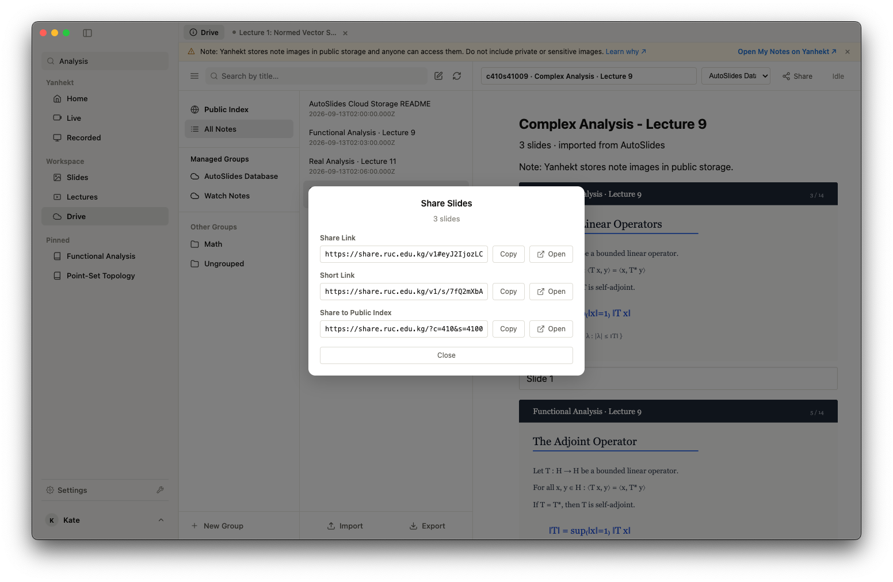
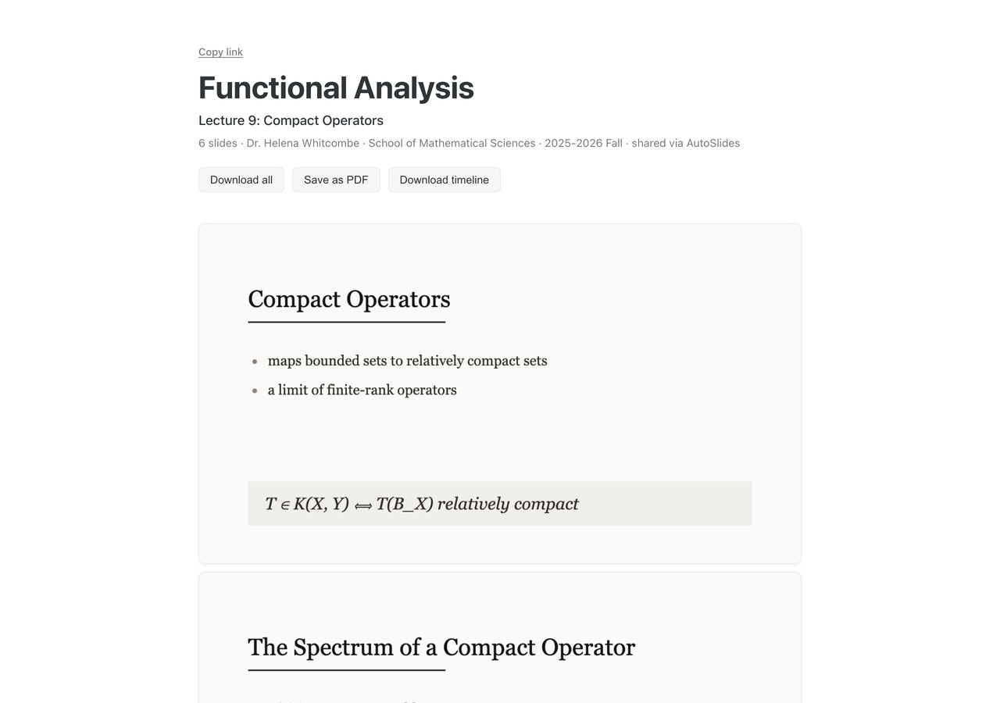
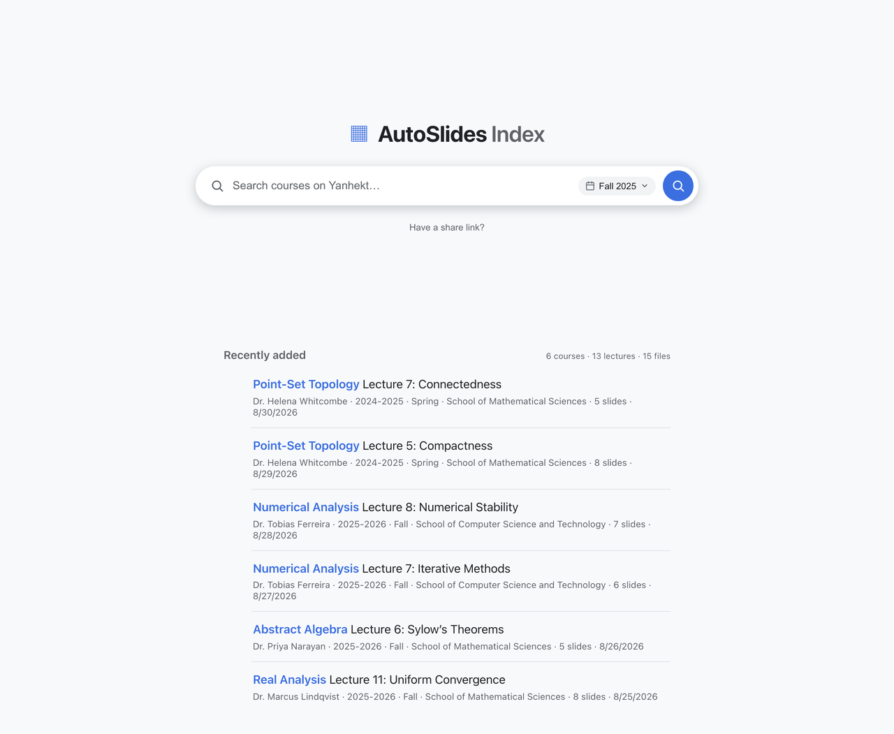
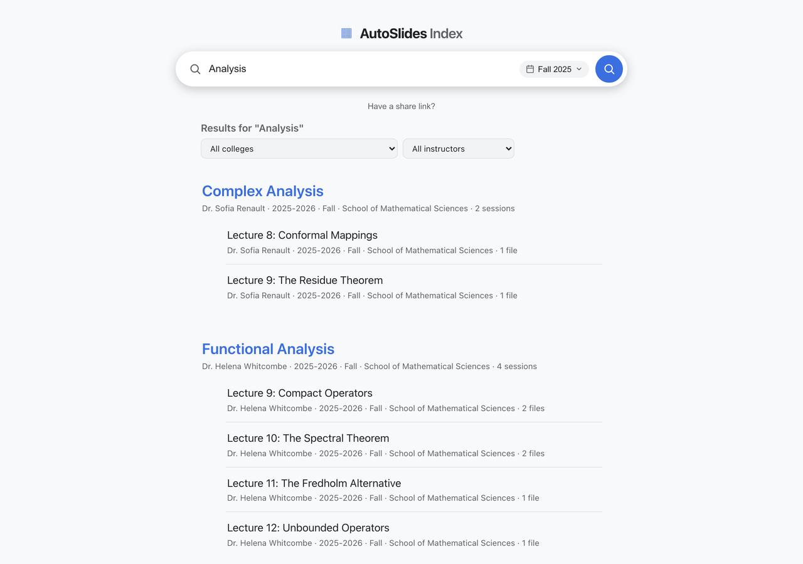
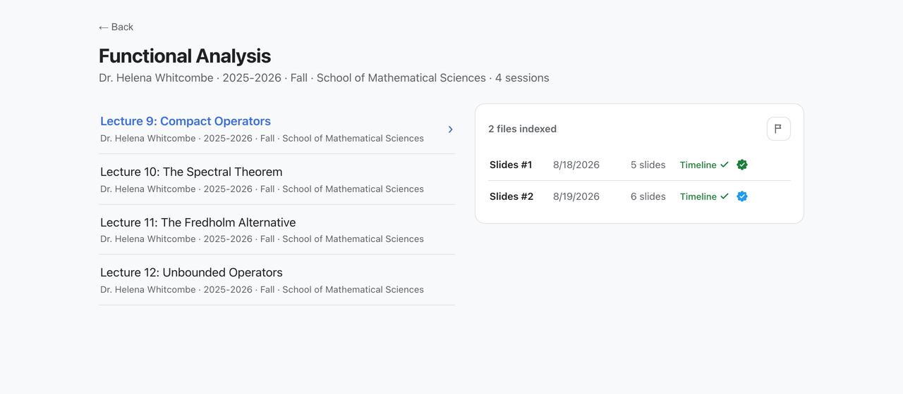
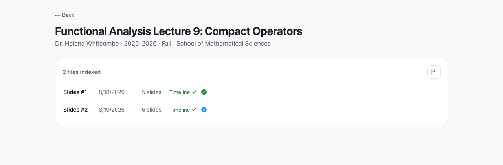
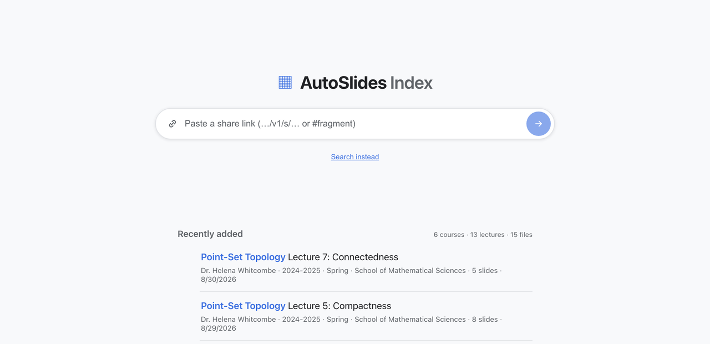

<div align="center">

  

  # AutoSlides Index

  **公开课件索引与幻灯片分享页｜搜索别人上传的课件｜一条链接分享整套幻灯片**

  <p>
    
    
    
  </p>

  <p>
    <a href="https://share.ruc.edu.kg">🌐 在线使用</a> •
    <a href="https://share.ruc.edu.kg/demo/">🎮 在线演示</a> •
    <a href="#-完整流程">🧭 完整流程</a> •
    <a href="../README.md">💻 桌面版</a>
  </p>

</div>

---

> [!CAUTION]
> **Disclaimer**: This tool is intended strictly for personal study; users assume full legal responsibility for ensuring their usage complies with all applicable copyright laws and platform regulations. Terms and Conditions apply.
> <br> **免责声明**：本工具严格仅供个人学习之用；用户须自行承担全部法律责任，确保其使用符合所有适用的版权法及平台规例。受条款及细则约束。
>
> <p align="center"><a href="https://learn.ruc.edu.kg/terms">Read full Terms and Conditions / 按此查阅完整条款及细则</a></p>
>
> This tool is NOT an official application of, and is NOT affiliated with, associated with, endorsed by, or in any way connected to Beijing Institute of Technology (BIT), or any of their subsidiaries or affiliates. All product and company names are trademarks™ or registered® trademarks of their respective holders.
> <br> 本工具**并非**北京理工大学（BIT）的官方应用程式，亦与其或其任何附属机构或关联方无任何关联、联系、获其认可或以任何方式相关。所有产品及公司名称均为其各自持有人的商标™或注册®商标。

## ✨ 这是什么

[share.ruc.edu.kg](https://share.ruc.edu.kg) 👈 是 [AutoSlides](../README.md) 的分享端，两个页面：

- **幻灯片分享页**（`/v1/…`）——把一条链接里的整套课件排成一页长文档，可以整包下载、存成 PDF，也可以下载幻灯片时间轴。打开不需要登录。
- **公共索引**（`/`）——大家自愿公开的课件目录。按课程、老师或学院搜索，找到之后直接打开对应的幻灯片分享页。

静态演示：[share.ruc.edu.kg/demo/](https://share.ruc.edu.kg/demo/) 👈

> [!NOTE]
> 索引本身**不保存**课程名、老师名和幻灯片文件。数据库里只有课程号、课节号和图片指纹；页面上的名称是打开时向延河课堂实时查询的，图片则来自延河课堂的公开对象存储。

<br>

## 🧭 完整流程

一句话概括：

> 用 **AutoSlides** 自动提取录播课程的幻灯片 → 作为课件笔记上传到**个人云存储** → 通过**链接**分享给别人，或**公开到公共索引**。

反过来也成立：在动手提取一门课之前，先到公共索引搜一下——也许已经有人上传过了。

<br>

### 1. 提取幻灯片

在 AutoSlides [桌面版](../README.md) 或[网页版](../web/README.md) 里播放一节录播课，幻灯片会一边看一边提取出来，重复画面、板书之外的画面和编辑模式截图由后处理和 AI 过滤掉。提取结果在 `工作区 > 课程幻灯片` 里按课程节次成册，可以恢复、删除、裁剪。

<p align="center">
  
</p>

<br>

---

### 2. 上传到云存储

`工作区 > 云存储` 底部的 `导入` 把本地 `slides_*` 文件夹做成一条云端笔记，存进延河课堂你自己的笔记里（自动管理的 `AutoSlides 数据库` 分组）。笔记末尾会附带这套课件的 `metadata.json` 与 `timeline.json`，所以之后无论是分享还是还原成本地文件夹，信息都不会丢。

<p align="center">
  
</p>

> [!WARNING]
> 延河课堂把笔记中的图片存放在公开对象存储中，任何人拿到地址都能访问。请不要在笔记里放入私人或敏感图片——分享与公开索引都建立在这一点之上。

<br>

---

### 3. 分享，或公开到索引

打开一条笔记，右上角 `分享`，会看到三个东西：

- **分享链接**——一条长链接，课程号、课节号和每张图片的短哈希都编码在 `#` 后面。任何人打开都能看到这套幻灯片，无需登录；链接本身就是全部数据，服务器不留记录。
- **短链接**——点 `获取短链接` 把上面那条压成 `…/v1/s/xxxxxxxxxx`，方便发给别人。短链接会记回笔记里，下次分享复用同一条。
- **公开到公共索引**——点 `发布` 把这节课登记进公共索引，别人就能搜到。只有**录播**课节的笔记可以公开（索引以课程号 + 课节号为主键，随堂笔记没有课节号）。

如果 `设置 > 云端 > 嵌入幻灯片时间轴` 开着（默认开启），且这套课件有 `timeline.json`，链接里还会带上一份压缩过的时间轴——对方就能知道每张幻灯片对应录像里的哪一刻。

<p align="center">
  
</p>

<br>

---

### 4. 别人打开链接看到的页面

分享链接指向幻灯片分享页：整套课件排成一页长文档，顶部是课程、课节、老师、学院和学期——这些名称是打开时向延河课堂查的，不在链接里。

三个操作：`Download all` 打包成 zip（带 `timeline.json`），`Save as PDF` 逐页合成 PDF，`Download timeline` 单独下载时间轴（链接里没有时间轴时不可用）。点任意一张可以放大。

<p align="center">
  
</p>

<br>

---

### 5. 在公共索引里找课件

打开 [share.ruc.edu.kg](https://share.ruc.edu.kg)。没有搜索时，首页列出 `Recently added`——最近公开的课件，点进去就是它的分享页。

<p align="center">
  
</p>

搜索框直接查延河课堂的课程目录，再和已公开的课节对上，所以可以按**课程名、老师、学院**搜，也可以直接填**课程号**。右侧的学期选择器默认只搜最新学期，可以改成多个学期或全部学期（课程号搜索总是跨全部学期）。结果按课程分组，命中较多时上方会出现学院 / 学期 / 老师筛选。

<p align="center">
  
</p>

点进一门课，左边是这门课已公开的所有课节，右边是选中课节的文件列表。每个文件一行：

- `Timeline ✓` —— 这套课件带幻灯片时间轴
- 绿色对勾 —— 上传者在本地复查过
- 蓝色对勾 —— 上传者复查并改动过（裁剪、删除误判等）

<p align="center">
  
</p>

直接打开一条 `/?c=…&s=…` 链接（比如别人发给你的、或桌面版里跳过来的）会落在单节课的页面上，内容一样。

<p align="center">
  
</p>

拿到的是一条分享链接而不是课程名，可以点搜索框下面的 `Have a share link?`，把链接或 `#` 后面那段直接粘进去。

<p align="center">
  
</p>

<br>

---

### 6. 先搜，再决定要不要自己提取

同样的索引在桌面版里也有：`工作区 > 云存储` 左侧点 `公共索引`。找到合适的课件后，可以 `导入到 AutoSlides 数据库` 变成自己的一条云端笔记，或者 `导出到本地` 直接还原成一个幻灯片文件夹（连时间轴一起）——不用再跑一遍提取。

<p align="center">
  
</p>

<br>

---

### 7. 撤下自己上传的内容

课节页面文件列表右上角的旗标按钮是 `Request removal`。粘贴你的延河课堂 token 后，服务器只会删掉**你自己**上传的版本，别人的不受影响。桌面版的公共索引页会自动带上当前账号的 token，不用手动粘贴。

<br>

## 🛠 开发

本目录是一个 Cloudflare Worker，外加两个 React + Vite 前端：`src/` 是 v1 幻灯片分享页与 Worker（KV 短链接、D1 索引、延河课堂元数据代理），`apex/` 是公共索引站点。

```sh
npm install
cp wrangler.example.jsonc wrangler.jsonc   # 填入你自己的 KV / D1 id 与自定义域名
npm run build        # 构建 dist/v1（分享页）、dist/（索引）与 dist/demo（演示站）
npm run dev          # vite dev，只跑分享页
npm run demo         # vite dev，只跑索引演示站
npm run demo:v1      # vite dev，只跑分享页演示站
npm run preview      # wrangler dev：Worker + 静态资源 + 本地 KV/D1
npm run screenshots  # Playwright 驱动演示站重新生成 docs/*.png（需要 magick）
npm run typecheck && npm test
npm run deploy       # 构建并发布
```

首次部署还需要建好两个存储：

```sh
wrangler kv namespace create SHARE_KV          # v1 短链接 + 首页统计缓存
wrangler d1 create autoslides-index-v2         # v2 索引
npm run db:migrate                             # 应用 migrations/（db:migrate:local 用于本地）
```

---

<div align="center">
<p>Copyright © 2026 bit-admin.</p>
<p>
<a href="https://github.com/bit-admin/Yanhekt-AutoSlides">GitHub</a> •
<a href="mailto:info@ruc.edu.kg">Email</a> •
<a href="https://it.ruc.edu.kg/docs">Docs</a>
</p>
</div>
